# 今日内容介绍

<extoc></extoc>

# 事物
## 事物概述

    事务：指的是逻辑上的一组操作，组成这组操作的各个逻辑单元，要么全都成功，要么全都失败。

    MYSQL命令行窗口事物常用操作有三个:

        1. 开启事物:`start transaction`


        2. 提交事物`commit`

        3. 回滚事物:`rollback`


    MySQL数据库中事务默认自动提交,事务提交的两种方式：

        1. 自动提交：
          * mysql就是自动提交的
          * 一条DML(增删改)语句会自动提交一次事务。

        2. 手动提交：
          * Oracle 数据库默认是手动提交事务
          * 需要先开启事务，再提交

        * 修改事务的默认提交方式：
          - 查看事务的默认提交方式：SELECT @@autocommit; -- 1 代表自动提交  0 代表手动提交

          - 修改默认提交方式： set @@autocommit = 0;


## 环境准备
```sql
create table account(
	id int primary key auto_increment,
	name varchar(20),
	money double
);

insert into account values (null,'小张',10000);
insert into account values (null,'小凤',10000);
```

## 转账案例

### 提交事物
```sql
start transaction ; -- 开启事物
update account set money = money-1000 where name='小张'; -- 扣除小张账户的钱
update account set money = money+1000 where name='小风'; -- 给小风的账户添加钱
commit; -- 提交事物
```

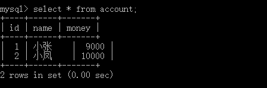

### 回滚事物
```sql
update account set money = 10000;  -- 恢复数据
start transaction ; -- 开启事物
update account set money = money-1000 where name='小张'; -- 扣除小张账户的钱
update account set money = money+1000 where name='小风'; -- 给小风的账户添加钱
rollback; -- 提交事物
```

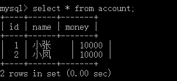

## 事物特性

    1. 原子性:事务的不可分割，组成事务的各个逻辑单元不可分割

    2. 一致性：事务执行的前后，数据完整性保持一致

    3. 隔离性：事务执行不应该受到其他事务的干扰

    4. 持久性：事务一旦结束，数据就持久化到数据库中


## 不考虑隔离性引发的安全性问题

    隔离性：一个事务的执行，不应该受到其他事务的干扰。

    如果不考虑隔离性（一个事务执行受到其他的事务的干扰），引发一些安全问题，主要体现在读取数据上：

    1. 脏读：一个事务，读取到另一个事务中没有提交的数据,导致多次读取到的数据不一样。

    2. 不可重复读(虚读)：一个事物读到了另一个事物已经提交的update的数据,导致多次读取到的数据不一样。

    3. 幻读：一个事务读到了另一个事务已经提交的insert的数据，导致多次查询结果不一致。


## 如何解决这些安全性问题(事物的隔离级别)?

    可以通过设置事物的隔离级别解决这些安全性问题

    1. read uncommitted(读未提交)	： 脏读，不可重复读，虚读都有可能发生

    2. read committed(读已提交)	：避免脏读。但是不可重复读和虚读是有可能发生

    3. repeatable read(可重复读)	：避免脏读和不可重复读，但是虚读有可能发生

    4. serializable(串行化)		：避免脏读，不可重复读，虚读。


### 演示脏读

1. 开启两个窗口A,B

2. 设置A窗口的隔离级别为read uncommitted;
  ```sql
  SET SESSION TRANSACTION ISOLATION LEVEL read uncommitted;
  ```
 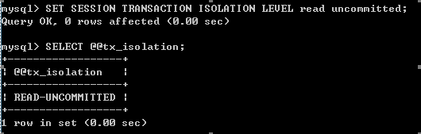

3. 在A，B两个窗口中开启事务
  ```sql
  start transaction;
  ```

4. 在B窗口中完成转账的功能：
  ```sql
  update account set money = money - 1000 where name= '小张';
  update account set money = money + 1000 where name= '小凤';
  -- 这里不提交事物
  ```

5. 在A窗口中进行查询
  ```sql
  select * from account;
  ```
 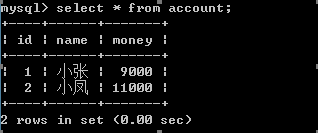  

  <font color='red'>**发现A窗口中已经查询到转账成功了！！！已经发生了脏读：一个事务中已经读到了另一个事务未提交的数据。**</font>

### 避免脏读

1. 开启两个窗口A,B

2. 设置A窗口的隔离级别为read committed;
  ```sql
  SET SESSION TRANSACTION ISOLATION LEVEL read committed;
  ```
  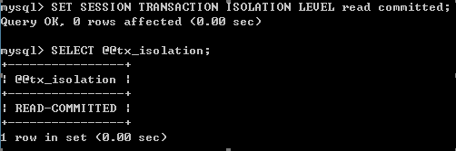

3. 分别在两个窗口中开启事务：
  ```sql
  start transaction;  
  ```

4. 在B窗口中完成转账
  ```sql
  update account set money = money - 1000 where name= '小张';
  update account set money = money + 1000 where name= '小凤';
  -- 没有提交事物
  ```

5. 在A窗口中进行查询：
  ```sql
  select * from account;  
  ```
  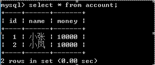

  <font color='red'>**发现这个时候没有转账成功！！！（没有查询到另一个事务未提交的数据：说明已经避免了脏读）。**</font>

6. 在B窗口中提交事务
  ```sql
  commit;
  ```

7. 在A窗口查询
  ```sql
  select * from account;
  ```
  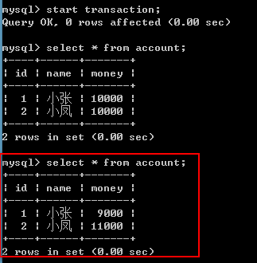


  <font color='red'>**发现这次的结果已经发生了变化！！！（已经发生不可重复读：一个事务已经读到了另一个事务提交的update的数据，导致多次查询结果不一**</font>

### 避免不可重复读

1. 分别开启两个窗口A，B

2. 设置A窗口的隔离级别：repeatable read;
  ```sql
  SET SESSION TRANSACTION ISOLATION LEVEL repeatable read;
  ```
 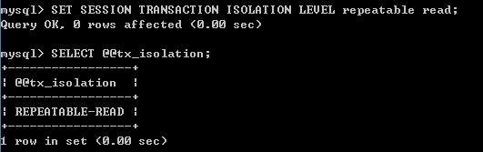

3. 在A，B两个窗口中开启事务:
  ```sql
  start transaction;
  ```

4. 在B窗口完成转账
  ```sql
  update account set money = money - 1000 where name= '小张';
  update account set money = money + 1000 where name= '小凤';
  -- 没有提交事物
  ```
  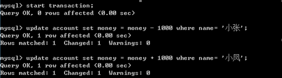

5. 在A窗口中进行查询
  ```sql
  select * from account;
  ```
  <font color='red'>**发现没有转账成功：说明避免脏读！！！**</font>

6. 在B窗口中提交事务
  ```sql
  commit;
  ```

7. 在A窗口中再次查询：
  ```sql
  select * from account;
  ```
  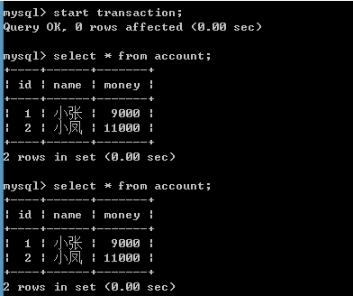  

  <font color='red'>**发现在一个事务中的多次查询结果是一致！！！（已经避免不可重复读）**</font>

### 避免虚读/幻读

1. 开启两个窗口A,B

2. 设置A窗口的隔离级别：serializable
  ```sql
  SET SESSION TRANSACTION ISOLATION LEVEL serializable;
  ```
  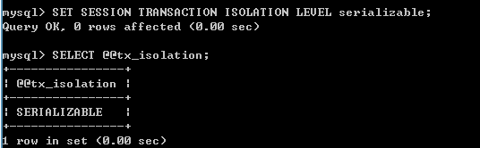


3. 分别在两个窗口中开启事务：
  ```sql
  start transaction;
  ```

3. 在B窗口中插入一条记录
  ```sql
  insert into account values (null,'小李',10000);
  ```

4. 在A窗口中进行查询
  ```sql
  select * from account;
  ```
  <font color='red'>**发现A窗口已经卡住了（说明事务不允许出现并发，A窗口需要等待B窗口事务执行完成以后，才会执行A窗口的事务。）当B窗口的事务结束（提交或者回滚），那么A窗口马上就会出现结果。**</font>


# DCL：
## SQL分类：
	1. DDL：操作数据库和表
	2. DML：增删改表中数据
	3. DQL：查询表中数据
	4. DCL：管理用户，授权

## DBA：数据库管理员

## DCL：管理用户，授权
### 管理用户
1. 添加用户：`CREATE USER '用户名'@'主机名' IDENTIFIED BY '密码';`

2. 删除用户：`DROP USER '用户名'@'主机名';`

3. 修改用户密码：
```sql
-- 第一种方式
UPDATE USER SET PASSWORD = PASSWORD('新密码') WHERE USER = '用户名';
UPDATE USER SET PASSWORD = PASSWORD('abc') WHERE USER = 'lisi';
-- 第二种方式
SET PASSWORD FOR '用户名'@'主机名' = PASSWORD('新密码');
SET PASSWORD FOR 'root'@'localhost' = PASSWORD('123');
```

4. mysql中忘记了root用户的密码?
  ```
  1. cmd -- > net stop mysql 停止mysql服务
    * 需要管理员运行该cmd
  2. 使用无验证方式启动mysql服务： mysqld --skip-grant-tables
  3. 打开新的cmd窗口,直接输入mysql命令，敲回车。就可以登录成功
  4. use mysql;
  5. update user set password = password('你的新密码') where user = 'root';
  6. 关闭两个窗口
  7. 打开任务管理器，手动结束mysqld.exe 的进程
  8. 启动mysql服务
  9. 使用新密码登录。
  ```

5. 查询用户：
```sql
-- 1. 切换到mysql数据库
USE myql;
-- 2. 查询user表
SELECT * FROM USER;
-- 通配符： % 表示可以在任意主机使用用户登录数据库
```

### 权限管理：
1. 查询权限：
```sql
-- 查询权限
SHOW GRANTS FOR '用户名'@'主机名';
SHOW GRANTS FOR 'lisi'@'%';
```

2. 授予权限：
```sql
-- 授予权限
grant 权限列表 on 数据库名.表名 to '用户名'@'主机名';
-- 给张三用户授予所有权限，在任意数据库任意表上
GRANT ALL ON *.* TO 'zhangsan'@'localhost';
```

3. 撤销权限：
```sql
-- 撤销权限：
revoke 权限列表 on 数据库名.表名 from '用户名'@'主机名';
REVOKE UPDATE ON db3.`account` FROM 'lisi'@'%';
```
