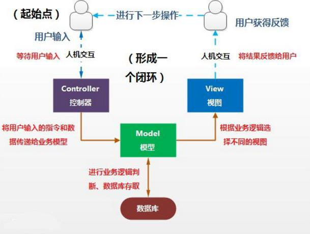
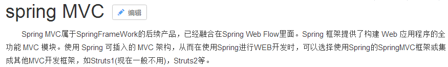
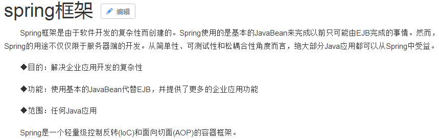
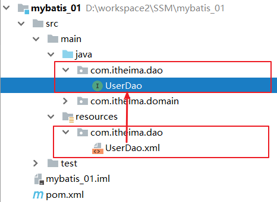
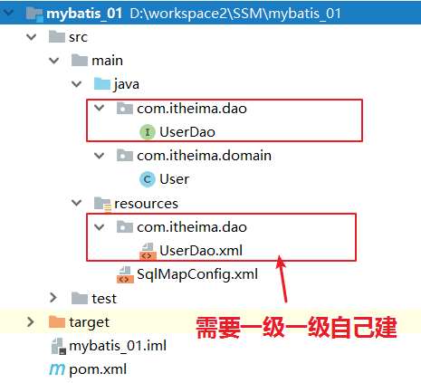
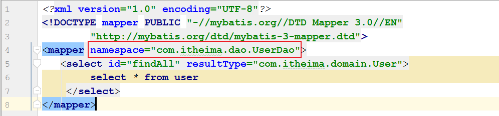
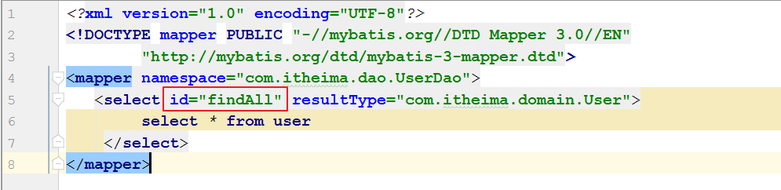
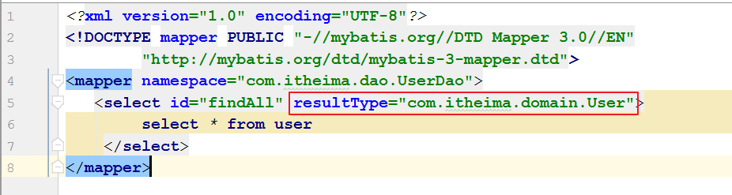
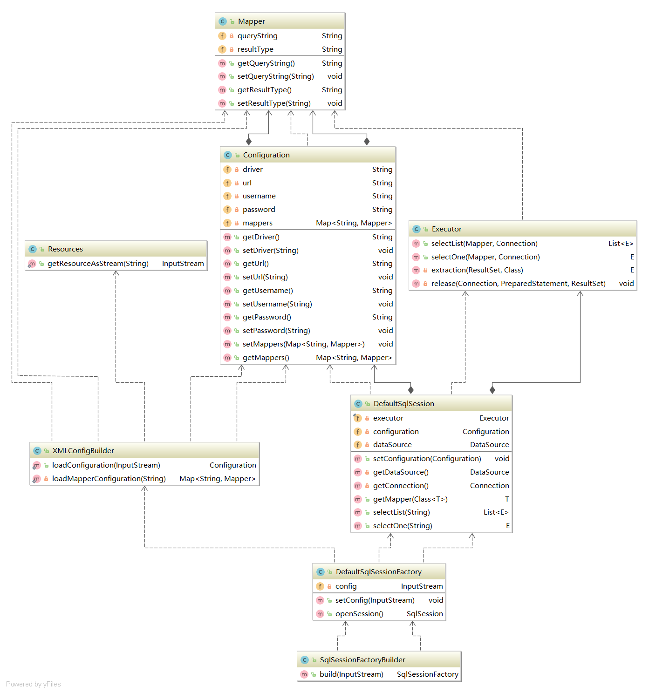
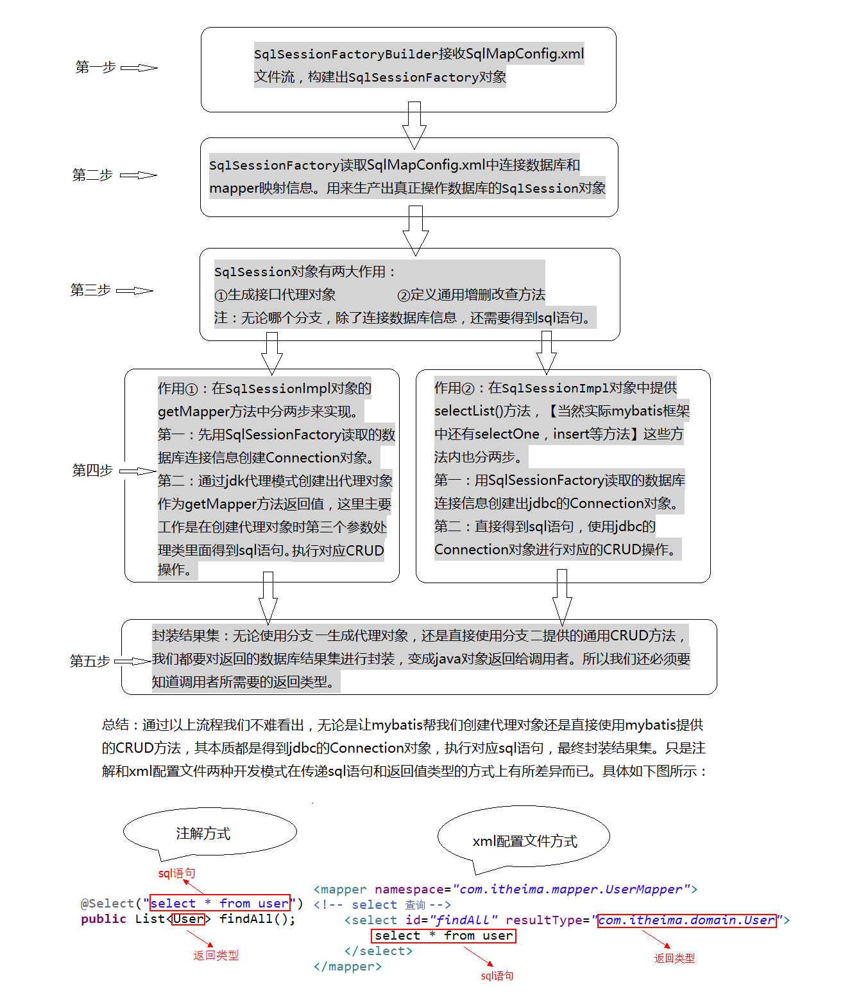

# 今日内容介绍

<extoc></extoc>

# 框架概述(了解)
## 什么是框架
    框架（Framework）是整个或部分系统的可重用设计，表现为一组抽象构件及构件实例间交互的方法;另一种定义认为，框架是可被应用开发者定制的应用骨架。

    前者是从应用方面而后者是从目的方面给出的定义。 简而言之，框架其实就是某种应用的半成品，就是一组组件，供你选用完成你自己的系统。简单说就是使用别人搭好的舞台，你来做表演。

    而且，框架一般是成熟的，不断升级的软件。

### 框架要解决什么问题(了解)

    框架要解决的最重要的一个问题是技术整合的问题.

    在J2EE的 框架中，有着各种各样的技术，不同的软件企业需要从J2EE中选择不同的技术，这就使得软件企业最终的应用依赖于这些技术，技术自身的复杂性和技术的风险性将会直接对应用造成冲击。

    而应用是软件企业的核心，是竞争力的关键所在，因此应该将应用自身的设计和具体的实现技术解耦。

    这样，软件企业的研发将集中在应用的设计上，而不是具体的技术实现，技术实现是应用的底层支撑，它不应该直接对应用产生影响。

    框架一般处在低层应用平台（如J2EE）和高层业务逻辑之间的中间层。

### 软件开发分层的重要性(了解)

    框架的重要性在于它实现了部分功能，并且能够很好的将低层应用平台和高层业务逻辑进行了缓和。

    为了实现软件工程中的“高内聚、低耦合”。把问题划分开来各个解决，易于控制，易于延展，易于分配资源。

    我们常见的MVC软件设计思想就是很好的分层思想。



<font>通过分层更好的实现了各个部分的职责，在每一层将再细化出不同的框架，分别解决各层关注的问题。</font>

### 分层开发下的常见框架(了解)
  - WEB层:SpringMVC框架
  

  - 数据访问层:Mybatis框架
  

  - 解决技术整合问题的框架:Spring框架
  

### Mybatis框架概述(了解)
    mybatis是一个优秀的基于java的持久层框架，它内部封装了jdbc，使开发者只需要关注sql语句本身，而不需要花费精力去处理加载驱动、创建连接、创建statement等繁杂的过程。

    mybatis通过xml或注解的方式将要执行的各种statement配置起来
    并通过java对象和statement中sql的动态参数进行映射生成最终执行的sql语句
    最后由mybatis框架执行sql并将结果映射为java对象并返回。

    采用ORM思想解决了实体和数据库映射的问题，对jdbc进行了封装，屏蔽了jdbc api底层访问细节，使我们不用与jdbc api打交道，就可以完成对数据库的持久化操作。

## JDBC编程存在的问题(理解)
    1. 数据库链接创建、释放频繁造成系统资源浪费从而影响系统性能，如果使用数据库链接池可解决此问题。
    2. sql语句在代码中硬编码，造成代码不易维护，实际应用sql变化的可能较大，sql变动需要改变java代码。
    3. 使用preparedStatement向占有位符号传参数存在硬编码，因为sql语句的where条件不一定，可能多也可能少，修改sql还要修改代码，系统不易维护。
    4. 对结果集解析存在硬编码（查询列名），sql变化导致解析代码变化，系统不易维护，如果能将数据库记录封装成pojo对象解析比较方便。

# Mybatis快速入门(掌握)
## 开发环境准备(掌握)
### mybatis开发文档(掌握)
http://www.mybatis.org/mybatis-3/zh/index.html

### 创建maven项目(掌握)


### 创建数据库及表(掌握)
```sql
create database  mybatis_01 character set utf8;

use mybatis_01 ;

CREATE TABLE `user` (
  `id` int(11) NOT NULL auto_increment,
  `username` varchar(32) NOT NULL COMMENT '用户名称',
  `birthday` datetime default NULL COMMENT '生日',
  `sex` char(1) default NULL COMMENT '性别',
  `address` varchar(256) default NULL COMMENT '地址',
  PRIMARY KEY  (`id`)
) ENGINE=InnoDB DEFAULT CHARSET=utf8;

insert  into `user`(`id`,`username`,`birthday`,`sex`,`address`) values
(41,'老王','2018-02-27 17:47:08','男','北京'),
(42,'小二王','2018-03-02 15:09:37','女','北京金燕龙'),
(43,'小二王','2018-03-04 11:34:34','女','北京金燕龙'),
(45,'传智播客','2018-03-04 12:04:06','男','北京金燕龙'),
(46,'老王','2018-03-07 17:37:26','男','北京'),
(48,'小马宝莉','2018-03-08 11:44:00','女','北京修正');
```

## 搭建开发环境(入门)(掌握)

### 导入mybatis及依赖坐标(掌握)
```xml
<dependencies>
    <dependency>
        <groupId>org.mybatis</groupId>
        <artifactId>mybatis</artifactId>
        <version>3.4.5</version>
    </dependency>
    <dependency>
        <groupId>mysql</groupId>
        <artifactId>mysql-connector-java</artifactId>
        <version>5.1.38</version>
    </dependency>
    <dependency>
        <groupId>log4j</groupId>
        <artifactId>log4j</artifactId>
        <version>1.2.17</version>
    </dependency>
    <dependency>
        <groupId>junit</groupId>
        <artifactId>junit</artifactId>
        <version>4.11</version>
    </dependency>
</dependencies>

<!-- 可以解决idea不能编译src目录下的xml文件 -->
<build>
    <!--加载src目录下的静态文件-->
   <resources>
       <resource>
           <directory>src/main/java</directory>
           <includes>
               <include>**/*.xml</include>
           </includes>
       </resource>
   </resources>
</build>
```

### 创建实体类`User`(掌握)
```java
package com.itheima.domain;

import java.util.Date;

/**
 * CREATE TABLE `user` (
 *   `id` int(11) NOT NULL auto_increment,
 *   `username` varchar(32) NOT NULL COMMENT '用户名称',
 *   `birthday` datetime default NULL COMMENT '生日',
 *   `sex` char(1) default NULL COMMENT '性别',
 *   `address` varchar(256) default NULL COMMENT '地址',
 *   PRIMARY KEY  (`id`)
 * ) ENGINE=InnoDB DEFAULT CHARSET=utf8;
 */
public class User {

    private int id ;
    private String username;
    private Date birthday;
    private String sex;
    private String address;

    public int getId() {
        return id;
    }

    public void setId(int id) {
        this.id = id;
    }

    public String getUsername() {
        return username;
    }

    public void setUsername(String username) {
        this.username = username;
    }

    public Date getBirthday() {
        return birthday;
    }

    public void setBirthday(Date birthday) {
        this.birthday = birthday;
    }

    public String getSex() {
        return sex;
    }

    public void setSex(String sex) {
        this.sex = sex;
    }

    public String getAddress() {
        return address;
    }

    public void setAddress(String address) {
        this.address = address;
    }
}
```
### 编写数据访问层接口`UserDao`(掌握)
```java
/**
 * 用户的持久层操作
 */
public interface UserDao {

    public List<User> findAll();

}
```

### 编写持久层接口的映射文件`UserDao.xml`(掌握)
```xml
<?xml version="1.0" encoding="UTF-8"?> <!DOCTYPE mapper PUBLIC "-//mybatis.org//DTD Mapper 3.0//EN"
        "http://mybatis.org/dtd/mybatis-3-mapper.dtd">
<mapper namespace="com.itheima.dao.UserDao">
    <select id="findAll" resultType="com.itheima.domain.User">
        select * from user
    </select>
</mapper>
```

    注意:
        创建位置：必须和持久层接口在相同的包中。
        名称：必须以持久层接口名称命名文件名，扩展名是.xml



### 编写配置文件`SqlMapConfig.xml`(掌握)
```xml
<?xml version="1.0" encoding="UTF-8"?>
<!DOCTYPE configuration PUBLIC "-//mybatis.org//DTD Config 3.0//EN"
        "http://mybatis.org/dtd/mybatis-3-config.dtd">
<configuration>
    <!--配置mybatis环境-->
    <environments default="mysql">
        <!--配置mysql的环境-->
        <environment id="mysql">
            <!--配置事物管理类型-->
            <transactionManager type="JDBC"></transactionManager>
            <!--配置数据库连接池-->
            <dataSource type="POOLED">
                <property name="driver" value="com.mysql.jdbc.Driver"/>
                <property name="url" value="jdbc:mysql://localhost:3306/mybatis_01"/>
                <property name="username" value="root"/>
                <property name="password" value="zl"/>
            </dataSource>
        </environment>
    </environments>

    <!--引入映射文件-->
    <mappers>
        <mapper resource="com/itheima/dao/UserDao.xml"></mapper>
    </mappers>

</configuration>
```

### 编写测试类`SqlMapConfig.xml`
```java
@Test
public void test1() throws IOException {
    //1. 读取配置文件,通过mybatis提供的Resources对象读取
    //InputStream is = Resources.getResourceAsStream("SqlMapConfig.xml");
    InputStream is = MybatisTest.class.getClassLoader().getResourceAsStream("SqlMapConfig.xml");
    //2. 获取sqlSession工厂对象  sqlSessionFactory
    //2.1 获取SqlSessionFactory的构建者对象
    SqlSessionFactoryBuilder builder = new SqlSessionFactoryBuilder();
    //2.2. 获取sqlSession工厂对象
    SqlSessionFactory sf = builder.build(is);
    //3. 获取sqlSession对象
    SqlSession sqlSession = sf.openSession();
    //4. 使用SqlSession创建dao接口的代理对象
    UserDao userDao = sqlSession.getMapper(UserDao.class);
    //5. 使用代理对象执行查询所有方法
    List<User> users = userDao.findAll();
    System.out.println(users);
    //6. 释放资源
    sqlSession.close();
    is.close();
}
```

```
测试类操作数据库基本步骤:
    1. 读取配置文件,通过mybatis提供的Resources对象读取
    2. 获取sqlSession工厂对象  sqlSessionFactory
    3. 获取sqlSession对象
    4. 使用SqlSession创建dao接口的代理对象
    5. 使用代理对象执行查询所有方法
    6. 释放资源
```

### 注意事项`SqlMapConfig.xml`
  1. mapper映射文件要和对应的dao接口类同名，且在同一路径下

  

  2. mapper映射文件的namespace要标识到具体的dao接口类

  

  3. mapper映射文件中的sql节点id要与dao接口类中的方法名相同

  

  4. mapper映射文件中的sql节点要有返回值类型才能得到操作后的数据

  

  5. 在使用IDEA工具开发时（eclipse无此问题）如果在resources中创建映射文件目录时只能一层一层的创建，不会自动生成。


## 基于注解的Mybatis开发(熟悉)
### 在数据访问层接口中添加注解(熟悉)
```java
/**
 * 用户的持久层操作
 */
public interface UserDao {

    @Select("select * from user")
    public List<User> findAll();

}
```

### 修改`SqlMapConfig.xml`配置(熟悉)
```xml
<!--引入映射文件-->
<mappers>
    <!--<mapper resource="com/itheima/dao/UserDao.xml"></mapper>-->
    <mapper class="com.itheima.dao.UserDao"></mapper>
</mappers>
```

### 删除配置文件`UserDao.xml`(熟悉)

在使用基于注解的Mybatis配置时，请移除xml的映射配置（IUserDao.xml）。

## 基于Mapper实现类的Mybatis开发(熟悉)

### 创建Mapper实现类
```java
public class UserDaoImpl implements UserDao {

    private  SqlSessionFactory sqlSessionFactory;

    public UserDaoImpl(SqlSessionFactory sqlSessionFactory){
        this.sqlSessionFactory = sqlSessionFactory ;
    }

    public List<User> findAll() {
        //获取session
        SqlSession session = sqlSessionFactory.openSession();
        //执行查询
        List<User> list = session.selectList("com.itheima.dao.UserDao.findAll");
        return list;
    }
}
```

### 编写测试类(熟悉)
```java
@Test
public void test2() throws IOException {
    //1. 读取配置文件,通过mybatis提供的Resources对象读取
    //InputStream is = Resources.getResourceAsStream("SqlMapConfig.xml");
    InputStream is = MybatisTest.class.getClassLoader().getResourceAsStream("SqlMapConfig.xml");
    //2. 获取sqlSession工厂对象  sqlSessionFactory
    //2.1 获取SqlSessionFactory的构建者对象
    SqlSessionFactoryBuilder builder = new SqlSessionFactoryBuilder();
    //2.2. 获取sqlSession工厂对象
    SqlSessionFactory sf = builder.build(is);
    //3. 创建数据访问层实现类
    UserDao userDao = new UserDaoImpl(sf);
    //4. 调用方法完成查询操作
    List<User> users = userDao.findAll();
    System.out.println(users);
    //5. 释放资源
    is.close();
}
```
# 自定义Mybatis框架(理解)

## 自定义mybatis流程分析(理解)


## 需要定义的类的分析(理解)
    1. 加载类加载目录下的资源文件 `Resources.java`
    2. 保存配置文件的配置信息 `Configuration.java`
    3. 映射文件解析后信息类 `Mapper.java`
    4. `SqlSession`接口及实现类
    5. `SqlSessionFactory`接口及实现类
    6. `SqlSessionFactory`的构建者类`SqlSessionFactoryBuilder.java`
    7. xml解析的工具类`Executor.java`
    8. sql执行的执行类`XMLConfigBuilder.java`



## 自定义mybatis代码实现(理解)
### 定义`Resources.java`类(理解)
```java
/**
 * 加载资源的工具类
 */
public class Resources {

    /**
     * 加载类加载目录下的资源
     * @param path
     * @return
     */
    public static  InputStream getResourceAsStream(String path){
        return Resources.class.getClassLoader().getResourceAsStream(path);
    }
}
```

### 定义mybatis映射配置信息类 `Mapper.java`(理解)
```java
/**
 * 映射的配置信息类
 */
public class Mapper {

    private String queryString;// SQL语句

    private String resultType;// 实体类全限定名

    public String getQueryString() {
        return queryString;
    }

    public void setQueryString(String queryString) {
        this.queryString = queryString;
    }

    public String getResultType() {
        return resultType;
    }

    public void setResultType(String resultType) {
        this.resultType = resultType;
    }
}
```

### 定义mybatis核心配置信息类 `Configuration.java`(理解)
```java
/**
 * mybatis配置的实体类
 * 用来保存mybatis.xml解析过程中的节点属性
 */
public class Configuration {

    private String driver;      //jdbc驱动类
    private String url;         //jdbc连接字符串
    private String username;    //数据库连接用户名
    private String password;    //数据库连接密码
    private Map<String, Mapper> mappers = new HashMap<String, Mapper>();//映射文件

    public String getDriver() {
        return driver;
    }

    public void setDriver(String driver) {
        this.driver = driver;
    }

    public String getUrl() {
        return url;
    }

    public void setUrl(String url) {
        this.url = url;
    }

    public String getUsername() {
        return username;
    }

    public void setUsername(String username) {
        this.username = username;
    }

    public String getPassword() {
        return password;
    }

    public void setPassword(String password) {
        this.password = password;
    }

    public void setMappers(Map<String, Mapper> mappers) {
        this.mappers.putAll(mappers);
    }

    public Map<String, Mapper> getMappers() {
        return mappers;
    }
}
```

### 引入配置文件解析的工具类(理解)
```java
/**
 * 用于解析配置文件
 */
public class XMLConfigBuilder {


    /**
     * 解析主配置文件，把里面的内容填充到DefaultSqlSession所需要的地方
     * 使用的技术：
     * dom4j+xpath
     */
    public static Configuration loadConfiguration(InputStream config) {
        try {
            //定义封装连接信息的配置对象（mybatis的配置对象）
            Configuration cfg = new Configuration();

            //1.获取SAXReader对象
            SAXReader reader = new SAXReader();
            //2.根据字节输入流获取Document对象
            Document document = reader.read(config);
            //3.获取根节点
            Element root = document.getRootElement();
            //4.使用xpath中选择指定节点的方式，获取所有property节点
            List<Element> propertyElements = root.selectNodes("//property");
            //5.遍历节点
            for (Element propertyElement : propertyElements) {
                //判断节点是连接数据库的哪部分信息
                //取出name属性的值
                String name = propertyElement.attributeValue("name");
                if ("driver".equals(name)) {
                    //表示驱动
                    //获取property标签value属性的值
                    String driver = propertyElement.attributeValue("value");
                    cfg.setDriver(driver);
                }
                if ("url".equals(name)) {
                    //表示连接字符串
                    //获取property标签value属性的值
                    String url = propertyElement.attributeValue("value");
                    cfg.setUrl(url);
                }
                if ("username".equals(name)) {
                    //表示用户名
                    //获取property标签value属性的值
                    String username = propertyElement.attributeValue("value");
                    cfg.setUsername(username);
                }
                if ("password".equals(name)) {
                    //表示密码
                    //获取property标签value属性的值
                    String password = propertyElement.attributeValue("value");
                    cfg.setPassword(password);
                }
            }
            //取出mappers中的所有mapper标签，判断他们使用了resource还是class属性
            List<Element> mapperElements = root.selectNodes("//mappers/mapper");
            //遍历集合
            for (Element mapperElement : mapperElements) {
                //判断mapperElement使用的是哪个属性
                Attribute attribute = mapperElement.attribute("resource");
                if (attribute != null) {
                    System.out.println("使用的是XML");
                    //表示有resource属性，用的是XML
                    //取出属性的值
                    String mapperPath = attribute.getValue();//获取属性的值"com/itheima/dao/IUserDao.xml"
                    //把映射配置文件的内容获取出来，封装成一个map
                    Map<String, Mapper> mappers = loadMapperConfiguration(mapperPath);
                    //给configuration中的mappers赋值
                    cfg.setMappers(mappers);
                }
            }
            //返回Configuration
            return cfg;
        } catch (Exception e) {
            throw new RuntimeException(e);
        } finally {
            try {
                config.close();
            } catch (Exception e) {
                e.printStackTrace();
            }
        }

    }

    /**
     * 根据传入的参数，解析XML，并且封装到Map中
     *
     * @param mapperPath 映射配置文件的位置
     * @return map中包含了获取的唯一标识（key是由dao的全限定类名和方法名组成）
     * 以及执行所需的必要信息（value是一个Mapper对象，里面存放的是执行的SQL语句和要封装的实体类全限定类名）
     */
    private static Map<String, Mapper> loadMapperConfiguration(String mapperPath) throws IOException {
        InputStream in = null;
        try {
            //定义返回值对象
            Map<String, Mapper> mappers = new HashMap<String, Mapper>();
            //1.根据路径获取字节输入流
            in = Resources.getResourceAsStream(mapperPath);
            //2.根据字节输入流获取Document对象
            SAXReader reader = new SAXReader();
            Document document = reader.read(in);
            //3.获取根节点
            Element root = document.getRootElement();
            //4.获取根节点的namespace属性取值
            String namespace = root.attributeValue("namespace");//是组成map中key的部分
            //5.获取所有的select节点
            List<Element> selectElements = root.elements();
            //6.遍历select节点集合
            for (Element selectElement : selectElements) {
                //获取sql语句类型
                String type = selectElement.getName();
                //取出id属性的值      组成map中key的部分
                String id = selectElement.attributeValue("id");
                //取出resultType属性的值  组成map中value的部分
                String resultType = selectElement.attributeValue("resultType");
                //取出文本内容            组成map中value的部分
                String queryString = selectElement.getText();
                //创建Key
                String key = namespace + "." + id;
                //创建Value
                Mapper mapper = new Mapper();
                mapper.setQueryString(queryString);
                mapper.setResultType(resultType);
                //把key和value存入mappers中
                mappers.put(key, mapper);
            }
            return mappers;
        } catch (Exception e) {
            throw new RuntimeException(e);
        } finally {
            in.close();
        }
    }

}
```

### 引入SQL语句的执行对象`Executor.java`(理解)
```java
/**
 * 负责执行SQL语句，并且封装结果集
 */
public class Executor {

    /**
     * 根据mapper查询多条数据
     * @param mapper
     * @param conn
     * @param <E>
     * @return
     */
    public <E> List<E> selectList(Mapper mapper, Connection conn) {
        PreparedStatement pstm = null;
        ResultSet rs = null;
        try {
            //1.取出mapper中的数据
            String queryString = mapper.getQueryString();//select * from user
            String resultType = mapper.getResultType();//com.itheima.domain.User
            Class domainClass = Class.forName(resultType);
            //2.获取PreparedStatement对象
            pstm = conn.prepareStatement(queryString);
            //3.执行SQL语句，获取结果集
            rs = pstm.executeQuery();
            //4.封装结果集
            List<E> list = new ArrayList<E>();//定义返回值
            while (rs.next()) {
                //将结果集中的数据封装到实体中
                E obj = extraction(rs, domainClass);
                //把赋好值的对象加入到集合中
                list.add(obj);
            }
            return list;
        } catch (Exception e) {
            throw new RuntimeException(e);
        } finally {
            release(conn, pstm, rs);
        }
    }

    /**
     * 根据mapper查询数据,查询一条数据,如果结果集中有多条数据,返回第一条数据封装的实体对象
     * @param mapper
     * @param conn
     * @param <E>
     * @return
     */
    public <E> E selectOne(Mapper mapper, Connection conn) {
        PreparedStatement pstm = null;
        ResultSet rs = null;
        try {
            //1.取出mapper中的数据
            String queryString = mapper.getQueryString();//select * from user
            String resultType = mapper.getResultType();//com.itheima.domain.User
            Class domainClass = Class.forName(resultType);
            //2.获取PreparedStatement对象
            pstm = conn.prepareStatement(queryString);
            //3.执行SQL语句，获取结果集
            rs = pstm.executeQuery();
            //4.封装结果集
            if (rs.next()) {
                //将结果集中的数据封装到实体中
                E obj = extraction(rs, domainClass);
                return obj;
            }
            return null;
        } catch (Exception e) {
            throw new RuntimeException(e);
        } finally {
            release(conn, pstm, rs);
        }
    }

    /**
     * 将结果集中的一条数据封装到实体对象中
     * @param rs
     * @param domainClass
     * @param <E>
     * @return
     * @throws Exception
     */
    private <E> E extraction(ResultSet rs,Class domainClass) throws Exception{
        //实例化要封装的实体类对象
        E obj = (E) domainClass.newInstance();
        //取出结果集的元信息：ResultSetMetaData
        ResultSetMetaData rsmd = rs.getMetaData();
        //取出总列数
        int columnCount = rsmd.getColumnCount();
        //遍历总列数
        for (int i = 1; i <= columnCount; i++) {
            //获取每列的名称，列名的序号是从1开始的
            String columnName = rsmd.getColumnName(i);
            //根据得到列名，获取每列的值
            Object columnValue = rs.getObject(columnName);
            //给obj赋值：使用Java内省机制（借助PropertyDescriptor实现属性的封装）
            PropertyDescriptor pd = new PropertyDescriptor(columnName, domainClass);//要求：实体类的属性和数据库表的列名保持一种
            //获取它的写入方法
            Method writeMethod = pd.getWriteMethod();
            //把获取的列的值，给对象赋值
            writeMethod.invoke(obj, columnValue);
        }

        return  obj;
    }

    private void release(Connection conn, PreparedStatement pstm, ResultSet rs) {
        if (rs != null) {
            try {
                rs.close();
            } catch (Exception e) {
                e.printStackTrace();
            }
        }

        if (pstm != null) {
            try {
                pstm.close();
            } catch (Exception e) {
                e.printStackTrace();
            }
        }

        if (conn != null) {
            try {
                conn.close();
            } catch (Exception e) {
                e.printStackTrace();
            }
        }
    }
}
```

### 定义SqlSession的接口及实现类(理解)
#### 接口`SqlSession.java`
```java
public interface SqlSession {

    /**
     * 获取mapper代理对象
     * @param clzz
     * @param <T>
     * @return
     */
    <T> T getMapper(Class<T> clzz) ;

    /**
     * 查询数据库,返回多条数据
     * @param statement
     * @param <E>
     * @return
     */
    public <E> List<E> selectList(String statement) throws Exception ;

    /**
     *查询数据库返回一条数据
     * @param statement
     * @param <E>
     * @return
     */
    public <E> E selectOne(String statement) throws Exception ;
}
```

#### 实现类`DefaultSqlSession.java`
```java
public class DefaultSqlSession implements SqlSession {

    /**
     * sql执行处理器
     */
    private final Executor executor;

    /**
     * 解析之后的配置文件
     */
    private Configuration configuration;

    /**
     * 数据库连接池
     */
    private DataSource dataSource;

    /**
     * 创建SqlSession对象时,初始化执行器对象
     */
    public DefaultSqlSession() {
        this.executor = new Executor();
    }

    /**
     * 设置配置信息
     * @param configuration
     */
    public void setConfiguration(Configuration configuration) {
        this.configuration = configuration;
    }

    /**
     * 根据连接信息创建一个数据源
     * @return
     * @throws Exception
     */
    private DataSource getDataSource() throws Exception {
        if (dataSource == null) {
            //返回一个 javax.sql.DataSource对象
            ComboPooledDataSource ds = new ComboPooledDataSource();
            ds.setDriverClass(configuration.getDriver());
            ds.setJdbcUrl(configuration.getUrl());
            ds.setUser(configuration.getUsername());
            ds.setPassword(configuration.getPassword());
            this.dataSource = ds;
        }

        return this.dataSource;
    }

    /**
     * 从连接池获取连接
     *
     * @return
     * @throws Exception
     */
    private Connection getConnection() throws Exception {
        return getDataSource().getConnection();
    }

    /**
     * 获取持久层对象的代理对象
     *
     * @param clzz
     * @param <T>
     * @return
     */
    public <T> T getMapper(Class<T> clzz) {
        return (T) Proxy.newProxyInstance(clzz.getClassLoader(), new Class[]{clzz}, new MapperProxyFactory(this));
    }

    /**
     * 查询数据库,返回多条数据
     *
     * @param statement
     * @param <E>
     * @return
     */
    public <E> List<E> selectList(String statement) throws Exception {
        return executor.selectList(configuration.getMappers().get(statement), getConnection());
    }

    /**
     * 查询数据库返回一条数据
     *
     * @param statement
     * @param <E>
     * @return
     */
    public <E> E selectOne(String statement) throws Exception {
        return executor.selectOne(configuration.getMappers().get(statement), getConnection());
    }
}
```

### 创建动态代理的处理类`MapperProxyFactory.java`(理解)
```java
/**
 * 创建代理对象的InvocationHandler的实现类
 */
public class MapperProxyFactory implements InvocationHandler {

    private final SqlSession sqlSession;

    public MapperProxyFactory(SqlSession sqlSession){
        this.sqlSession = sqlSession ;
    }

    public Object invoke(Object proxy, Method method, Object[] args) throws Throwable {
        //1. 获取需要执行的sql语句
        //1.1 获取执行的方法名称----需要根据方法名称找到对应的需要执行的sql语句
        String methodName = method.getName();
        //1.2 获取方法所在类的全路径名称
        String className = method.getDeclaringClass().getName();
        //1.3 获取需要执行的statement
        String statment = className+"."+methodName;
        //1.4 获取返回值类型
        Class<?> type = method.getReturnType();

        //1.5 根据查询结果调用查询方法
        if(type == List.class){
            return sqlSession.selectList(statment);
        }
        if(type != List.class){
            return sqlSession.selectOne(statment);
        }

        return method.invoke(new Object(),args) ;
    }
}
```

### 创建SqlSession工厂的接口及实现类(理解)
#### 接口`SqlSessionFactory.java`
```java
/**
 * SqlSession工厂
 */
public interface SqlSessionFactory {

    /**
     * 创建session
     * @return
     */
    public SqlSession openSession();
}
```
#### 实现类`DefaultSqlSessionFactory.java`
```java
/**
 * SqlSession工厂的实现类
 */
public class DefaultSqlSessionFactory implements  SqlSessionFactory {

    /**
     * 配置文件的输入流
     */
    private  InputStream config;

    public void setConfig(InputStream config) {
        this.config = config;
    }

    /**
     * 创建sqlSession
     * @return
     */
    public SqlSession openSession() {
        DefaultSqlSession sqlSession = new DefaultSqlSession();
        sqlSession.setConfiguration(XMLConfigBuilder.loadConfiguration(config));
        return sqlSession;
    }
}
```

### 定义SqlSession工厂的构建者类(理解)
```java
/**
 * SqlSession工厂的构建者
 */
public class SqlSessionFactoryBuilder {

    /**
     * 构建session工厂
     * @param is
     * @return
     */
    public SqlSessionFactory build(InputStream is){
        DefaultSqlSessionFactory factory = new DefaultSqlSessionFactory();
        factory.setConfig(is);
        return factory;
    }
}
```

### 总结:自定义mybatis框架流程分析(理解)

