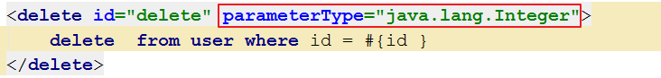
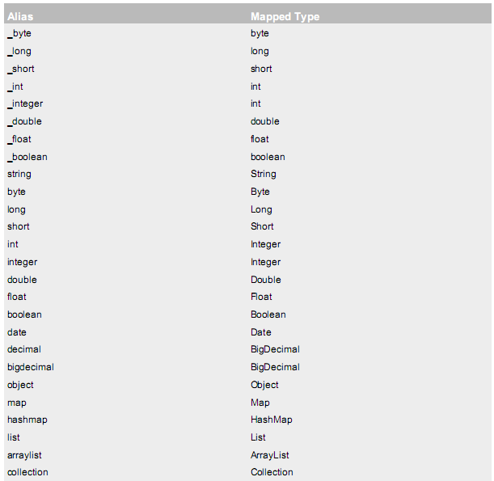
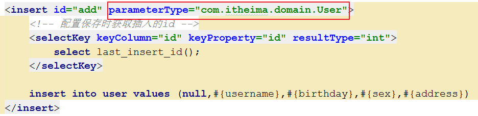
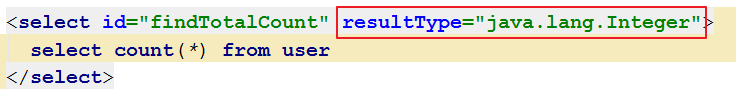
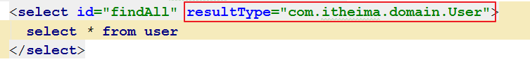
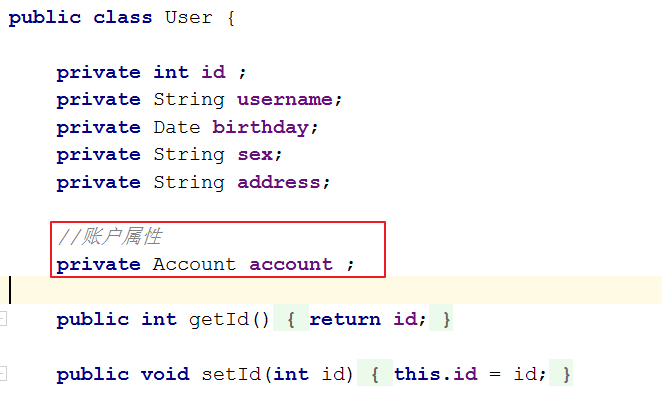
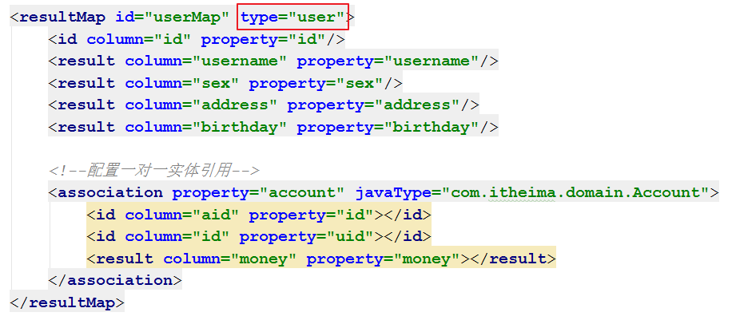

# 今日内容介绍

<extoc></extoc>

# Mybatis的CRUD操作(掌握)
## 准备功能(掌握)
### Mybatis开发环境搭建(掌握)
    1. 创建项目导坐标
        mysql驱动   mybatis的坐标   log4j   junit4.10
    2. 创建pojo实体类
    3. 创建mapper接口
    4. 创建mybatis核心配置文件`SqlMapConfig.xml`
    5. 创建mybatis的`mapper.xml`映射文件

### 测试类模板编写(掌握)
```java
/**
 * UserDao测试类
 */
public class UserDaoTest {

    private SqlSession session ;
    private InputStream is ;
    private UserDao userDao ;

    @Before
    public void init()  throws IOException {
        //1. 创建sqlSessionBuilder构造者对象
        SqlSessionFactoryBuilder builder = new SqlSessionFactoryBuilder();

        //2. 创建SqlSessionFactory对象
        //2.1 加载配置文件
        is = Resources.getResourceAsStream("SqlMapConfig.xml");
        //2.2 构建SqlSession工厂
        SqlSessionFactory sf = builder.build(is);

        //3. 获取SqlSession对象
        session = sf.openSession();

        //4. 获取mapper类的代理对象
        userDao = session.getMapper(UserDao.class);
    }

    @After
    public  void destroy()throws IOException{
        //提交事物
        session.commit();

        //6. 释放资源
        session.close();
        is.close();
    }

    @Test
    public void testFindAll(){
        //5. 调用执行方法
        List<User> users = userDao.findAll();
        System.out.println(users);
    }
}
```

## 保存操作(C)(掌握)
### 在`UserDao`接口中编写方法(掌握)
```java
/**
 * 添加用户
 * @param user
 */
public void add(User user);
```
### 在`UserDao.xml`中编写添加SQL语句(掌握)
```xml
<insert id="add" parameterType="com.itheima.domain.User">
    insert into user values (null,#{username},#{birthday},#{sex},#{address})
</insert>
```

#### 配置返回新增数据的主键值
```
新增用户后,同时还要返回当前新增用户的id值,因为id是由数据库的自动增长来实现的,所以就相当于我们要在新增后将自动增长auto_increment的值返回.
```
##### 配置
```xml
<insert id="add" parameterType="com.itheima.domain.User">
    <!-- 配置保存时获取插入的id -->
    <selectKey keyColumn="id" keyProperty="id" resultType="int">
        select last_insert_id();
    </selectKey>

    insert into user values (null,#{username},#{birthday},#{sex},#{address})
</insert>
```

### 测试(掌握)
```java
@Test
public void testAdd(){
    //创建用户对象
    User user = new User();
    user.setUsername("zhangsan");
    user.setAddress("金融港");
    user.setSex("男");
    user.setBirthday(new Date());

    //调用执行方法
    userDao.add(user);
    //获取自动生成的主键值
    int id = user.getId();
    System.out.println(id);
}
```


## 更新操作(U)(掌握)
### 在`UserDao`接口中编写方法(掌握)
```java
/**
 * 更新--根据用户id进行更新所有字段
 * 注意:如果字段没有值,将会被更新为null
 * @param user
 */
public void update(User user);
```
### 在`UserDao.xml`中编写添加SQL语句(掌握)
```XML
<update id="update" parameterType="com.itheima.domain.User">
    update  user  set username = #{username },birthday = #{birthday},sex = #{sex},address=#{address} where id = #{id}
</update>
```
### 编写测试方法(掌握)
```java
@Test
public void testUpdate(){
    //创建用户对象
    User user = new User();
    user.setId(51);
    user.setUsername("洪七公");
    user.setAddress("金融港");
    user.setSex("男");
    user.setBirthday(new Date());

    //调用执行方法
    userDao.update(user);

}
```

## 删除操作(D)(掌握)
### 在`UserDao`接口中编写方法(掌握)
```java
/**
 * 根据id删除用户
 * @param id
 */
public void delete(Integer id);
```
### 在`UserDao.xml`中编写添加SQL语句(掌握)
```xml
<delete id="delete" parameterType="java.lang.Integer">
    delete  from user where id = #{id }
</delete>
```
### 编写测试方法(掌握)
```java
@Test
public void testDelete(){
    //调用执行方法
    userDao.delete(51);
}
```

## 查询操作(R)(掌握)
### 查询一条数据(掌握)
#### 在`UserDao`接口中编写方法
```java
/**
 * 查询一条数据
 * @param id
 */
public User findById(Integer id);
```
#### 在`UserDao.xml`中编写添加SQL语句
```xml
<select id="findById" resultType="com.itheima.domain.User" parameterType="java.lang.Integer">
  select * from user where id = #{id }
</select>
```
#### 编写测试方法
```java
@Test
public void testFindById(){
    //调用执行方法
    User user = userDao.findById(48);
    System.out.println(user);
}
```

### 模糊查询(掌握)
#### 在`UserDao`接口中编写方法
```java
/**
 * 根据用户名,模糊查询用户信息
 * @param name
 * @return
 */
public List<User>  findLikeName(String name);
```
#### 在`UserDao.xml`中编写添加SQL语句
```xml
<select id="findLikeName" resultType="com.itheima.domain.User" parameterType="java.lang.String">
  <!--底层使用字符串拼接,不建议使用-->
  <!--select * from user where username like '%${value }%'-->

  <!--底层使用预编译sql语句,建议使用-->
  select * from user where username like #{username }
</select>
```
#### 编写测试方法
```java
@Test
public void testFindLikeName(){
    //调用执行方法
    //List<User> list = userDao.findLikeName("王"); //底层使用字符串拼接,不建议使用
    List<User> list = userDao.findLikeName("%王%"); //底层使用预编译sql语句,建议使用
    System.out.println(list);
}
```

### 查询返回单行单列数据(掌握)
#### 在`UserDao`接口中编写方法
```java
/**
 * 查询所有用户数量
 * @return
 */
public int findTotalCount();
```
#### 在`UserDao.xml`中编写添加SQL语句
```xml
<select id="findTotalCount" resultType="java.lang.Integer" >
  select count(*) from user
</select>
```
#### 编写测试方法
```java
@Test
public void testFindTotalCount(){
    //调用执行方法
    int count = userDao.findTotalCount();
    System.out.println(count);
}
```

# Mybatis的传入参数与返回结果(掌握)
## Mybatis的传入参数类型(掌握)

我们在上一章节中已经介绍了SQL语句传参,使用标签的parameterType属性来设定.

该属性的取值可以是基本类型,引用类型（例如:String类型）,还可以是实体类类型（POJO类）,同时也可以使用实体类的包装类.

### 参数类型为基本类型及引用类型(掌握)

  


    基本类型和String我们可以直接写类型名称,也可以使用包名.类名的方式,例如：java.lang.String.

    原因是因为mybaits在加载时已经把常用的数据类型注册了别名,从而我们在使用时可以不写包名.

  


### 参数类型为实体类类型(POJO类)(掌握)

  

    实体类类型,目前我们只能使用全限定类名.

    mybaits在加载时已经把常用的数据类型注册了别名,从而我们在使用时可以不写包名.

    而实体类并没有注册别名,所以必须写全限定类名.

### 参数类型为实体类的包装类(掌握)

    开发中通过pojo传递查询条件 ,查询条件是综合的查询条件,不仅包括用户查询条件还包括其它的查询条件（比如将用户购买商品信息也作为查询条件）,

    这时可以使用包装对象传递输入参数. Pojo类中包含pojo.

    需求：根据用户名查询用户信息,查询条件放到QueryVo的user属性中.

#### 编写pojo的包装类QueryVo
```java
package com.itheima.domain;

/**
 * 查询用户的包装类
 */
public class QueryVo {

    private User user;

    public User getUser() {
        return user;
    }

    public void setUser(User user) {
        this.user = user;
    }
}
```

#### 在`UserDao`接口中编写方法
```java
/**
 * 根据pojo包装类查询用户
 * @param queryVo
 * @return
 */
public List<User> findByVo(QueryVo queryVo);
```

#### 在`UserDao.xml`中编写添加SQL语句
```XML
<select id="findByVo" resultType="com.itheima.domain.User" parameterType="com.itheima.domain.QueryVo">
  select * from user where username like #{user.username }
</select>
```

#### 编写测试代码
```Java
@Test
public void testFindByVo(){
    //创建pojo包装类
    QueryVo queryVo = new QueryVo();
    User user = new User();
    user.setUsername("%王%");
    queryVo.setUser(user);

    //调用执行方法
    List<User> users = userDao.findByVo(queryVo);
    System.out.println(users);
}
```

## Mybatis的返回结果类型(掌握)

我们在上一章节中已经介绍了SQL语句返回结果类型,resultType属性可以指定结果集的类型,它支持基本类型和实体类类型.

需要注意的是,它和parameterType一样,如果注册过类型别名的,可以直接使用别名.没有注册过的必须使用全限定类名.

### 返回结果为基本类型(掌握)
  

### 返回结果为实体(POJO)类型(掌握)
  

### resultMap结果类型(掌握)

    当使用pojo类型和pojo列表类型作为输出类型的时候有个前提条件就是pojo中的属性名称必须和数据表中的字段名一致.

    如果我们查询出来的数据是由多张表组合而来的,或查询出来的数据有别名和pojo中的名称不对应,此时要怎样输出结果？


     方式一：修改pojo类中的属性与数据表查询出来属性一致,但此种方式改动较大如果在其他地方使用了该pojo将会报错(不推荐)

     方式二：使用resultMap建立对应关系

         resultMap标签可以建立查询的列名和实体类的属性名称不一致时建立对应关系.从而实现封装.

         在select标签中使用resultMap属性指定引用即可.

         同时resultMap可以实现将查询结果映射为复杂类型的pojo,比如在查询结果映射对象中包括pojo和list实现一对一查询和一对多查询.

    例如:查询用户及用户的账户信息,可以使用ResultMap对结果进行封装,代码如下:

#### 在数据库创建账户表
```sql
DROP TABLE IF EXISTS `account`;

CREATE TABLE `account` (
  `ID` int(11) NOT NULL COMMENT '编号',
  `UID` int(11) default NULL COMMENT '用户编号',
  `MONEY` double default NULL COMMENT '金额',
  PRIMARY KEY  (`ID`),
  KEY `FK_Reference_8` (`UID`),
  CONSTRAINT `FK_Reference_8` FOREIGN KEY (`UID`) REFERENCES `user` (`id`)
) ENGINE=InnoDB DEFAULT CHARSET=utf8;

insert  into `account`(`ID`,`UID`,`MONEY`) values (1,41,1000),(2,45,1000),(3,41,2000);
```

#### 创建封装数据的实体类`UserAccount.java`
```java
/**
 * 用户及账户信息封装实体类
 */
public class UserAccount {
    //用户表
    private int id ;
    private String username;
    private Date birthday;
    private String sex;
    private String address;
    //账户表
    private double money;  

    public int getId() {
        return id;
    }

    public void setId(int id) {
        this.id = id;
    }

    public String getUsername() {
        return username;
    }

    public void setUsername(String username) {
        this.username = username;
    }

    public Date getBirthday() {
        return birthday;
    }

    public void setBirthday(Date birthday) {
        this.birthday = birthday;
    }

    public String getSex() {
        return sex;
    }

    public void setSex(String sex) {
        this.sex = sex;
    }

    public String getAddress() {
        return address;
    }

    public void setAddress(String address) {
        this.address = address;
    }

    public double getMoney() {
        return money;
    }

    public void setMoney(double money) {
        this.money = money;
    }
}
```

#### 在`UserDao`接口中编写方法
```java
/**
 * 获取用户及账户信息
 * @param id
 * @return
 */
UserAccount findUserAccountById(int id);
```

#### 在`UserDao.xml`中编写添加resultMap标签
```xml
<!--
建立UserAccount实体和查询结果集的对应关系
    type属性：指定实体类的全限定类名
    id属性：给定一个唯一标识,是给查询select标签引用用的.

子标签:
    id标签：用于指定主键字段
    result标签：用于指定非主键字段
        column属性：用于指定数据库列名
        property属性：用于指定实体类属性名称
-->
<resultMap id="userAccountMap" type="com.itheima.domain.UserAccount">
    <id column="id" property="id"/>
    <result column="username" property="username"/>
    <result column="sex" property="sex"/>
    <result column="address" property="address"/>
    <result column="birthday" property="birthday"/>
    <result column="money" property="money"></result>
</resultMap>
```

#### 在`UserDao.xml`中编写添加SQL语句
```xml
<!--
    返回结果集使用resultMap属性指定映射的resultMap标签
-->
<select id="findUserAccountById" parameterType="java.lang.Integer" resultMap="userAccountMap">
  select  u.*,a.id aid,a.MONEY from user u inner  join account a on u.id = a.UID where u.id = #{id }
</select>
```

#### 编写测试代码
```java
@Test
public void testFindUserAccountById(){
    //调用执行方法
    UserAccount ua = userDao.findUserAccountById(41);
    System.out.println(ua);
}
```

#### 总结
    以上方式需要重新定一个封装数据的pojo类,显的比较麻烦,我们如果不希望新建封装数据的实体类,那么可以使用关系映射进行数据封装

### resultMap结果类型--关系映射(理解)
#### 创建账户信息实体类`Accout.java`
```java
package com.itheima.domain;

/**
 * 用户账户信息实体
 */
public class Account {

    private  int id ;

    private int uid ;

    private double money ;

    public int getId() {
        return id;
    }

    public void setId(int id) {
        this.id = id;
    }

    public int getUid() {
        return uid;
    }

    public void setUid(int uid) {
        this.uid = uid;
    }

    public double getMoney() {
        return money;
    }

    public void setMoney(double money) {
        this.money = money;
    }

    @Override
    public String toString() {
        return "Accout{" +
                "id=" + id +
                ", uid=" + uid +
                ", money=" + money +
                '}';
    }
}
```
#### 在`User.java`类中添加`account`属性,提供getter和setter方法



#### 在`UserDao`接口中编写方法
```java

/**
 * 获取用户信息,包含账户信息
 * @param id
 * @return
 */
public User findUserWithAccountById(int id);
```
#### 在`UserDao.xml`中修改resultMap标签
```xml
<resultMap id="userMap" type="com.itheima.domain.User">
    <id column="id" property="id"/>
    <result column="username" property="username"/>
    <result column="sex" property="sex"/>
    <result column="address" property="address"/>
    <result column="birthday" property="birthday"/>

    <!--配置一对一实体引用-->
    <association property="account" javaType="com.itheima.domain.Account">
        <id column="aid" property="id"></id>
        <id column="id" property="uid"></id>
        <result column="money" property="money"></result>
    </association>
</resultMap>
```

#### 在`UserDao.xml`中编写添加SQL语句
```xml
<select id="findUserWithAccountById" parameterType="java.lang.Integer" resultMap="userMap">
  select  u.*,a.id aid,a.MONEY from user u inner  join account a on u.id = a.UID where u.id = #{id }
</select>
```

#### 编写测试代码
```java
@Test
public void testFindUserWithAccountById(){
    //调用执行方法
    User user = userDao.findUserWithAccountById(41);
    System.out.println(user);
}
```

# Mybatis基于实现类的DAO开发(熟悉)

使用Mybatis开发Dao通常有两个方法,即原始Dao开发方式和Mapper接口开发方式.

而现在主流的开发方式是接口代理开发方式,这种方式总体上更加简便.我们的课程讲解也主要以接口代理开发方式为主.

在第二章节已经给大家介绍了基于Mapper接口方式的dao开发

现在给大家介绍一下基于传统编写Dao实现类的开发方式.此种方式大家会用即可,不用花太多精力在上面.

## 示例代码(熟悉)
### 编写数据访问层接口`UserDao.java`(熟悉)
```java
public interface UserDao {

    /**
     * 查询所有用户
     * @return
     */
    public List<User> findAll();

    /**
     * 添加用户
     * @param user
     */
    public void add(User user);

    /**
     * 更新--根据用户id进行更新所有字段
     * 注意:如果字段没有值,将会被更新为null
     * @param user
     */
    public void update(User user);

    /**
     * 根据id删除用户
     * @param id
     */
    public void delete(Integer id);

    /**
     * 查询一条数据
     * @param id
     */
    public User findById(Integer id);

    /**
     * 根据用户名,模糊查询用户信息
     * @param name
     * @return
     */
    public List<User> findLikeUsername(String name);

    /**
     * 查询所有用户数量
     * @return
     */
    public int findTotalCount();

    /**
     * 根据查询条件查询用户
     * @param queryVo
     * @return
     */
    public List<User> findByVo(QueryVo queryVo);

    /**
     * 获取用户及账户信息
     * @param id
     * @return
     */
    UserAccount findUserAccountById(int id);

    /**
     * 获取用户信息,包含账户信息
     * @param id
     * @return
     */
    public User findUserWithAccountById(int id);
}
```

### 编写数据访问层实现类(熟悉)
```java
public class UserDaoImpl implements UserDao {

    private SqlSession session;

    public UserDaoImpl(SqlSession sqlSession) {
        this.session = sqlSession;
    }

    @Override
    public List<User> findAll() {
        //执行操作
        List<User> users = session.selectList("com.itheima.dao.UserDao.findAll");
        return  users ;
    }

    @Override
    public void add(User user) {
        //执行操作
        session.insert("com.itheima.dao.UserDao.add",user);
    }

    @Override
    public void update(User user) {
        //执行操作
        session.update("com.itheima.dao.UserDao.update",user);
    }

    @Override
    public void delete(Integer id) {
        //执行操作
        session.delete("com.itheima.dao.UserDao.delete", id);
    }

    @Override
    public User findById(Integer id) {
        //执行操作
        User user = session.selectOne("com.itheima.dao.UserDao.findById", id);

        return user;
    }

    @Override
    public List<User> findLikeUsername(String name) {
        //执行操作
        List<User> users = session.selectList("com.itheima.dao.UserDao.findLikeUsername", name);

        return users;
    }

    @Override
    public int findTotalCount() {
        //执行操作
        Integer count = session.selectOne("com.itheima.dao.UserDao.findTotalCount");

        return count;
    }

    @Override
    public List<User> findByVo(QueryVo queryVo) {
        //执行操作
        List<User> users = session.selectList("com.itheima.dao.UserDao.findByVo", queryVo);

        return users;
    }

    @Override
    public UserAccount findUserAccountById(int id) {
        //执行操作
        UserAccount ua = session.selectOne("com.itheima.dao.UserDao.findUserAccountById",id);

        return ua;
    }

    @Override
    public User findUserWithAccountById(int id) {
        //执行操作
        User user = session.selectOne("com.itheima.dao.UserDao.findUserWithAccountById",id);

        return user;
    }
}
```

### 编写持久层映射配置(熟悉)
```xml
<?xml version="1.0" encoding="UTF-8"?>
<!DOCTYPE mapper PUBLIC "-//mybatis.org//DTD Mapper 3.0//EN"
        "http://mybatis.org/dtd/mybatis-3-mapper.dtd">
<mapper namespace="com.itheima.dao.UserDao">
    <select id="findAll" resultType="com.itheima.domain.User">
      select * from user
    </select>

    <select id="findById" resultType="com.itheima.domain.User" parameterType="java.lang.Integer">
      select * from user where id = #{id }
    </select>

    <select id="findLikeUsername" resultType="com.itheima.domain.User" parameterType="java.lang.String">
      select * from user where username like #{username }
    </select>

    <select id="findTotalCount" resultType="java.lang.Integer">
      select count(*) from user
    </select>

    <select id="findByVo" resultType="com.itheima.domain.User" parameterType="com.itheima.domain.QueryVo">
      select * from user where username like #{user.username }
    </select>

    <!--
    建立UserAccount实体和查询结果集的对应关系
        type属性：指定实体类的全限定类名
        id属性：给定一个唯一标识,是给查询select标签引用用的.

    子标签:
        id标签：用于指定主键字段
        result标签：用于指定非主键字段
            column属性：用于指定数据库列名
            property属性：用于指定实体类属性名称
    -->

    <resultMap id="userAccountMap" type="com.itheima.domain.UserAccount">
        <id column="id" property="id"/>
        <result column="username" property="username"/>
        <result column="sex" property="sex"/>
        <result column="address" property="address"/>
        <result column="birthday" property="birthday"/>
        <result column="money" property="money"></result>
    </resultMap>

    <resultMap id="userMap" type="com.itheima.domain.User">
        <id column="id" property="id"/>
        <result column="username" property="username"/>
        <result column="sex" property="sex"/>
        <result column="address" property="address"/>
        <result column="birthday" property="birthday"/>

        <!--配置一对一实体引用-->
        <association property="account" javaType="com.itheima.domain.Account">
            <id column="aid" property="id"></id>
            <id column="id" property="uid"></id>
            <result column="money" property="money"></result>
        </association>
    </resultMap>

    <!--
        返回结果集使用resultMap属性指定映射的resultMap标签
    -->
    <select id="findUserAccountById" parameterType="java.lang.Integer" resultMap="userAccountMap">
      select  u.*,a.id aid,a.MONEY from user u inner  join account a on u.id = a.UID where u.id = #{id }
    </select>

    <select id="findUserWithAccountById" parameterType="java.lang.Integer" resultMap="userMap">
      select  u.*,a.id aid,a.MONEY from user u inner  join account a on u.id = a.UID where u.id = #{id }
    </select>


    <insert id="add" parameterType="com.itheima.domain.User">
        <!-- 配置保存时获取插入的id -->
        <selectKey keyColumn="id" keyProperty="id" resultType="int">
            select last_insert_id();
        </selectKey>

        insert into user values (null,#{username},#{birthday},#{sex},#{address})
    </insert>

    <update id="update" parameterType="com.itheima.domain.User">
        update  user  set username = #{username },birthday = #{birthday},sex = #{sex},address=#{address} where id = #{id}
    </update>

    <delete id="delete" parameterType="java.lang.Integer">
        delete  from user where id = #{id }
    </delete>

</mapper>
```
### 编写测试类(熟悉)
```java
/**
 * UserDao测试类
 */
public class UserDaoTest {

    private SqlSession session ;
    private InputStream is ;
    private UserDao userDao ;

    @Before
    public void init()  throws IOException {
        //1. 创建sqlSessionBuilder构造者对象
        SqlSessionFactoryBuilder builder = new SqlSessionFactoryBuilder();

        //2. 创建SqlSessionFactory对象
        //2.1 加载配置文件
        is = Resources.getResourceAsStream("SqlMapConfig.xml");
        //2.2 构建SqlSession工厂
        SqlSessionFactory sf = builder.build(is);

        //3. 获取SqlSession对象
        session = sf.openSession();

        //4. 获取mapper类的代理对象
        //userDao = session.getMapper(UserDao.class);
        userDao = new UserDaoImpl(session);
    }

    @After
    public  void destroy()throws IOException{
        //提交事物
        session.commit();
        //6. 释放资源
        session.close();
        is.close();
    }

    @Test
    public void testFindAll(){
        //5. 调用执行方法
        List<User> users = userDao.findAll();
        System.out.println(users);
    }

    @Test
    public void testAdd(){
        //创建用户对象
        User user = new User();
        user.setUsername("lisi");
        user.setAddress("金融港");
        user.setSex("男");
        user.setBirthday(new Date());

        //调用执行方法
        userDao.add(user);
        //获取自动生成的主键值
        int id = user.getId();
        System.out.println(id);

    }


    @Test
    public void testUpdate(){
        //创建用户对象
        User user = new User();
        user.setId(54);
        user.setUsername("洪七公");
        user.setAddress("金融港");
        user.setSex("男");
        user.setBirthday(new Date());

        //调用执行方法
        userDao.update(user);

    }

    @Test
    public void testDelete(){
        //调用执行方法
        userDao.delete(53);
    }

    @Test
    public void testFindById(){
        //调用执行方法
        User user = userDao.findById(54);
        System.out.println(user);
    }

    @Test
    public void testFindLikeName(){
        //调用执行方法
        List<User> list = userDao.findLikeUsername("%王%");
        System.out.println(list);
    }


    @Test
    public void testFindTotalCount(){
        //调用执行方法
        int count = userDao.findTotalCount();
        System.out.println(count);
    }

    @Test
    public void testFindByVo(){

        QueryVo queryVo = new QueryVo();
        User user = new User();
        user.setUsername("%王%");
        queryVo.setUser(user);

        //调用执行方法
        List<User> users = userDao.findByVo(queryVo);
        System.out.println(users);
    }

    @Test
    public void testFindUserAccountById(){
        //调用执行方法
        UserAccount ua = userDao.findUserAccountById(41);
        System.out.println(ua);
    }

    @Test
    public void testFindUserWithAccountById(){
        //调用执行方法
        User user = userDao.findUserWithAccountById(41);
        System.out.println(user);
    }
}
```

## Mybatis执行CRUD源码流程分析(理解)

参考视频及截图自己斟酌斟酌


# `SqlMapConfig.xml`配置文件(掌握)

## SqlMapConfig.xml中配置的内容和顺序(掌握)

MyBatis 的配置文件包含了会深深影响 MyBatis 行为的设置（settings）和属性（properties）信息.文档的顶层结构如下：

    configuration 配置
        properties 属性
        settings 设置
        typeAliases 类型别名
        typeHandlers 类型处理器
        objectFactory 对象工厂
        plugins 插件
        environments 环境
            environment 环境变量
                transactionManager 事务管理器
                dataSource 数据源
        databaseIdProvider 数据库厂商标识
        mappers 映射器

## properties标签(掌握)

在使用properties标签配置时,我们可以采用两种方式指定属性配置

### 第一种:静态属性值(掌握)
```xml
<properties>
  <property name="jdbc.driver" value="com.mysql.jdbc.Driver"/>
  <property name="jdbc.url" value="jdbc:mysql://localhost:3306/eesy"/>
  <property name="jdbc.username" value="root"/>
  <property name="jdbc.password" value="1234"/>
</properties>
```

### 第二种:动态属性值(掌握)
#### 在classpath下定义db.properties文件
```
jdbc.driver=com.mysql.jdbc.Driver
jdbc.url=jdbc:mysql://localhost:3306/mybatis_01
jdbc.username=root
jdbc.password=1234
```

#### properties标签配置,引用`db.properties`中的数据
```xml
<!-- 配置连接数据库的信息
    resource属性：用于指定properties配置文件的位置,要求配置文件必须在类路径下 resource="jdbcConfig.properties"
    url属性：
        URL： Uniform Resource Locator 统一资源定位符 http://localhost:8080/mystroe/CategoryServlet URL 协议 主机 端口 URI
        URI：Uniform Resource Identifier 统一资源标识符 /mystroe/CategoryServlet 它是可以在web应用中唯一定位一个资源的路径
-->
<properties resource="db.properties"></properties>
```

#### 引用`db.properties`中的数据库配置信息
```xml
<environment id="mysql">
    <transactionManager type="JDBC"></transactionManager>
    <dataSource type="POOLED">
        <property name="driver" value="${jdbc.driver}"></property>
        <property name="url" value="${jdbc.url}"></property>
        <property name="username" value="${jdbc.username}"></property>
        <property name="password" value="${jdbc.password}"></property>
    </dataSource>
</environment>
```

## typeAliases 类型别名(掌握)
```xml
<typeAliases>
    <!-- 单个别名定义 -->
    <typeAlias alias="user" type="com.itheima.domain.User"/>
    <!-- 批量别名定义,扫描整个包下的类,别名为类名（首字母大写或小写都可以） -->
    <package name="com.itheima.domain"/>
</typeAliases>
```

每一个在包 com.itheima.domain 中的 Java Bean,在没有注解的情况下,会使用 Bean 的首字母小写的非限定类名来作为它的别名.

比如 domain.blog.Author 的别名为 author；

若有注解,则别名为其注解值.看下面的例子：

```java
@Alias("user")
public class User {
  ......
}
```



## mappers映射器(掌握)

我们在使用Mybatis开发时,会使用mapper映射配置文件定义SQL语句.之后我们需要告诉 MyBatis 到哪里去找到这些语句.

Java 在自动查找这方面没有提供一个很好的方法,所以最佳的方式是告诉 MyBatis 到哪里去找映射文件.

我们可以使用相对于类路径的资源引用, 或完全限定资源定位符（包括 file:/// 的 URL）,或类名和包名等.

### 配置`mapper.xml`映射配置文件路径(掌握)
```xml
<!-- 使用相对于类路径的资源引用 -->
<mappers>
    <mapper resource="com/itheima/dao/UserDao.xml"></mapper>
</mappers>
```

### 配置`mapper`接口路径(掌握)
```xml
<mappers>
    <!--此种方法要求mapper接口名称和mapper映射文件名称相同，且放在同一个目录中。-->
    <mapper class="com.itheima.dao.UserDao"></mapper>
</mappers>
```

### 扫描包下的所有mapper接口(掌握)
```xml
<mappers>
    <!--此种方法要求mapper接口名称和mapper映射文件名称相同，且放在同一个目录中。-->
    <package name="com.itheima.dao"></package>
</mappers>
```
