# 今日内容介绍

<extoc></extoc>

# Mybatis延迟加载策略(理解)
## 什么是延迟加载(理解)
延迟加载： 就是在需要用到数据时才进行加载,不需要用到数据时就不加载数据.延迟加载也称懒加载.

立即加载：不管用不用,只要一调用马上发起查询

## 需求场景介绍(理解)
查询账户(Account)信息并且关联查询用户(User)信息.

先查询账户(Account)信息,当我们需要查询用户(User)信息时再查询用户(User)信息.

把对用户(User)信息的按需去查询就是延迟加载.

mybatis第三天实现多表操作时,我们使用了resultMap来实现一对一,一对多,多对多关系的操作.主要是通过association、collection实现一对一及一对多映射.

association、collection具备延迟加载功能.

## Mybatis环境搭建(理解)
### 创建maven项目(理解)
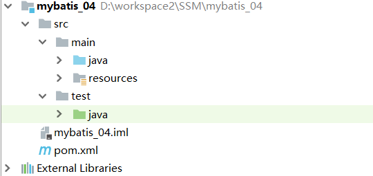

### 创建pojo实体类(理解)

#### User实体类
```java
public class User {

    private int id ;
    private String username;
    private Date birthday;
    private String sex;
    private String address;

    //账户属性 , 一个用户有多个账户
    private List<Account> accounts ;

    public int getId() {
        return id;
    }

    public void setId(int id) {
        this.id = id;
    }

    public String getUsername() {
        return username;
    }

    public void setUsername(String username) {
        this.username = username;
    }

    public Date getBirthday() {
        return birthday;
    }

    public void setBirthday(Date birthday) {
        this.birthday = birthday;
    }

    public String getSex() {
        return sex;
    }

    public void setSex(String sex) {
        this.sex = sex;
    }

    public String getAddress() {
        return address;
    }

    public void setAddress(String address) {
        this.address = address;
    }

    public List<Account> getAccounts() {
        return accounts;
    }

    public void setAccounts(List<Account> accounts) {
        this.accounts = accounts;
    }

    @Override
    public String toString() {
        return "User{" +
                "id=" + id +
                ", username='" + username + '\'' +
                ", birthday=" + birthday +
                ", sex='" + sex + '\'' +
                ", address='" + address + '\'' +
                ", accounts=" + accounts +
                '}';
    }
}
```

#### 账户实体类
```java
package com.itheima.domain;

/**
 * 用户账户信息实体
 */
public class Account {

    private  int id ;

    private int uid ;

    private double money ;

    private User user ;

    public int getId() {
        return id;
    }

    public void setId(int id) {
        this.id = id;
    }

    public int getUid() {
        return uid;
    }

    public void setUid(int uid) {
        this.uid = uid;
    }

    public double getMoney() {
        return money;
    }

    public void setMoney(double money) {
        this.money = money;
    }

    public User getUser() {
        return user;
    }

    public void setUser(User user) {
        this.user = user;
    }

    @Override
    public String toString() {
        return "Account{" +
                "id=" + id +
                ", uid=" + uid +
                ", money=" + money +
                '}';
    }
}
```
**为了能看到懒加载效果,注意toString不要输出user属性**

### 引入配置文件(理解)
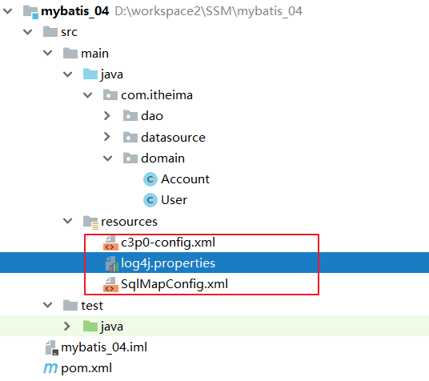

## 使用association实现延迟加载(理解)

### 编写账户的Dao接口`AccountDao.java`及映射文件`AccountDao.xml`(理解)
#### 编写账户的Dao接口`AccountDao.java`
```java
public interface AccountDao {

    /**
     * 查询所有账户信息
     * @return
     */
    public List<Account> findAll();
}
```

#### 编写账户的SQL映射文件`AccountDao.xml`
```xml
<!-- 建立对应关系 -->
<resultMap type="account" id="AccountUserMap">
    <id column="aid" property="id"/>
    <result column="uid" property="uid"/>
    <result column="money" property="money"/> <!-- 它是用于指定从表方的引用实体属性的 -->
    <association property="user" javaType="user" select="com.itheima.dao.UserDao.findById"
                 column="uid">
    </association>
</resultMap>

<!--定义SQL语句-->
<select id="findAll" resultMap="AccountUserMap">
    select  * from account
</select>
```

### 编写用户的Dao接口`UserDao.java`及映射文件`UserDao.xml`(理解)
#### 编写用户的Dao接口`UserDao.java`
```java
public interface UserDao {

    /**
     * 查询根据ID查询用户信息
     * @param uid
     * @return
     */
    public User findById(int uid);
}
```

#### 编写用户的SQL映射文件`UserDao.xml`
```xml
<!--定义查询的sql语句-->
<select id="findById" resultMap="User"  parameterType="int" >
    select *  from  user  where id = #{id }
</select>
```

### 编写测试类测试----立即加载(理解)
```java
@Test
public void findAll() {
    List<Account> accounts = accountDao.findAll();
    for (Account account : accounts) {
        System.out.println("账户信息:"+account);
        System.out.println("用户信息:"+account.getUser());
        System.out.println("-------------------------");
    }
}
```

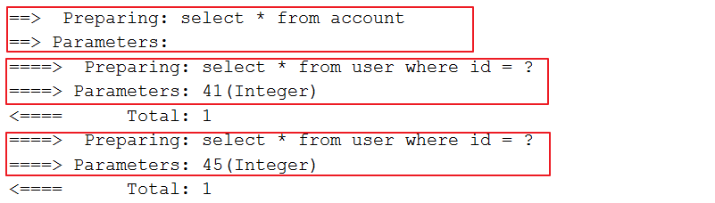

根据日志可以看到,此种方式配置Mybatis走的是立即加载,即一次性发送多条SQL语句加载所有数据

### 开启Mybatis的延迟加载策略(理解)

在`SqlMapConfig.xml`配置文件中开启全局的懒加载配置
```xml
<settings>
    <!--
    延迟加载的全局开关. 当开启时,所有关联对象都会延迟加载.
    true    开启懒加载
    false   关闭懒加载
    -->
    <setting name="lazyLoadingEnabled" value="true"/>

    <!--
    积极延迟加载的全局开关 .
    true 代表只要访问延迟加载对象的任意一个属性,都会导致这个延迟加载对象的完全加载
    false 每个属性会按需加载(参考lazyLoadTriggerMethods).
    -->
    <setting name="aggressiveLazyLoading" value="false"/>

    <!--
    指定哪个对象的方法触发一次延迟加载
    在mybatis中,默认情况下只要调用了equals,clone,hashCode,toString这几个方法,都会对对象进行完全加载
    因为这里我需要调用toString方法,查看返回的数据,又不想触发完全加载,所有配置了一个hashCode
    -->
    <setting name="lazyLoadTriggerMethods" value="hashCode"/>
</settings>
```

### 重新执行测试(理解)

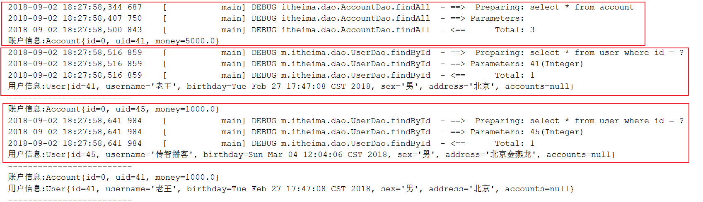

## 使用Collection实现延迟加载(理解)

我们不仅可以在 一对一的<association>节点上配置延迟加载,也可以在一对多的<collection>结点中配置延迟加载策略.

<collection>结点中也有select属性,column属性.

需求： 完成加载用户对象时,查询该用户所拥有的账户信息.

###  编写用户的Dao接口`UserDao.java`及映射文件`UserDao.xml`(理解)
#### 编写用户的Dao接口`UserDao.java`
```java
/**
 * 查询所有用户信息
 * @return
 */
public List<User> findAll();
```
#### 编写用户的映射文件`UserDao.xml`
```xml
<!--定义结果集映射-->
<resultMap id="UserAccountsMap" type="User">
    <id column="id" property="id"></id>
    <result column="username" property="username"></result>
    <result column="birthday" property="birthday"></result>
    <result column="sex" property="sex"></result>
    <result column="address" property="address"></result>

    <!--
        配置一对多映射,一个用户可以有多个账户
    -->
    <collection property="accounts" ofType="Account" select="com.itheima.dao.AccountDao.findById" column="id" >
    </collection>
</resultMap>

<select id="findAll" resultMap="UserAccountsMap" >
    select *  from  user
</select>
```

### 编写账户的Dao接口`AccountDao.java`及映射文件`AccountDao.xml`(理解)
#### 编写账户的Dao接口`AccountDao.java`
```java
/**
 * 根据用户id查询用户的所有账户信息
 * @param uid
 * @return
 */
public List<Account> findByUid(int uid);
```

#### 编写账户的映射文件`AccountDao.xml`

```xml
<select id="findByUid"  parameterType="int" resultType="Account">
    select  * from account where uid = #{uid }
</select>
```

### 编写测试类(理解)
```java
@Test
public void findAll() {
    List<User> users = userDao.findAll();
    for (User user : users) {
        System.out.println("用户信息:"+user);
        System.out.println("账户信息:"+user.getAccounts());
        System.out.println("-----------------------------");
    }
}
```

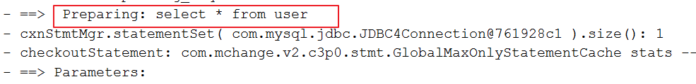

# Mybatis缓存(理解)

缓存就是存在于内存中的临时数据.使用缓存能减少数据库的查询次数, 从而提高性能.但不是所有场合都适用于缓存.

适用场合：经常查询且不经常改变的数据,数据的正确与否对结果影响不大的数据

不适用场合：经常改变的数据,数据的正确与否对结果的影响很大.

Mybatis的缓存分为：一级缓存和二级缓存

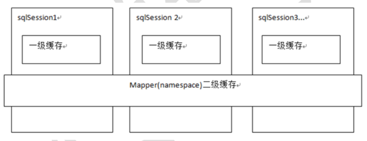

一级缓存:基于`Perpetual Cache`的`HashMap`本地缓存,其存储作用域为`SqlSession`,当`SqlSession` `flush` 或 `close` 之后,该`SqlSession`当中的所有缓存就将清空.

二级缓存:二级缓存与一级缓存其机制相同,默认也是采用`PerpetualCache`,`HashMap`存储,不同在于其存储作用域为 `Mapper(Namespace)`,并且可自定义存储源,如Ehcache.

## Mybatis一级缓存(理解)

一级缓存是SqlSession级别的缓存,只要SqlSession没有flush或close,它就存在.

当我们执行查询之后,查询的结果会同时存入到SqlSession为我们提供一块区域中.

该区域的结构是一个Map.当我们再次查询同样的数据,mybatis会先去sqlsession中查询是否有,有的话直接拿出来用,当SqlSession对象消失时,mybatis的一级缓存也就消失了.


### 测试一级缓存(理解)
```java
@Test
public void findById() {
    User user = userDao.findById(43);
    System.out.println("第一次查询:"+user);
    User user2 = userDao.findById(43);
    System.out.println("第一次查询:"+user2);
}
```

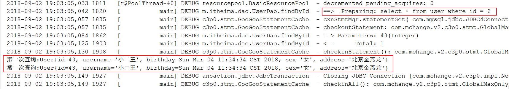

调用了两次dao查询方法,但只执行了一条sql语句,说明第二次查询获得的对象是从缓存中取的,并未执行sql语句

### 测试缓存是存在`SqlSession`中的(理解)
```java
    @Test
    public void findById() {
        User user = userDao.findById(43);
        System.out.println("第一次查询:"+user);

        session.clearCache();//清空session

        User user2 = userDao.findById(43);
        System.out.println("第一次查询:"+user2);
    }
```
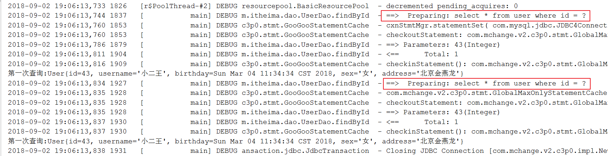

第一次查询执行完毕之后,清空session,执行第二次查询,二次查询执行了二条sql语句,说明第二次查询没有从缓存中获取到数据,重新发了SQL语句查询

### 测试一级缓存的清空(理解)

一级缓存是 `SqlSession` 范围的缓存,当调用`sqlSession`完成`CUD(插入、更新、删除)`操作, 会清空SqlSession中的一级缓存

这样做的目的为了让缓存中存储的是最新的信息,避免脏读.

当然当`SqlSession`关闭,或者我们手动调用`session.clearCache()`也可以清空一级缓存

####  编写用户的Dao接口`UserDao.java`及映射文件`UserDao.xml`
#####  编写用户的Dao接口`UserDao.java`
```java
/**
 * 更新用户信息
 * @param user1
 */
void update(User user1);
```

#####  编写用户的映射文件`UserDao.xml`
```xml
<update id="update">
    update  user  set username = #{username },birthday = #{birthday },sex = #{sex },address = #{address } where id = #{id }
</update>
```

#### 编写测试代码
```java
@Test
public void testClearlCache() {
    //1.根据id查询用户
    User user1 = userDao.findById(41);
    System.out.println(user1);

    //2.更新用户信息
    user1.setUsername("update user clear cache");
    user1.setAddress("北京市海淀区");
    userDao.update(user1);

    //3.再次查询id为41的用户
    User user2 = userDao.findById(41);
    System.out.println(user2);
    System.out.println(user1 == user2);
}
```

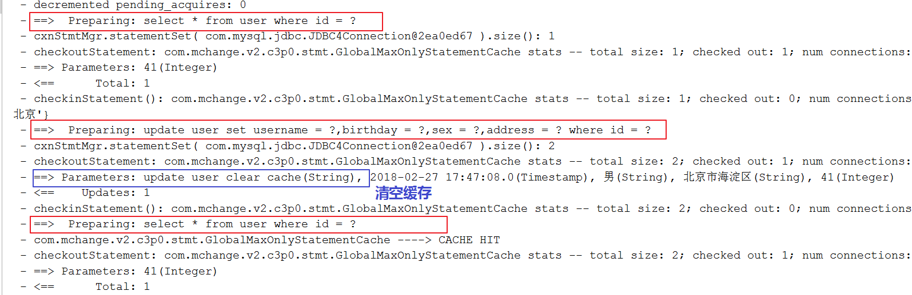

## Mybatis二级缓存(理解)

二级缓存是mapper映射级别的缓存,多个SqlSession去操作同一个Mapper映射的sql语句,多个SqlSession可以共用二级缓存,二级缓存是跨SqlSession的.


首先开启mybatis的二级缓存.

sqlSession1去查询用户信息,查询到用户信息会将查询数据存储到二级缓存中.

sqlSession2去查询与sqlSession1相同的用户信息,首先会去缓存中找是否存在数据,如果存在直接从缓存中取出数据.

如果SqlSession3去执行相同mapper映射下sql,执行commit提交,将会清空该 mapper映射下的二级缓存区域的数据.

### 开启二级缓存(理解)

#### 第一步:在`SqlMapConfig.xml`文件开启二级缓存


#### 第二步:配置相关的Mapper映射文件
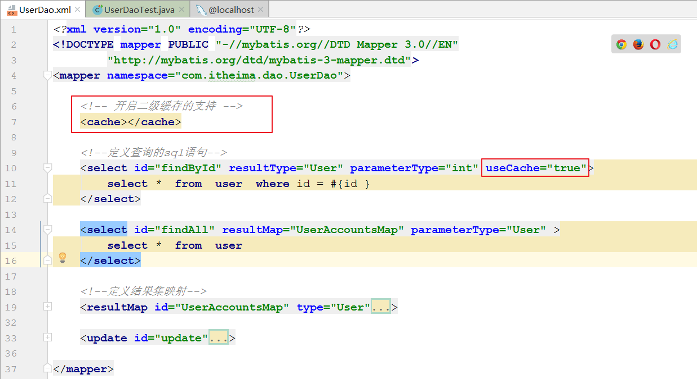

在映射配置文件添加`<cache></cache>`代表开启二级缓存,效果如下:

    映射语句文件中的所有 select 语句将会被缓存.

    映射语句文件中的所有 insert,update 和 delete 语句会刷新缓存.

    缓存会使用 Least Recently Used(LRU,最近最少使用的)算法来收回.

    根据时间表(比如 no Flush Interval,没有刷新间隔), 缓存不会以任何时间顺序 来刷新.

    缓存会存储列表集合或对象(无论查询方法返回什么)的 1024 个引用.

    缓存会被视为是 read/write(可读/可写)的缓存.

所有的这些属性都可以通过缓存元素的属性来修改.比如:

    <cache
    eviction="FIFO"
    flushInterval="60000"
    size="512"
    readOnly="true"/>

eviction:缓存类型

    LRU – 最近最少使用的:移除最长时间不被使用的对象.
    FIFO – 先进先出:按对象进入缓存的顺序来移除它们.
    SOFT – 软引用:移除基于垃圾回收器状态和软引用规则的对象.
    WEAK – 弱引用:更积极地移除基于垃圾收集器状态和弱引用规则的对象

flushInterval:刷新间隔

    可以被设置为任意的正整数,而且它们代表一个合理的毫秒形式的时间段.默认情况是不设置,也就是没有刷新间隔,缓存仅仅调用语句时刷新.

size:引用数目

    可以被设置为任意正整数,要记住你缓存的对象数目和你运行环境的 可用内存资源数目.默认值是 1024.

readOnly:readOnly

    可以被设置为 true 或 false.只读的缓存会给所有调用者返回缓 存对象的相同实例.因此这些对象不能被修改.这提供了很重要的性能优势.可读写的缓存 会返回缓存对象的拷贝(通过序列化) .这会慢一些,但是安全,因此默认是 false.

### 测试二级缓存(理解)
```java
@Test
public void testSecondLevelCache() {
    SqlSession sqlSession1 = sf.openSession();
    UserDao dao1 = sqlSession1.getMapper(UserDao.class);
    User user1 = dao1.findById(41);
    System.out.println(user1);

    //一级缓存消失
    sqlSession1.close();

    SqlSession sqlSession2 = sf.openSession();
    UserDao dao2 = sqlSession2.getMapper(UserDao.class);
    User user2 = dao2.findById(41);
    System.out.println(user2);

    sqlSession2.close();
    System.out.println(user1 == user2);//false  二级缓存缓存的是数据而不是对象,从缓存中获取到对象重新组装成对象返回
}
```

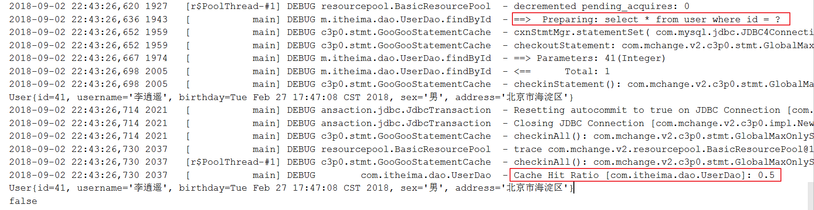

### 注意(理解)

二级缓存缓存的是数据而不是对象,从缓存中获取到对象重新组装成对象返回

所以当我们在使用二级缓存时,所缓存的类一定要实现java.io.Serializable接口,这种就可以使用序列化方式来保存对象.

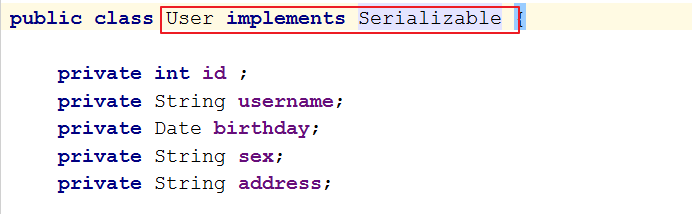


# Mybatis注解开发(熟悉)
## 常用注解说明(熟悉)

mybatis注解就是使用注解代替mapper.xml映射文件,也就是说以后编写dao接口是没有对应的mapper.xml映射文件的.

虽然mybatis有注解功能但官方推荐使用mapper.xml配置方式来开发dao,注解方式大家会用即可

mybatis注解如下:

| 注解 | 功能     |
| :------------- | :--------- |
|   @Insert       |  实现新增 |
|   @Update       |  实现更新 |
|   @Delete       |  实现删除 |
|   @Select       |  实现查询 |
|   @Result       |  实现结果集封装 |
|   @Results      |  可以与@Result 一起使用,封装多个结果集 |
|   @One          | 实现一对一结果集封装  |
|   @Many         | 实现一对多结果集封装  |
|   @SelectProvider|  实现动态SQL映射 |

mybatis针对crud操作一共四个注解：@select、@update、@insert、@update下面我们使用注解来进行CRUD操作

## 环境准备(熟悉)
### 创建maven项目(熟悉)
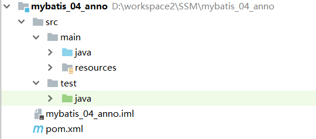

### 创建pojo实体类`User.java`(熟悉)

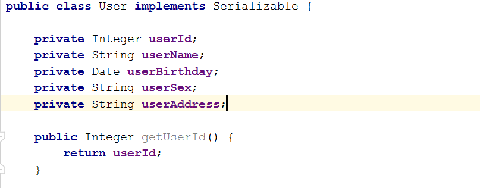

<font color='red'><b>注意:此处我们故意和数据库表的列名不一致。为了方便测试</b></font>

### 引入配置文件(熟悉)
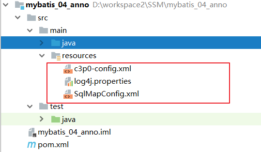

### 修改SqlMapConfig.xml配置(熟悉)
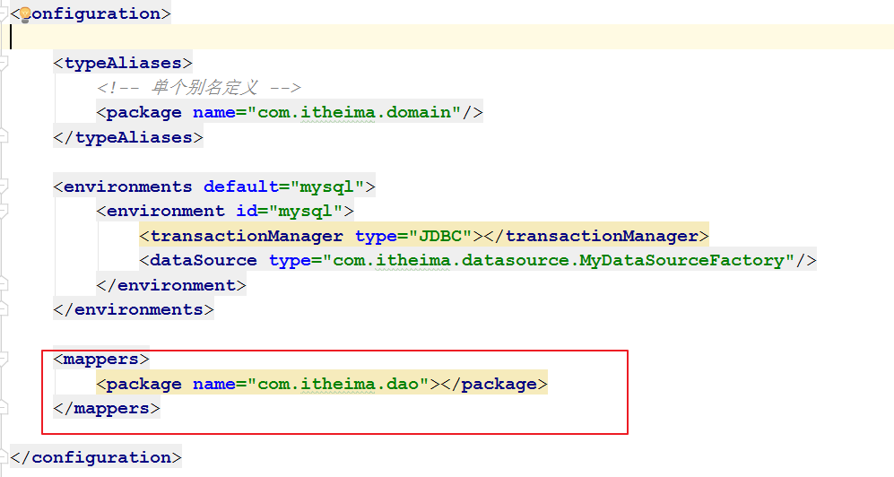

## 使用Mybatis注解完成CRUD(熟悉)
### 使用注解方式开发持久层接口`UserDao.java`(熟悉)
```java
public interface UserDao {

    /**
     * 查询所有用户信息
     *
     * @return
     */
    @Select("select * from user")
    @Results(id = "userMap",
            value = {
                    @Result(id = true, column = "id", property = "userId"),
                    @Result(column = "username", property = "userName"),
                    @Result(column = "sex", property = "userSex"),
                    @Result(column = "address", property = "userAddress"),
                    @Result(column = "birthday", property = "userBirthday")})
    public List<User> findAll();

    /**
     * 查询根据ID查询用户信息
     *
     * @param uid
     * @return
     */
    @Select("select * from user where id = #{uid }")
    @ResultMap("userMap")
    public User findById(int uid);

    /**
     * 插入用户数据
     *
     * @param user
     * @return
     */
    @Insert("insert into user(username,sex,birthday,address)values(#{userName},#{userSex},#{userBirthday},#{userAddress})")
    @SelectKey(keyColumn = "id", keyProperty = "userId", resultType = Integer.class, before = false, statement = {"select last_insert_id()"})
    int add(User user);

    /**
     * 更新用户信息
     *
     * @param user
     */
    @Update("update user set username=#{userName},address=#{userAddress},sex=#{userSex},birthday=#{userBirthday} where id =#{userId} ")
    void update(User user);

    /**
     * 根据用户id删除用户
     *
     * @param id
     * @return
     */
    @Delete("delete from user where id = #{uid} ")
    int deleteById(Integer id);

    /**
     * 查询总数量
     *
     * @return
     */
    @Select("select count(*) from user ")
    int findTotalCount();


    /**
     * 模糊查询
     * @param name
     * @return
     */
    @Select("select * from user where username like #{username} ")
    List<User> findLikeName(String name);
}
```

### 编写测试方法(熟悉)
```java
public class UserDaoTest {

    private SqlSession session;
    private InputStream is;
    private UserDao userDao;

    @Before
    public void init() throws IOException {
        //1. 创建sqlSessionBuilder构造者对象
        SqlSessionFactoryBuilder builder = new SqlSessionFactoryBuilder();

        //2. 创建SqlSessionFactory对象
        //2.1 加载配置文件
        is = Resources.getResourceAsStream("SqlMapConfig.xml");
        //2.2 构建SqlSession工厂
        SqlSessionFactory sf = builder.build(is);

        //3. 获取SqlSession对象
        session = sf.openSession(true);

        //4. 获取mapper类的代理对象
        userDao = session.getMapper(UserDao.class);
    }

    @After
    public void destroy() throws IOException {
        //提交事物
        //session.commit();
        //6. 释放资源
        session.close();
        is.close();
    }


    @Test
    public void findAll() {
        List<User> users = userDao.findAll();
        System.out.println(users);
    }

    @Test
    public void findById() {
        User user = userDao.findById(44);
        System.out.println(user);
    }

    @Test
    public void add() {
        //创建用户对象
        User user = new User();
        user.setUserName("段誉");
        user.setUserAddress("金融港");
        user.setUserSex("男");
        user.setUserBirthday(new Date());

        //调用执行方法
        userDao.add(user);
        //获取自动生成的主键值
        int id = user.getUserId();
        System.out.println(id);
    }

    @Test
    public void update() {
        //创建用户对象
        User user = userDao.findById(45);
        user.setUserAddress("长城园");
        userDao.update(user);
    }

    @Test
    public void deleteById() {
        userDao.deleteById(57);
    }

    @Test
    public void findTotalCount() {
        int count = userDao.findTotalCount();
        System.out.println(count);
    }

    @Test
    public void findLikeName() {
        List<User> users = userDao.findLikeName("%小%");
        System.out.println(users);
    }
}
```

### 总结(熟悉)

`@Insert` `@Update` `@Delete` `@Select` 注解可以帮我们完成基本的CRUD操作

如果查询的数据库字段与实体属性不一致,我们可以使用`@Results`注解建立映射关系

    @Select("select * from user")
    @Results(id = "userMap",
            value = {
                    @Result(id = true, column = "id", property = "userId"),
                    @Result(column = "username", property = "userName"),
                    @Result(column = "sex", property = "userSex"),
                    @Result(column = "address", property = "userAddress"),
                    @Result(column = "birthday", property = "userBirthday")})
    public List<User> findAll();


## 使用注解完成复杂关系映射(熟悉)

实现复杂关系映射之前我们可以在映射文件中通过配置<resultMap>来实现,在使用注解开发时我们需要借助@Results注解,@Result注解,@One注解,@Many注解.

`@Results`代替的是标签`<resultMap>`
    该注解中可以使用单个`@Result`注解,也可以使用`@Result`集合 `@Results({@Result(),@Result()})`或@`Results(@Result()) `

`@Result`注解代替了`<id>`标签和`<result>`标签

    @Result 中 属性介绍：
          id 是否是主键字段
          column 数据库的列名
          property需要装配的属性名
          one需要使用的`@One`注解`@Result(one=@One)`,`many` 需要使用的`@Many`注解`@Result(many=@many)`

`@One`注解(一对一) 代替了`<assocation>`标签,是多表查询的关键,在注解中用来指定子查询返回单一对象.

    `@One`注解属性介绍：
          select 指定用来多表查询的sqlmapper
          fetchType会覆盖全局的配置参数lazyLoadingEnabled.. 使用格式： `@Result(column=" ",property="",one=@One(select=""))`

`@Many`注解(多对一) 代替了`<Collection>`标签,是是多表查询的关键,在注解中用来指定子查询返回对象集合.

    聚集元素用来处理"一对多"的关系.需要指定映射的Java实体类的属性,属性的javaType(一般为ArrayList)但是注解中可以不定义;
    使用格式`@Result(property="",column="",many=@Many(select=""))`

### Mybatis基于注解的一对一(熟悉)

需求:加载账户信息时并且加载该账户的用户信息，根据情况可实现延迟加载。（注解方式实现）

#### 创建pojo实体类`Account.java`
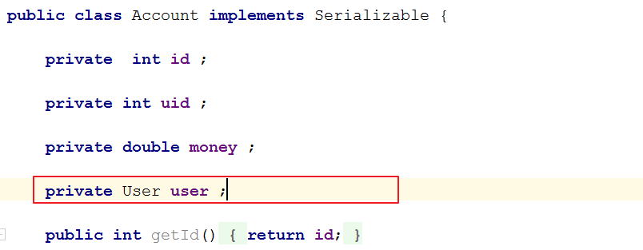


#### 编写账户的持久层接口`AccountDao.java`并使用注解配置
```java
public interface AccountDao {

    /**
     * 查询所有账户信息
     *
     * @return
     */
    @Select("select * from account")
    @Results(id = "accountMap",
            value = {
                    @Result(id = true, column = "id", property = "id"),
                    @Result(column = "uid", property = "uid"),
                    @Result(column = "money", property = "money"),
                    @Result(column = "uid", property = "user",
                            one = @One(select = "com.itheima.dao.UserDao.findById",fetchType = FetchType.LAZY))})
    public List<Account> findAll();
}
```

#### 编写用户的持久层接口`UserDao.java`并使用注解配置
```java
/**
 * 查询根据ID查询用户信息
 *
 * @param uid
 * @return
 */
@Select("select * from user where id = #{uid }")
@Results(id = "userMap",
        value = {
                @Result(id = true, column = "id", property = "userId"),
                @Result(column = "username", property = "userName"),
                @Result(column = "sex", property = "userSex"),
                @Result(column = "address", property = "userAddress"),
                @Result(column = "birthday", property = "userBirthday")})
public User findById(int uid);
```

#### 测试代码
```java
@Test
public void findAll() {
    List<Account> accounts = accountDao.findAll();
    for (Account account : accounts) {
        System.out.println("账户信息:"+account);
        System.out.println("用户信息:"+account.getUser());
        System.out.println("-------------------------");
    }
}
```


### Mybatis基于注解的一对多(熟悉)

需求:查询用户信息时，也要查询他的账户列表。使用注解方式实现。一个用户可以拥有多个账户

#### 在用户实体中添加账户属性`User.java`

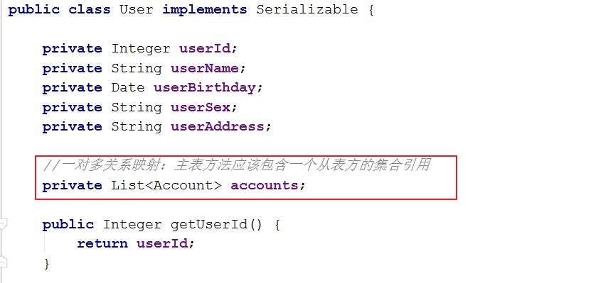


#### 编写用户的持久层接口`UserDao.java`并使用注解配置
```java
/**
 * 查询所有用户信息
 *
 * @return
 */
@Select("select * from user")
@Results(id = "userAccountsMap",
        value = {
                @Result(id = true, column = "id", property = "userId"),
                @Result(column = "username", property = "userName"),
                @Result(column = "sex", property = "userSex"),
                @Result(column = "address", property = "userAddress"),
                @Result(column = "birthday", property = "userBirthday"),
                @Result(column = "id",property = "accounts",
                        many = @Many(select="com.itheima.dao.AccountDao.findByUid", fetchType=FetchType.LAZY))})
public List<User> findAll();
```

#### 编写账户的持久层接口`AccountDao.java`并使用注解配置
```java
/**
 * 根据用户id查询用户的所有账户信息
 * @param uid
 * @return
 */
@Select("select * from account where uid = #{uid }")
public List<Account> findByUid(int uid);
```

#### 测试代码
```java
@Test
public void findAll() {
    List<User> users = userDao.findAll();
    for (User user : users) {
        System.out.println("用户信息:"+user);
        //System.out.println("账户信息:"+user.getAccounts());
        System.out.println("---------------------------");
    }
}
```

## 基于注解的Mybatis二级缓存(熟悉)
### 在SqlMapConfig中开启二级缓存支持(熟悉)
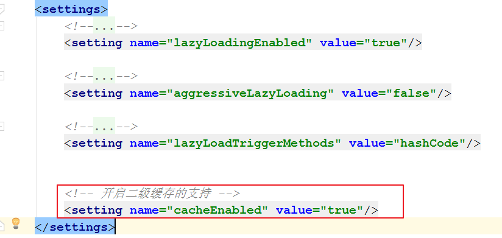

### 在持久层接口中使用注解配置二级缓存(熟悉)
```java
//mybatis基于注解方式实现配置二级缓存
@CacheNamespace(blocking=true)
public interface AccountDao {
  ......
}
```


# 基于Redis实现的Mybatis二级缓存(扩展)

## Mybatis二级缓存特点(理解)

    1. MyBatis默认实现了自己的二级缓存（PerpetualCache），内部使用HashMap实现，无法实现分布式，并且服务器重启后就没有缓存了。

    2. MyBatis二级缓存只适用于不常进行增、删、改的数据，比如国家行政区省市区街道数据。一但数据变更，MyBatis会清空缓存。因此二级缓存不适用于经常进行更新的数据。

    3. MyBatis二级缓存是按命名空间（namespace）进行缓存的，可以指定某个命名空间下的sql进行缓存

    4. MyBatis二级缓存的对象必须实现Serializable接口

## 基于Redis实现的Mybatis二级缓存(理解)
### 添加依赖jar包(理解)
```xml
<!--Redis的java客户端-->
<dependency>
    <groupId>redis.clients</groupId>
    <artifactId>jedis</artifactId>
    <version>2.8.0</version>
</dependency>

<!--mybatis-redis集成的依赖包-->
<dependency>
    <groupId>org.mybatis.caches</groupId>
    <artifactId>mybatis-redis</artifactId>
    <version>RELEASE</version>
</dependency>
```

### 编写配置文件`redis.properties`(理解)
```
#redis的服务器地址
redis.host=127.0.0.1
#redis的服务端口
redis.port=6379
#链接数据库
redis.default.db=0
#客户端超时时间单位是毫秒
redis.timeout=60000
#最大连接数
redis.maxActive=300
#最大空闲数
redis.maxIdle=100
#最小空闲数
redis.minIdle=1
#最大建立连接等待时间
redis.maxWait=1000
#指明是否在从池中取出连接前进行检验,如果检验失败,则从池中去除连接并尝试取出另一个
redis.testOnBorrow=true
#当调用return Object方法时，进行有效性检查
redis.testOnReturn=true
```

### 核心配置文件开启二级缓存(理解)
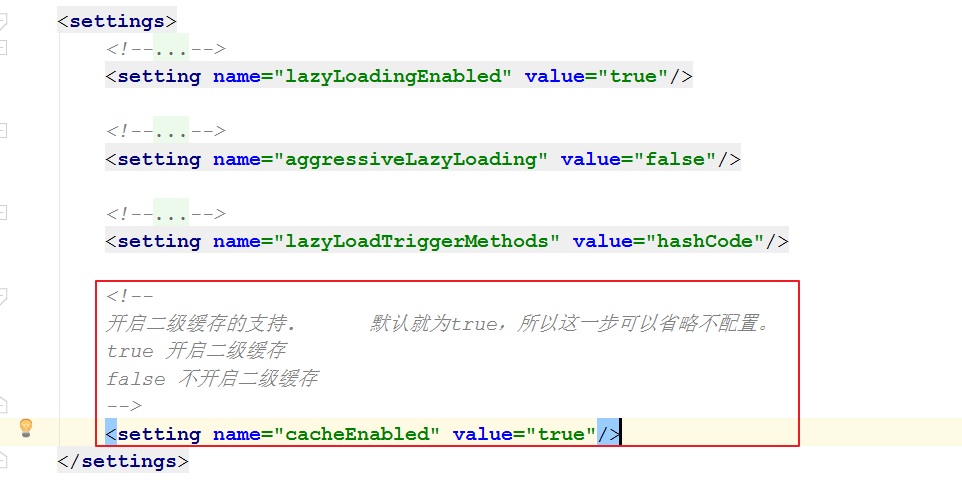


### mapper接口开启缓存(理解)
```xml
<!-- 开启二级缓存的支持 -->
<cache type="org.mybatis.caches.redis.RedisCache" />
```

### 使用注解开启二级缓存(理解)
```java
//mybatis基于注解方式实现配置二级缓存
@CacheNamespace(blocking=true,implementation = org.mybatis.caches.redis.RedisCache.class)
public interface UserDao {
  ...
}
```
