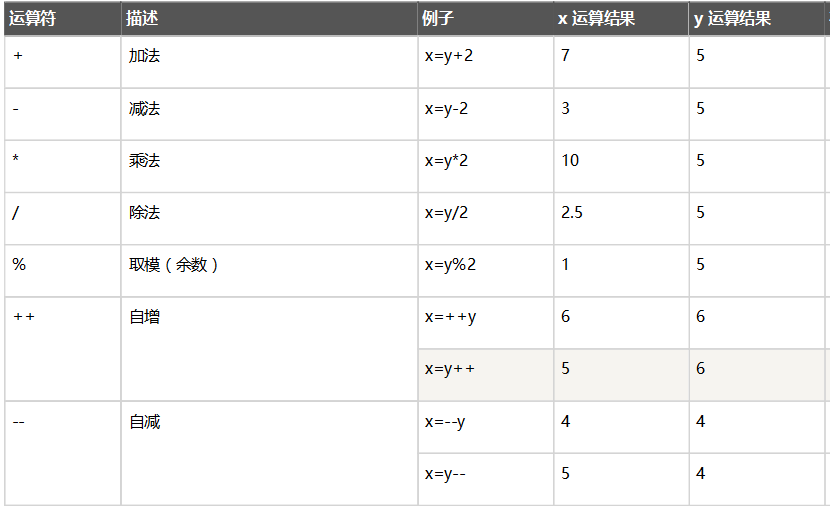
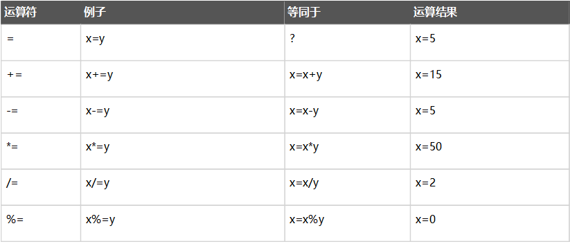
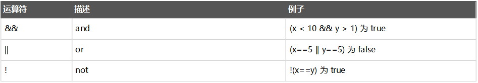
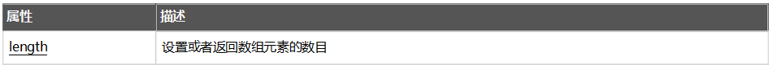
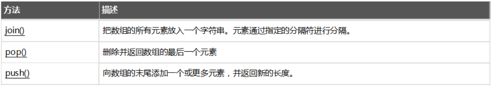
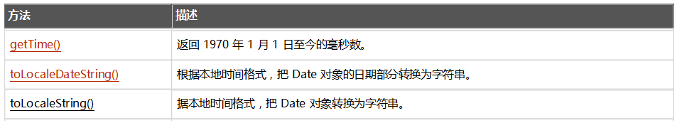
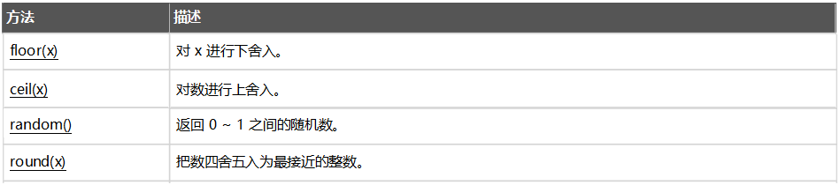
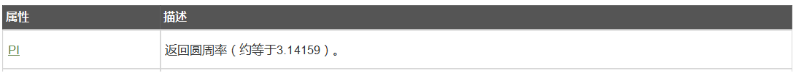
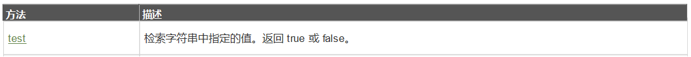
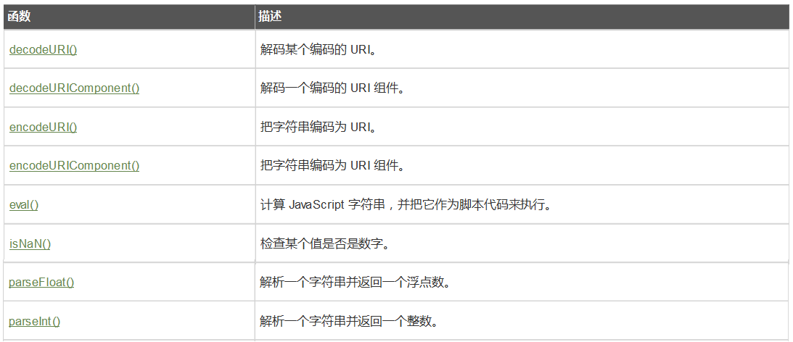

# (一)WEB前端技术-JavaScript基础

<extoc></extoc>

## JavaScript：
### 概念
```
前端三要素:
    HTML        : 从结构的角度描述页面的组成
    CSS         : 从美观的角度描述页面的样式
    JavaScript  : 从交互的角度描述页面的行为

* JavaScript：运行在客户端浏览器中的脚本语言。每一个浏览器都有JavaScript的解析引擎
* 脚本语言：不需要编译，直接就可以被浏览器解析执行了
```
#### 功能
```
* 可以来增强用户和html页面的交互过程，可以来控制html元素，让页面有一些动态的效果，增强用户的体验。
```
#### JavaScript发展史
```
1. 1992年，Nombase公司，开发出第一门客户端脚本语言，专门用于表单的校验。命名为 ： C--	，后来更名为：ScriptEase
2. 1995年，Netscape(网景)公司，开发了一门客户端脚本语言：LiveScript。后来，请来SUN公司的专家，修改LiveScript，命名为JavaScript
3. 1996年，微软抄袭JavaScript开发出JScript语言
4. 1997年，ECMA(欧洲计算机制造商协会)，制定出客户端脚本语言的标准：ECMAScript，就是统一了所有客户端脚本语言的编码方式。

* JavaScript = ECMAScript + JavaScript自己特有的东西(BOM+DOM)

```
#### 组成
```
1. ECMAScript                  : 客户端脚本语言的标准
2. BOM(Browser Object Model)   :   浏览器对象模型
3. DOM(Document Object Model)  :  文档对象模型
```

## 基本语法：
### 与html结合方式
  	1. 内部JS：
  		* 定义<script>，标签体内容就是js代码
  	2. 外部JS：
  		* 定义<script>，通过src属性引入外部的js文件
  	3. 注意：
  		1. <script>可以定义在html页面的任何地方。但是定义的位置会影响执行顺序。
  		2. <script>可以定义多个。
### 注释
  	1. 单行注释：//注释内容
  	2. 多行注释：/*注释内容*/
### 数据类型：
#### 原始数据类型(基本数据类型)：
  	1. number：数字。 整数/小数/NaN(not a number 一个不是数字的数字类型)
  	2. string：字符串。 字符串  "abc" "a" 'abc'
  	3. boolean: true和false
  	4. null：一个对象为空的占位符
  	5. undefined：未定义。如果一个变量没有给初始化值，则会被默认赋值为undefined

#### 引用数据类型：对象(Object)

### 变量
```
什么是变量：一小块存储数据的内存空间

Java语言是强类型语言，而JavaScript是弱类型语言。
	* 强类型：在开辟变量存储空间时，定义了空间将来存储的数据的数据类型。只能存储固定类型的数据
	* 弱类型：在开辟变量存储空间时，不定义空间将来的存储数据类型，可以存放任意类型的数据。
```

#### 定义变量:`var 变量名 = 初始化值;`

#### typeof运算符：获取变量的类型。
```JavaScript
var a ;
alert(typeof (a));  //undefined
a = 10.1 ;
alert(typeof (a)); //number
a = "10.1";
alert(typeof (a)); //string
a = "aaa";
alert(typeof (a)); //string
a = true ;
alert(typeof (a)); //boolean
a = null ;
alert(typeof (a)); // object
```

注：null运算后得到的是object

### 运算符
#### 算术运算符

```
注意：
1. 在JS中，如果运算数不是运算符所要求的类型，那么js引擎会自动的将运算数进行类型转换
		* string转number：按照字面值转换。如果字面值不是数字，则转为NaN（不是数字的数字）
		* boolean转number：true转为1，false转为0
2. 在JS中执行加发运算时,如果其中有一方是字符串,那么执行的是字符串的拼接
```
##### 练习
```JavaScript
//1. 说出下面代码的执行结果
var num1 = 10 ;
alert(num1++); // 输出?
alert(++num);// 输出?
alert(num1);// 输出?

var num2 = 10 ;
alert(num1--); // 输出?
alert(--num);// 输出?
alert(num1);// 输出?
```

#### 赋值运算符


##### 练习
```JavaScript
//1. 说出下面代码的执行结果
var num1 = 10 ;
num1+=10 ;
alert(num1);// 输出?

num1+="20";
alert(num1);// 输出?

var num2 = 20 ;
num2-="10" ;
alert(num2)// 输出?

var a = 10 ;
var b = 20 ;
alert("a+b="+a+b);
```

#### 比较运算符


```JavaScript
== 逻辑等。仅仅对比 值
=== 全等。 对比值并且对比类型。如果值和类型都相同，则为true；值和类型有一个不同，则为false
```

##### 练习
```JavaScript
var x=8;
alert(x==8);// 输出?
alert(x===8);// 输出?

alert(x=="8");// 输出?
alert(x==="8");// 输出?
```


#### 逻辑运算符

```JavaScript
JS中执行逻辑运算符,如果运算的变量不是boolean类型,那么会自动转化为boolean类型进行运算
1. number：0或NaN为假，其他为真
2. string：除了空字符串("")，其他都是true
3. null&undefined:都是false
4. 对象：所有对象都为true
```

#### 三元运算符

语法: `表达式? 值1:值2`

判断表达式的值，如果是true则取值1，如果是false则取值2

##### 示例
```JavaScript
//如果变量 age 中的值小于 18，则向变量 voteable 赋值 "年龄太小"，否则赋值 "年龄已达到"。
var age = 20 ;
var result = (age<18)?"年龄太小":"年龄已达到";
alert(result);  //输出?
```

### 流程控制语句

#### if...else...
```JavaScript
// 判断大小
if(age<18){
	alert("未成年...");
}else{
	alert("已成年...")
}
```

#### switch
```JavaScript
//在java中，switch语句可以接受的数据类型： byte int shor char,枚举(1.5) ,String(1.7)

//在JS中,switch语句可以接受任意的原始数据类型

//根据分类id输出分类名称
var category = 1 ; //分类id
switch (category){
    case 1:
        alert("电脑办公...") ;
        break;
    case 2:
        alert("手机数码...") ;
        break;
    case 3:
        alert("丽人美妆...") ;
        break;
    default:
        alert("其他..")
}
```

#### while循环
```JavaScript
//输出1-100中能被11100中能被11整出的数
var i = 0 ;
while( i <= 100 ){
		if(i%11==0){
				alert(i)
		}
		i++ ;
}
```

#### do...while循环
```JavaScript
var i = 0  ;
do{
		if(i%11==0){
				alert(i)
		};
		i++ ;
}
while( i <= 100 )
```

#### for循环
```JavaScript
//输出1-100中能被11100中能被11整出的数
for (var i = 0 ;i<=100;i++) {
		if(i%11==0){
				alert(i)
		};
}
```

#### JS特殊语法
```
1. 语句以`;`结尾，如果一行只有一条语句则 `;`可以省略 (不建议)
2. 变量的定义使用var关键字，也可以不使用
				* 用： 定义的变量是局部变量
				* 不用：定义的变量是全局变量(不建议)
```

```JavaScript
function func(){
	var a = 10 ;
}

func();
alert("a1"+a);   //方法外不能使用

function func2(){
	a = 10 ;
}

func2();
alert("a2"+a);   //方法外可以使用

```

### 练习：99乘法表
```html
<!DOCTYPE html>
<html lang="en">
<head>
<meta charset="UTF-8">
<title>99乘法表</title>
<style>
		td{
				border: 1px solid;
		}
</style>
<script>
		document.write("<table  align='center'>");
		//1.完成基本的for循环嵌套，展示乘法表
		for (var i = 1; i <= 9 ; i++) {
				document.write("<tr>");
				for (var j = 1; j <=i ; j++) {
						document.write("<td>");
						//输出  1 * 1 = 1
						document.write(i + " * " + j + " = " + ( i*j) +"&nbsp;&nbsp;&nbsp;");
						document.write("</td>");
				}
				/*//输出换行
				document.write("<br>");*/
				document.write("</tr>");
		}
		//2.完成表格嵌套
		document.write("</table>");
</script>
</head>
<body>
</body>
</html>
```			

## 基本对象：
### Function：函数(方法)对象
#### 创建函数：

```JavaScript
//var fun = new Function(形式参数列表,方法体);  //忘掉吧
var getSum = new Function("a","b","return a+b");

//function 方法名称(形式参数列表){ 方法体 	}
function getSum2(a,b){
	return a+b;
}

// var 方法名 = function(形式参数列表){ 方法体 }
var getSum3 = function(a,b){
	return a+b;
}
```

#### 属性：
  	1. length:代表形参的个数

#### 特点：
  	1. 方法定义是，形参的类型不用写,返回值类型也不写。
  	2. JS中不存在方法重载的概念,只有方法覆盖,后定义的方法会覆盖前面定义的同名方法
  	3. 在JS中，方法的调用只与方法的名称有关，和参数列表无关
  	4. 在方法声明中有一个隐藏的内置对象（数组），arguments,封装所有的实际参数
    5. JS的方法一定会有返回值,如果方法体中有return ,那么返回值就是return的值,如果方法体中没有return那么返回undefined
#### 调用：`方法名称(实际参数列表);`
```JavaScript
var sum = getSum3(10,20);
alert(sum);
```

### Array:数组对象(重要)
#### 创建：
```JavaScript
//方式一:创建一个空数组
var arr1 = new Array();

//方式二:创建一个指定长度的数组
var arr2 = new Array(10);

//方式三:创建一个含有初始化内容的数组
var arr3 = new Array("a", "b", 10, 20, true);

//方式四:创建一个含有初始化内容的数组
var arr4 = ["a", "b", 10, 20, true];
```

#### 属性


#### 方法


#### 示例
```JavaScript
//pop()     删除并且返回数组的最后一个元素
var arr=['a','b','c','d'];
alert(arr.length);
var temp=arr.pop();
alert(temp);
alert(arr.length);

//push(需要追加的元素)     向数组的末尾追加一个或者多个元素，返回数组的新长度
var arr2=['a','b','c','d'];
//追加一个元素
var len2=arr2.push('e');
alert(len2);

//追加多个元素
var len3=arr2.push('e','f','g');
alert(len3);

var str = arr2.join("-");
alert(str);
```

#### 特点：
    1. JS中，数组元素的类型可变的。
    2. JS中，数组长度可变的。
    3. JS中数组 索引越界异常,如果操作的索引超过了数组长度,会自动扩展数组

### Date：日期对象
#### 创建：
```JavaScript
//1. 最常用,获取当前事件的日期对象
var d = new Date();  
//2. 使用毫秒值创建日期
var d = new Date(milliseconds);
//3. 使用时间字符串创建日期
var d = new Date(dateString);   
//4. 使用年月日时分秒创建日期
var d = new Date(year, month, day, hours, minutes, seconds, milliseconds);
```                   

#### 方法：


```JavaScript
//创建当前时间的日期对象
var date = new Date();
//获取本地时间格式的字符串
var str = date.toLocaleString();
alert(str);
//获取当前时间的毫秒值
var time = date.getTime();
alert(time)
```

### Math：数学对象
#### 创建：不需要创建,直接使用
#### 方法：


#### 属性：


#### 特点：
	1. Math对象不用创建，直接使用。  `Math.方法名()`;

#### 示例:
```JavaScript
var num = 12.47;
var n1 = Math.floor(num);//向下取整
alert(n1);
var n2 = Math.ceil(num);//向上取整
alert(n2);
var n3 = Math.random(); //娶一个0-1的随机数
alert(n3);
var n4 = Math.round(num); //四舍五入
alert(n4);

//需求:获取一个1-100的随机数字
var random = Math.floor((Math.random()*100)+1);
alert(random);

//获取圆周率
var pi = Math.PI;
alert(pi);
```

### RegExp：正则表达式对象(重要)
#### 创建
```JavaScript
//创建正则表达式 3-10位数字字母下划线
//方式一:var reg = new RegExp("正则表达式");
var regExp = new RegExp("^\\w{3,10}$");
//方式二:var reg = /正则表达式/;
var regExp2 = /^\w{3,10}$/;
```

#### 2. 方法


#### 示例:
```JavaScript
//判断字符串是否匹配正则表达式
var regExp = /^\w{3,10}$/;
//定义字符串
var str = "zhangsan";
//判断字符串是否匹配正则
var result = regExp.test(str);
if(result){
	 alert("字符串符合正则表达式...");
}else{
	 alert("字符串不符合正则表达式...");
}
```

#### 特点：全局对象，这个Global中封装的方法不需要对象就可以直接调用。
#### 方法

#### 示例:
```JavaScript
var url = "http://localhost:8080/web01?name=传智播客";
//对URL进行编码 -- 特殊字符不编码
var n1 = encodeURI(url);
//对URL进行编码 -- 特殊字符也编码
var n2 = encodeURIComponent(url);
alert(n1);
alert(n2);

var url2 = "http://localhost:8080/web01?name=%E4%BC%A0%E6%99%BA%E6%92%AD%E5%AE%A2";
var url3 = "http%3A%2F%2Flocalhost%3A8080%2Fweb01%3Fname%3D%E4%BC%A0%E6%99%BA%E6%92%AD%E5%AE%A2";
//对URL进行解码操作
var n3 = decodeURI(url2);
//对URL进行解码操作
var n4 = decodeURIComponent(url3);
alert(n3);
alert(n4);

// 将字符串转化为number类型
var str = "100.10";
var num = parseInt(str);  //转化为整形
var num2 = parseFloat(str); //转化为浮点型
alert(num+"  "+ typeof(num));
alert(num2+"  "+ typeof(num2));

var code = "var i = 10 ;alert(i)" ;
// 将字符串当做JS代码执行
eval(code);
```

### Boolean
### Number
### String
### Global
