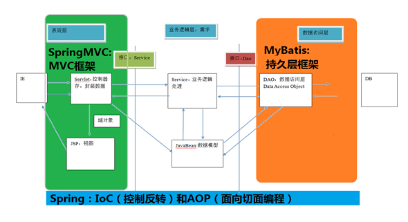
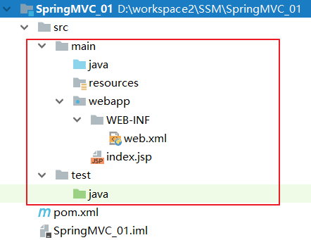
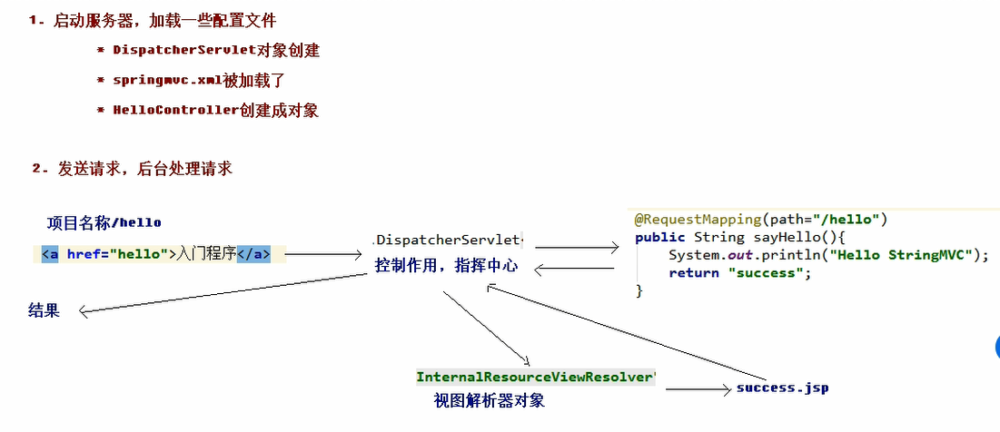
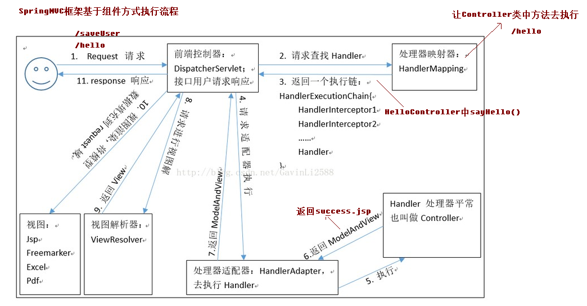
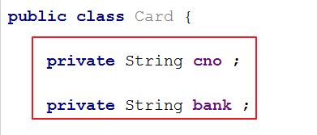
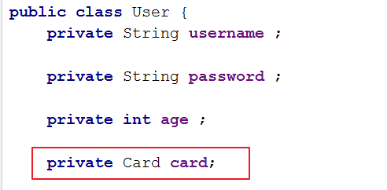
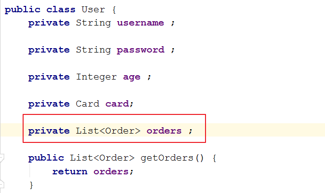
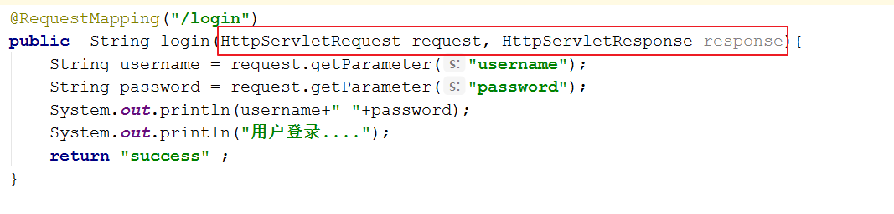
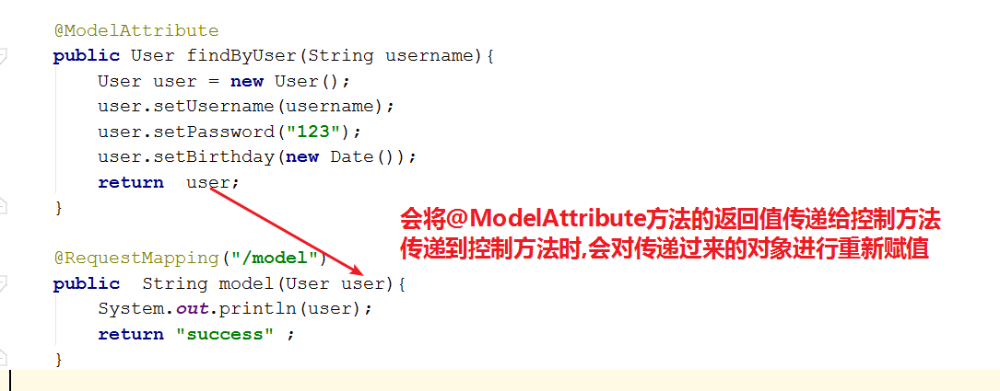

# 今日内容介绍
<extoc></extoc>

# SpringMVC基本概念(了解)
## 三层架构和MVC(了解)
### 三层架构(理解)

    我们的开发架构一般都是基于两种形式,一种是C/S架构,也就是客户端/服务器,另一种是B/S架构,也就是浏览器服务器.

    在JavaEE开发中,几乎全都是基于B/S架构的开发.那么在B/S架构中,系统标准的三层架构包括：表现层. 业务层. 持久层.

    三层架构在我们的实际开发中使用的非常多,所以我们课程中的案例也都是基于三层架构设计的.

    三层架构中,每一层各司其职,接下来我们就说说每层都负责哪些方面：

    表现层:也就是我们常说的web层.它负责接收客户端请求,向客户端响应结果,通常客户端使用http协议请求web层,web需要接收http请求,完成http响应.
           表现层包括展示层和控制层:控制层负责接收请求,展示层负责结果的展示.
           表现层依赖业务层,接收到客户端请求一般会调用业务层进行业务处理,并将处理结果响应给客户端.
           表现层的设计一般都使用MVC模型.(MVC是表现层的设计模型,和其他层没有关系)

    业务层:也就是我们常说的service层.它负责业务逻辑处理,和我们开发项目的需求息息相关.
           web层依赖业务层,但是业务层不依赖web层. 业务层在业务处理时可能会依赖持久层,如果要对数据持久化需要保证事务一致性.(也就是我们说的,事务应该放到业务层来控制)

    持久层:也就是我们是常说的dao层.负责数据持久化.包括数据层(数据库)和数据访问层.
          数据库是对数据进行持久化的载体,数据访问层是业务层和持久层交互的接口,业务层需要通过数据访问层将数据持久化到数据库中.
          通俗的讲,持久层就是和数据库交互,对数据库表进行曾删改查的.

### MVC模型(理解)

    MVC全名是Model View Controller,是模型(model)－视图(view)－控制器(controller)的缩写,是一种用于设计创建 Web 应用程序表现层的模式.

    MVC中每个部分各司其职：

    Model(模型)：通常指的就是我们的数据模型.作用一般情况下用于封装数据.

    View(视图)： 通常指的就是我们的jsp或者html.作用一般就是展示数据的. 通常视图是依据模型数据创建的.

    Controller(控制器)： 是应用程序中处理用户交互的部分.作用一般就是处理程序逻辑的.它相对于前两个不是很好理解
        这里举个例子,例如：
            我们要保存一个用户的信息,该用户信息中包含了姓名,性别,年龄等等. 这时候表单输入要求年龄必须是1~100之间的整数.姓名和性别不能为空.并且把数据填充到模型之中. 此时除了js的校验之外,服务器端也应该有数据准确性的校验,那么校验就是控制器的该做的. 当校验失败后,由控制器负责把错误页面展示给使用者. 如果校验成功,也是控制器负责把数据填充到模型,并且调用业务层实现完整的业务需求.

## SpringMVC概述(理解)
### SpringMVC是什么(理解)

    SpringMVC是一种基于Java的实现MVC设计模型的请求驱动类型的轻量级Web框架,属于 Spring FrameWork 的后续产品,已经融合在Spring Web Flow里面.

    Spring 框架提供了构建 Web 应用程序的全功能 MVC 模块.使用 Spring 可插入的 MVC 架构,从而在使用Spring进行WEB开发时,可以选择使用 Spring 的 Spring MVC 框架或集成其他MVC开发框架,如Struts1(现在一般不用),Struts2等.

    SpringMVC已经成为目前最主流的 MVC 框架之一,并且随着Spring3.0的发布,全面超越 Struts2,成为最优秀的 MVC 框架. 它通过一套注解,让一个简单的Java类成为处理请求的控制器,而无须实现任何接口.同时它还支持RESTful编程风格的请求.


### SpringMVC在三层架构的位置(理解)



### SpringMVC的优势(理解)

    1. 清晰的角色划分：前端控制器(DispatcherServlet). 请求到处理器映射(HandlerMapping). 处理器适配器(HandlerAdapter). 视图解析器(ViewResolver). 处理器或页面控制器(Controller). 验证器( Validator). 命令对象(Command 请求参数绑定到的对象就叫命令对象). 表单对象(Form Object 提供给表单展示和提交到的对象就叫表单对象).

    2. 分工明确,而且扩展点相当灵活,可以很容易扩展,虽然几乎不需要.

    3. 由于命令对象就是一个 POJO,无需继承框架特定 API,可以使用命令对象直接作为业务对象.

    4. 和 Spring 其他框架无缝集成,是其它 Web 框架所不具备的.

    5. 可适配,通过 HandlerAdapter 可以支持任意的类作为处理器.

    6. 可定制性,`HandlerMapping`, `ViewResolver` 等能够非常简单的定制.

    7. 功能强大的数据验证. 格式化. 绑定机制.

    8. 利用 Spring 提供的 Mock 对象能够非常简单的进行 Web 层单元测试.

    9. 本地化主题的解析的支持,使我们更容易进行国际化和主题的切换.

    10. 强大的 JSP 标签库,使 JSP 编写更容易.

    还有比如RESTful风格的支持. 简单的文件上传. 约定大于配置的契约式编程支持. 基于注解的零配置支持等等.

# SpringMVC入门程序(掌握)
## 需求(掌握)
需求：发送一个请求给后台程序，后台能够接收到该请求并且执行对应的业务方法，输出一段话。并且返回一个成功的页面。
## SpringMVC开发环境搭建(掌握)
### 创建Maven的WEB项目,补全目录解构(掌握)



### 添加SpringMCV开发的依赖jar包(掌握)
```xml
<properties>
    <project.build.sourceEncoding>UTF-8</project.build.sourceEncoding>
    <maven.compiler.source>1.8</maven.compiler.source>
    <maven.compiler.target>1.8</maven.compiler.target>
    <!--spring版本锁定-->
    <spring.version>5.0.2.RELEASE</spring.version>
  </properties>

  <dependencies>
    <dependency>
      <groupId>org.springframework</groupId>
      <artifactId>spring-context</artifactId>
      <version>${spring.version}</version>
    </dependency>
    <dependency>
      <groupId>org.springframework</groupId>
      <artifactId>spring-web</artifactId>
      <version>${spring.version}</version>
    </dependency>
    <dependency>
      <groupId>org.springframework</groupId>
      <artifactId>spring-webmvc</artifactId>
      <version>${spring.version}</version>
    </dependency>
    <dependency>
      <groupId>org.apache.tomcat</groupId>
      <artifactId>tomcat-api</artifactId>
      <version>9.0.10</version>
        <scope>provided</scope>
    </dependency>
  </dependencies>
```

## SpringMVC入门程序(掌握)

### 在`web.xml`中配置SpringMVC的核心控制器(掌握)
```xml
<!DOCTYPE web-app PUBLIC
 "-//Sun Microsystems, Inc.//DTD Web Application 2.3//EN"
 "http://java.sun.com/dtd/web-app_2_3.dtd" >

<web-app>

  <!--配置SpringMVC核心控制器-->
  <servlet>
    <servlet-name>dispatcherServlet</servlet-name>
    <servlet-class>org.springframework.web.servlet.DispatcherServlet</servlet-class>

    <!-- 配置Servlet的初始化参数，读取springmvc的配置文件，创建spring容器 -->
    <init-param>
      <param-name>contextConfigLocation</param-name>
      <param-value>classpath:springmvc.xml</param-value>
    </init-param>

    <!-- 配置servlet启动时加载对象 -->
    <load-on-startup>1</load-on-startup>
  </servlet>

  <!--配置springmvc过请求过滤器，/表示所有请求都经过springmvc处理-->
  <servlet-mapping>
    <servlet-name>dispatcherServlet</servlet-name>
    <url-pattern>/</url-pattern>
  </servlet-mapping>

</web-app>
```


### 创建SpringMCV配置文件`springmvc.xml`(掌握)
```xml
<?xml version="1.0" encoding="UTF-8"?>
<beans xmlns="http://www.springframework.org/schema/beans"
       xmlns:mvc="http://www.springframework.org/schema/mvc"
       xmlns:context="http://www.springframework.org/schema/context"
       xmlns:xsi="http://www.w3.org/2001/XMLSchema-instance"
       xsi:schemaLocation="http://www.springframework.org/schema/beans
        http://www.springframework.org/schema/beans/spring-beans.xsd
        http://www.springframework.org/schema/mvc
        http://www.springframework.org/schema/mvc/spring-mvc.xsd
        http://www.springframework.org/schema/context
        http://www.springframework.org/schema/context/spring-context.xsd">

    <!-- 配置创建spring容器要扫描的包 -->
    <context:component-scan base-package="com.itheima"></context:component-scan>

</beans>
```

### 修改`index.jsp`(掌握)
```html
<%@ page contentType="text/html;charset=UTF-8" language="java" %>
<html>
<body>
<h2>Hello SpringMVC!</h2>

<!--编写超链接,点击超链接访问springmvc_01项目下的hello资源-->
<a href="/springmvc_01/hello">
    访问HelloServlet
</a>

</body>
</html>
```

### 编写控制器并使用注解配置`HelloController`(掌握)
```java
@Controller("helloController")
public class HelloController {

    //设置sysHello方法的请求路径为"hello"
    @RequestMapping(path = "/hello")
    public String sysHello(){
        System.out.println("第一个SpringMVC程序");
        return "success";
    }
}
```

### 修改SpringMCV配置文件`springmvc.xml`配置视图解析器(掌握)
```xml
<?xml version="1.0" encoding="UTF-8"?>
<beans xmlns="http://www.springframework.org/schema/beans"
       xmlns:mvc="http://www.springframework.org/schema/mvc"
       xmlns:context="http://www.springframework.org/schema/context"
       xmlns:xsi="http://www.w3.org/2001/XMLSchema-instance"
       xsi:schemaLocation="http://www.springframework.org/schema/beans
        http://www.springframework.org/schema/beans/spring-beans.xsd
        http://www.springframework.org/schema/mvc
        http://www.springframework.org/schema/mvc/spring-mvc.xsd
        http://www.springframework.org/schema/context
        http://www.springframework.org/schema/context/spring-context.xsd">

    <!-- 配置创建spring容器要扫描的包 -->
    <context:component-scan base-package="com.itheima"></context:component-scan>

    <!-- 配置视图解析器 -->
    <bean class="org.springframework.web.servlet.view.InternalResourceViewResolver">
        <property name="prefix" value="/WEB-INF/pages/"></property>
        <property name="suffix" value=".jsp"></property>
    </bean>

</beans>
```

### 测试:http://localhost:8080/springmvc_01/index.jsp(掌握)

## 入门案例总结(理解)

### SpringMVC入门案例流程总结(理解)



    1. 当启动Tomcat服务器的时候，因为配置了load-on-startup标签，所以会创建DispatcherServlet对象，就会加载springmvc.xml配置文件
    2. 开启了注解扫描，那么HelloController对象就会被创建
    3. 从index.jsp发送请求，请求会先到达DispatcherServlet核心控制器，根据配置@RequestMapping注解找到执行的具体方法
    4. 根据执行方法的返回值，再根据配置的视图解析器，去指定的目录下查找指定名称的JSP文件
    5. Tomcat服务器渲染页面，做出响应

### SpringMVC组件介绍(理解)

    1. 前端控制器（DispatcherServlet）
    2. 处理器映射器（HandlerMapping）
    3. 处理器（Handler）
    4. 处理器适配器（HandlAdapter）
    5. 视图解析器（View Resolver）
    6. 视图（View）



### RequestMapping注解介绍(掌握)
    1. RequestMapping注解的作用是建立请求URL和处理方法之间的对应关系
    2. RequestMapping注解可以作用在方法和类上
        a. 作用在类上：第一级的访问目录
            例如： 账户模块：
                      /account/add
                      /account/update
                      /account/delete ...
                  订单模块：
                      /order/add
                      /order/update
                      /order/delete

        b. 作用在方法上：第二级的访问目录
    3. RequestMapping的属性
        a. path 指定请求路径的url
        b. value value属性和path属性是一样的
        c. mthod 指定该方法的请求方式
        d. params 指定限制请求参数的条件
        e. headers 发送的请求中必须包含的请求头

```java

/**
 * 此控制器的访问路径为 /user
 */
@RequestMapping("/user")
@Controller
public class UserController {

    /**
     *此方法的访问路径为   /add  使用value属性指定
     */
    @RequestMapping(value = "/add")
    public  void add(){
        System.out.println("添加用户....");
    }

    /**
     *此方法的访问路径为   /add  使用path属性指定 同value
     * 此方法的请求方式为 get
     */
    @RequestMapping(path = "/update",method = RequestMethod.GET)
    public  void update(){
        System.out.println("更新用户....");
    }

    /**
     *此方法的访问路径为   /findAll  ,必须包含Accept请求头
     *
     */
    @RequestMapping(path = "/findAll",headers = {"Accept"})
    public  void findAll(){
        System.out.println("查询所有用户....");
    }

    /**
     * 请求路径为/findById
     * 请求方式为GET
     * 必须包含id参数
     */
    @RequestMapping(path = "/findById",method = RequestMethod.GET,params = {"id"})
    public  void findById(){
        System.out.println("查询所有用户....");
    }
}
```

# SpringMVC请求参数(掌握)

## 绑定机制(掌握)
    1. 表单提交的数据都是k=v格式的 username=haha&password=123
    2. SpringMVC的参数绑定过程是把表单提交的请求参数，作为控制器中方法的参数进行绑定的

## 绑定要求(掌握)
    1. 提交表单的name和参数的名称是相同的

## 支持的数据类型(掌握)
    1. 基本数据类型和字符串类型
    2. 实体类型（JavaBean）
    3. 集合数据类型（List、map集合等）

### 请求绑定基本数据类型和字符串(掌握)
**客户端**
```html
<h1>根据id查询用户</h1>
<a href="${pageContext.request.contextPath}/user/findById?id=1">根据id查询用户</a>

<h1>根据用户名和密码查询用户</h1>
<a href="${pageContext.request.contextPath}/user/findByUsername?username=aaa&password=123">根据id查询用户</a>
```
**服务器**
```java
@RequestMapping("/user")
public class UserController {

    @RequestMapping(path = "/findById",params = {"id"})
    public  String findById(Integer id){
        System.out.println(id);
        System.out.println("查询所有用户....");
        return "success" ;
    }

    @RequestMapping(path = "/findByUsername")
    public  String findByUsername(String username,String password){
        System.out.println(username+" "+password);
        System.out.println("查询所有用户....");
        return "success" ;
    }
}
```

### 请求参数绑定实体类型(掌握)
**定义实体类**
```java
package com.itheima.bean;

public class User {
    private String username ;

    private String password ;

    private int age ;

    public String getUsername() {
        return username;
    }

    public void setUsername(String username) {
        this.username = username;
    }

    public String getPassword() {
        return password;
    }

    public void setPassword(String password) {
        this.password = password;
    }

    public int getAge() {
        return age;
    }

    public void setAge(int age) {
        this.age = age;
    }

    @Override
    public String toString() {
        return "User{" +
                "username='" + username + '\'' +
                ", password='" + password + '\'' +
                ", age=" + age +
                '}';
    }
}
```

**客户端**
```html
<h1>添加用户</h1>
<form action="${pageContext.request.contextPath}/user/add">
    用户名: <input type="text" name="username"> <br>
    密&nbsp;&nbsp;码: <input type="password" name="password"><br>
    年&nbsp;&nbsp;龄: <input type="text" name="age"><br>
    <input type="submit" value="注册">
</form>
```

**服务器**
```java
/**
 * @param user  封装数据的实体对象
 * @return
 */
@RequestMapping(value = "/add")
public  String add(User user){
    System.out.println(user);
    System.out.println("添加用户....");
    return "success" ;
}
```

注意：
1. 提交表单的name和JavaBean中的属性名称需要一致

2. JavaBean中的属性类型如果使用基本类型,如果没有该参数程序会保存

2. 如果一个JavaBean类中包含其他的引用类型，那么表单的name属性需要编写成：`对象.属性` 例如：`address.name`





```html
<h1>添加用户及账户</h1>
<form action="${pageContext.request.contextPath}/user/addWithAccount">
    用户名: <input type="text" name="username"> <br>
    密&nbsp;&nbsp;码: <input type="password" name="password"><br>
    年&nbsp;&nbsp;龄: <input type="text" name="age"><br>

    卡号:<input type="text" name="card.cno"><br>
    银行: <input type="text" name="card.bank"><br>
    <input type="submit" value="注册">
</form>
```

```java
/**
 * @param user  封装数据的实体对象
 * @return
 */
@RequestMapping(value = "/addWithAccount")
public  String addWithAccount(User user){
    System.out.println(user);
    System.out.println(user.getCard());
    System.out.println("添加用户....");
    return "success" ;
}
```

### 请求参数绑定List集合类型(熟悉)
**创建实体类**
```java
public class Order {

    private String ono ;

    private Double money ;

    public String getOno() {
        return ono;
    }

    public void setOno(String ono) {
        this.ono = ono;
    }

    public Double getMoney() {
        return money;
    }

    public void setMoney(Double money) {
        this.money = money;
    }

    @Override
    public String toString() {
        return "Order{" +
                "ono='" + ono + '\'' +
                ", money=" + money +
                '}';
    }
}
```

**实体类型添加集合**



**客户端**
```html
<h1>添加用户及订单</h1>
<form action="${pageContext.request.contextPath}/user/addWithOrders">
    用户名: <input type="text" name="username"> <br>
    密&nbsp;&nbsp;码: <input type="password" name="password"><br>
    年&nbsp;&nbsp;龄: <input type="text" name="age"><br>

    订单1编号: <input type="text" name="orders[0].ono"><br>
    订单1金额: <input type="text" name="orders[0].money"><br>

    订单2编号: <input type="text" name="orders[1].ono"><br>
    订单2金额: <input type="text" name="orders[1].money"><br>
    <input type="submit" value="注册">
</form>
```
**服务端**
```java
@RequestMapping("/addWithOrders")
public  String addWithOrders(User user){
    System.out.println(user);
    System.out.println(user.getOrders());
    System.out.println("添加用户....");
    return "success" ;
}
```


### 请求参数绑定Map集合类型(熟悉)
**客户端**
```html
<h1>添加用户及订单</h1>
<form action="${pageContext.request.contextPath}/user/addWithOthers">
    用户名: <input type="text" name="username"> <br>
    密&nbsp;&nbsp;码: <input type="password" name="password"><br>
    年&nbsp;&nbsp;龄: <input type="text" name="age"><br>

    订单1编号:<input type="text" name="others[o1].ono"><br>
    订单1金额: <input type="text" name="others[o1].money"><br>

    订单2编号:<input type="text" name="others[o2].ono"><br>
    订单2金额: <input type="text" name="others[o2].money"><br>
    <input type="submit" value="注册">
</form>
```

**服务端**
```java
@RequestMapping("/addWithOthers")
public  String addWithOthers(User user){
    System.out.println(user);
    System.out.println(user.getOthers());
    System.out.println("添加用户....");
    return "success" ;
}
```

## 请求参数的中文乱码问题(掌握)

    如果请求参数中携带了中文会产生中文乱码问题，这个时候我们配置类乱码过滤器就可以解决POST方式的中文乱码问题.

    tomcat7及以下版本需要手动解决中文乱码问题

在`web.xml`中添加以下配置:

```xml
<!--解决中文乱码-->
<filter>
  <filter-name>characterEncodingFilter</filter-name>
  <filter-class>org.springframework.web.filter.CharacterEncodingFilter</filter-class>
  <init-param>
    <param-name>encoding</param-name>
    <param-value>UTF-8</param-value>
  </init-param>
</filter>
<filter-mapping>
  <filter-name>characterEncodingFilter</filter-name>
  <url-pattern>/*</url-pattern>
</filter-mapping>

```

## 自定义类型转换器(掌握)
### 自定义类型转换器（时间类型）(掌握)
在springMVC封装传递的参数有时候需要自己写一个类型转换器来实现

### 基本步骤(掌握)
    1. 创建一个类实现实现`Converter`接口
    2. 实现`convert`方法,方法的参数就是传入的需要转换的数据,方法的返回值就是转换成功之后的数据
    3. SpringMVC的配置文件中配置自定义转换器
    4. 修改`<mvc:annotation-driven>`标签让自定义转换器生效

### 代码示例(掌握)
#### 1. 创建一个类实现实现`Converter`接口
```java
public class DateConverter implements Converter<String,Date> {
    /**
     *
     * @param source  传入的需要转化的数据,例如:2018-01-01
     * @return  转化之后的数据
     */
    @Override
    public Date convert(String source) {

        return null;

    }
}
```
#### 2. 实现`convert`方法,方法的参数就是传入的需要转换的数据,方法的返回值就是转换成功之后的数据
```java
/**
 *
 * @param source  传入的需要转化的数据,例如:2018-01-01
 * @return  转化之后的数据
 */
@Override
public Date convert(String source) {
    if(source!=null){
        DateFormat df=new SimpleDateFormat("yyyy-MM-dd");
        try{
            //把字符串转为日期
            return df.parse(source);
        }catch (Exception e){
            new RuntimeException("数据类型转换失败!");
        }
    }else{
        System.out.println("请传入数据!");
    }
    return null;

}
```
#### 3. SpringMVC的配置文件中配置自定义转换器
```xml

<!--配置自定义转换器-->
<bean id="conversionService" class="org.springframework.context.support.ConversionServiceFactoryBean">
    <property name="converters">
        <set>
            <bean class="com.itheima.convert.DateConverter"></bean>
        </set>
    </property>
</bean>
```

#### 4. 修改`<mvc:annotation-driven>`标签让自定义转换器生效
```xml
<!--SpringMVC注解驱动-->
<mvc:annotation-driven conversion-service="conversionService"></mvc:annotation-driven>
```

## 获得原生servletAPI(掌握)
    SpringMVC还支持使用原始ServletAPI对象作为控制器方法的参数。

    支持原始ServletAPI对象有：

        HttpServletRequest

        HttpServletResponse

        HttpSession

        InputStream

        OutputStream

        Reader

        Writer

    我们可以把上述对象，直接写在控制的方法参数中使用。



# SpringMVC常用注解(掌握)
## @RequestParam(掌握)
    作用： 把请求中指定名称的参数给控制器中的形参赋值。

    属性：
      value：请求参数中的名称。
      required：请求参数中是否必须提供此参数。默认值：true。表示必须提供，如果不提供将报错。
**客户端**
```html
<!-- requestParams注解的使用 -->
<a href="${pageContext.request.contextPath}/user/login2?name=aaa&password=123">requestParam注解</a>
```      
**服务端**
```java
@RequestMapping("/login2")
public  String login2(@RequestParam("name") String username, String password,@RequestParam(value = "age",required = false)Integer age){
    System.out.println(username+" "+password);
    System.out.println("用户登录....");
    return "success" ;
}
```

## @RequestBody(掌握)

    作用： 用于获取请求体内容。直接使用得到是key=value&key=value...结构的数据。 get请求方式不适用。

    属性：
      required：是否必须有请求体。默认值是:true。当取值为true时,get请求方式会报错。如果取值为false，get请求得到是null。


## @PathVariable注解(掌握)

    作用
      用于绑定url中的占位符。例如：请求url中 /delete/{id}，这个{id}就是url占位符。
      url支持占位符是spring3.0之后加入的。是springmvc支持rest风格URL的一个重要标志。

    属性
      value：指定url中的占位符名称
      required：是否必须提供占位符。


    restful风格的URL:请求路径一样，可以根据不同的请求方式去执行后台的不同方法
        1. 结构清晰
        2. 符合标准
        3. 易于理解
        4. 扩展方便

**客户端**
```html
<h1>restfull</h1>
<a href="${pageContext.request.contextPath}/user/find/1">查询用户</a>
```

**服务器**
```java
@RequestMapping("/find/{id}")
public  String find(@PathVariable("id") Integer id){
    System.out.println(id);
    return "success" ;
}
```

**REST风格URL**

    什么是rest： REST（英文：Representational State Transfer，简称REST）描述了一个架构样式的网络系统，比如 web 应用程序。它首次出现在 2000 年 Roy Fielding 的博士论文中，他是 HTTP 规范的主要编写者之一。在目前主流的三种Web服务交互方案中，REST相比于SOAP（Simple Object Access protocol，简单对象访问协议）以及XML-RPC更加简单明了，无论是对URL的处理还是对Payload的编码，REST都倾向于用更加简单轻量的方法设计和实现。值得注意的是REST并没有一个明确的标准，而更像是一种设计的风格。

    它本身并没有什么实用性，其核心价值在于如何设计出符合REST风格的网络接口。

    restful的优点

        它结构清晰、符合标准、易于理解、扩展方便，所以正得到越来越多网站的采用。

    restful的特性：
        资源（Resources）：网络上的一个实体，或者说是网络上的一个具体信息。 它可以是一段文本、一张图片、一首歌曲、一种服务，总之就是一个具体的存在。可以用一个URI（统一资源定位符）指向它，每种资源对应一个特定的 URI 。要 获取这个资源，访问它的URI就可以，因此 URI 即为每一个资源的独一无二的识别符。

        表现层（Representation）：把资源具体呈现出来的形式，叫做它的表现层 （Representation）。 比如，文本可以用 txt 格式表现，也可以用 HTML 格式、XML 格式、JSON 格式表现，甚至可以采用二进制格式。

        状态转化（State Transfer）：每 发出一个请求，就代表了客户端和服务器的一次交互过程。 HTTP协议，是一个无状态协议，即所有的状态都保存在服务器端。因此，如果客户端想要操作服务器，必须通过某种手段，让服务器端发生“状态转化”（State Transfer）。而这种转化是建立在表现层之上的，所以就是 “表现层状态转化”。具体说，就是 HTTP 协议里面，四个表示操作方式的动词：GET、POST、PUT、DELETE。它们分别对应四种基本操作：GET 用来获取资源，POST 用来新建资源，PUT 用来更新资源，DELETE 用来删除资源。

        restful的示例：
            /account/1 HTTP GET ： 得到 id = 1 的 account
            /account/1 HTTP DELETE： 删除 id = 1的 account
            /account/1 HTTP PUT： 更新id = 1的 account

## @RequestHeader注解(熟悉)
    作用： 用于获取请求消息头。
    属性：
        value：提供消息头名称
        required：是否必须有此消息头 注： 在实际开发中一般不怎么用。

**客户端**
```html
<h1>@RequestHeader注解</h1>
<a href="${pageContext.request.contextPath}/user/headers">@RequestHeader注解</a>
```

**服务端**
```java
@RequestMapping("/headers")
public  String headers(@RequestHeader("User-Agent")String agent){
    System.out.println(agent);
    return "success" ;
}
```

## @CookieValue注解(熟悉)
    作用： 用于把指定cookie名称的值传入控制器方法参数。
    属性：
      value：指定cookie的名称。
      required：是否必须有此cookie。

**客户端**
```html
<h1>@CookieValue注解</h1>
<a href="${pageContext.request.contextPath}/user/cookies">@CookieValue注解</a>
```

**服务端**
```java
@RequestMapping("/cookies")
public  String cookies(@CookieValue("JSESSIONID")String sessionID){
    System.out.println(sessionID);
    return "success" ;
}
```

## @ModelAttribute注解(熟悉)

作用： 该注解是SpringMVC4.3版本以后新加入的。它可以用于修饰方法和参数。

    出现在方法上，表示当前方法会在控制器的方法执行之前，先执行。它可以修饰没有返回值的方法，也可以修饰有具体返回值的方法。

    出现在参数上，获取指定的数据给参数赋值。

属性：
    value：用于获取数据的key。

    key可以是POJO的属性名称，也可以是map结构的key。

简单来说就是在执行控制方法之前执行@ModelAttribute注解修饰的方法,处理参数

**用法一:有返回值**
#### 客户端
```html
<h1>@ModelAttribute</h1>
<a href="${pageContext.request.contextPath}/user/model?username=aaa">@ModelAttribute</a>
```

#### 服务端
```java
@ModelAttribute
public User findByUser(String username){
    User user = new User();
    user.setUsername(username);
    user.setPassword("123");
    user.setBirthday(new Date());
    return  user;
}

@RequestMapping("/model")
public  String model(User user){
    System.out.println(user);
    return "success" ;
}
```



**用法二:没有返回值**
#### 客户端
```html
<h1>@ModelAttribute</h1>
<a href="${pageContext.request.contextPath}/user/model?username=aaa">@ModelAttribute</a>
```
#### 服务端
```java
@ModelAttribute
public void findByUser(String username, Map<String,User> map){
    User user = new User();
    user.setUsername("aaaaaaaaaaaa");
    user.setPassword("123");
    user.setBirthday(new Date());

    map.put("aaa",user);
}

@RequestMapping("/model")
public  String model(@ModelAttribute("aaa") User user){
    System.out.println(user);
    return "success" ;
}
```

注意:使用`@ModelAttribute`注解只能为参数中没有的属性重新赋值,不能操作参数中已经存在的属性的值


## @SessionAttribute注解(熟悉)
    作用： 用于多次执行控制器方法间的参数共享。可以将Model中的属性同步到session当中
    属性：
        value：用于指定存入的属性名称
        type：用于指定存入的数据类型。

    Model是spring提供的一个接口，该接口有一个实现类ExtendedModelMap * 该类继承了ModelMap，而ModelMap就是LinkedHashMap子类

    Spring会将存入Model中的数据,存入到request域中

**客户端**

```html
<!-- SessionAttribute注解的使用 -->
<a href="springmvc/testPut">存入SessionAttribute</a> <hr/>
<a href="springmvc/testGet">取出SessionAttribute</a> <hr/>
<a href="springmvc/testClean">清除SessionAttribute</a>
```

**服务器**
```java
@RequestMapping("/anno")
@SessionAttributes(value = {"username","password"})
public class AnnoController {

    @RequestMapping("/session/put")
    public  String sessionPut(Model model){
        model.addAttribute("username","aaaa");
        model.addAttribute("password","123");

        return "success" ;
    }

    @RequestMapping("/session/get")
    public  String sessionGut(ModelMap model){
        String username = (String) model.get("username");
        System.out.println(username);
        return "success" ;
    }

    @RequestMapping("/session/remove")
    public  String sessionRemove(SessionStatus ss){
        ss.setComplete();
        return "success" ;
    }
}
```
