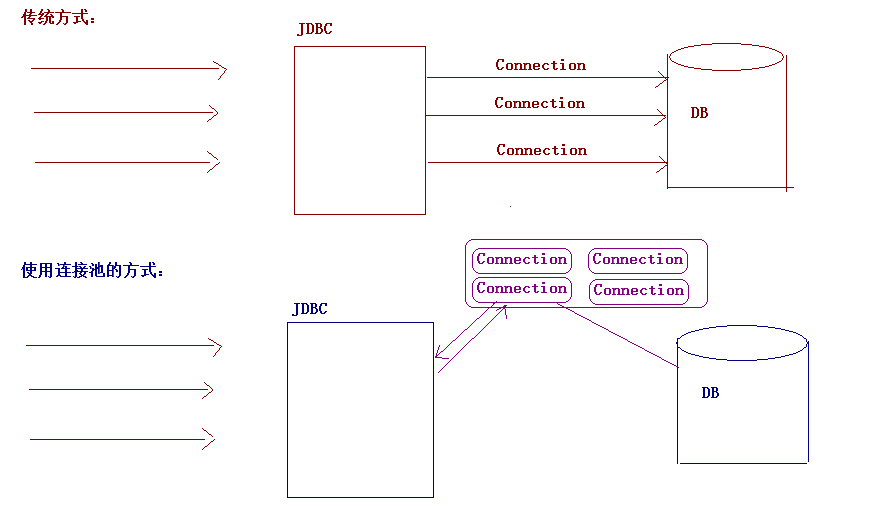

# (二)数据库连接池与jdbcTemplate

<extoc></extoc>

## 数据库连接池
### 概念：

		其实就是一个容器(集合)，存放数据库连接的容器。

		当系统初始化好后，容器被创建，容器中会申请一些连接对象，当用户来访问数据库时，从容器中获取连接对象，用户访问完之后，会将连接对象归还给容器。




### 好处
		1. 节约资源
		2. 用户访问高效


### 自定义连接池
#### 实现步骤:

		1. 步骤一:编写一个类实现DataSource接口

		2. 步骤二:重写getConnection方法

		3. 步骤三:初始化多个连接在内存中

		4. 步骤四:编写归还连接的方法

#### 代码实现
```java
public class MyDataSource implements DataSource {

	//初始化一些连接对象放到内存中，使用集合来装Connection对象，在构造方法中初始化
	private List<Connection> list=new ArrayList<Connection>();

	public DefinedDataSource() {
		//初始化3个连接方法list集合中，存到内存。
		for (int i = 0; i < 3; i++) {
			try {
				list.add(JDBCUtils.getConnection());
			} catch (ClassNotFoundException e) {
				e.printStackTrace();
			} catch (SQLException e) {
				e.printStackTrace();
			}
		}
	}

	@Override
	public Connection getConnection() throws SQLException {
		//要从集合中移除，否则还在集合中，所以使用get（）方法不可行
		return list.remove(0);
	}
	//对外提供一个归还连接对象的方法
	public void addBack(Connection connection){
		list.add(connection);
	}

	......
}
```

#### 测试代码
```java
@Test
public void test1() {
	Connection connection=null;
	PreparedStatement pstmt=null;
	ResultSet resultSet = null;
	//1、创建连接池对象
	DefinedDataSource dataSource = new DefinedDataSource();
	try {
		//2、获取连接
		connection = dataSource.getConnection();
		//3、获取preparedStatement对象，预编译sql语句
		pstmt = connection.prepareStatement("select * from account");
		//4、设置参数
		//5、执行sql语句或处理结果
		resultSet = pstmt.executeQuery();
		while (resultSet.next()) {
			System.out.println(resultSet.getInt("id")+" "+resultSet.getString("name")+" "+resultSet.getDouble("money"));
		}
	} catch (SQLException e) {
		e.printStackTrace();
	}finally {
		//6、释放资源
		if (resultSet!=null) {
			try {
				resultSet.close();
			} catch (SQLException e) {
				e.printStackTrace();
			}
			resultSet=null;
		}
		if (pstmt!=null) {
			try {
				pstmt.close();
			} catch (SQLException e) {
				e.printStackTrace();
			}
			pstmt=null;
		}
		//回收Connection对象
		if (connection!=null) {
			dataSource.addBack(connection);
		}
	}
}
```

## 开源连接池

		我们一般不会自己写连接池，市面上有很多优秀的开源连接池供我们使用
		1. C3P0：数据库连接池技术
		2. Druid：数据库连接池实现技术，由阿里巴巴提供的

### C3P0连接池

#### 基本步骤
```
1. 导入jar包 (两个) c3p0-0.9.5.2.jar mchange-commons-java-0.2.12.jar ，
	* 不要忘记导入数据库驱动jar包
2. 定义配置文件：
	* 名称： c3p0.properties 或者 c3p0-config.xml
	* 路径：直接将文件放在src目录下即可。

3. 创建核心对象 数据库连接池对象 ComboPooledDataSource
4. 获取连接： getConnection
```


#### 代码实现：
##### java代码
```java
@Test
 public void test1() throws SQLException {
		 //1. 创建连接池对象 --- 会自动的加载配置文件 c3p0-config.xml
		 ComboPooledDataSource ds = new ComboPooledDataSource();
		 //2. 获取连接
		 Connection connection = ds.getConnection();
		 //3.定义sql语句
		 String sql = "select * from student ";
		 //4.获取执行sql的对象 Statement
		 Statement stmt = connection.createStatement();
		 //5.执行sql
		 ResultSet rs = stmt.executeQuery(sql);
		 //6.处理结果
		 while(rs.next()){
				 System.out.println(rs.getObject("name")+" "+rs.getObject("age"));
		 }
		 //7.释放资源
		 JdbcUtils.close(rs,stmt,connection);
 }
```

##### 配置文件`c3p0-config.xml`
```xml
<?xml version="1.0" encoding="UTF-8"?>
<c3p0-config>
  <default-config>
    <property name="driverClass">com.mysql.jdbc.Driver</property>
    <property name="jdbcUrl">jdbc:mysql://localhost:3306/web05</property>
    <property name="user">root</property>
    <property name="password">zl</property>
    <!-- 其他设置 -->
    <!-- 连接超时设置30秒 -->   
    <property name="checkoutTimeout">3000</property>  
    <!-- 30秒检查一次connection的空闲 -->  
    <property name="idleConnectionTestPeriod">30</property>  
    <!--初始化的池大小 -->   
    <property name="initialPoolSize">2</property>  
    <!-- 最多的一个connection空闲时间 -->    
    <property name="maxIdleTime">30</property>  
    <!-- 最多可以有多少个连接connection -->  
    <property name="maxPoolSize">5</property>  
    <!-- 最少的池中有几个连接 -->  
    <property name="minPoolSize">2</property>  
    <!-- 批处理的语句 -->  
    <property name="maxStatements">50</property>  
    <!-- 每次增长几个连接 -->  
    <property name="acquireIncrement">3</property>  
  </default-config>

</c3p0-config>
```
<font color='red'><b>
		* 注意: <br/>
			1. 配置文件的名字一定是 `c3p0-config.xml` <br/>
			2. 配置文件一定放在`src`路径下    <br/>
			3. 配置文件中的属性名称一定要正确  <br/>
</b></font>

#### 使用c3p0连接池改写工具类
##### 编写工具类`JdbcUtils3.java`
```java
package com.itheima.utils;

import com.mchange.v2.c3p0.ComboPooledDataSource;

import javax.sql.DataSource;
import java.sql.Connection;
import java.sql.ResultSet;
import java.sql.SQLException;
import java.sql.Statement;

public class JdbcUtils3 {
    private static DataSource ds = new ComboPooledDataSource();

    /**
     * 获取连接
     * @return
     * @throws SQLException
     */
    public static Connection getConnection() throws SQLException {
        return ds.getConnection();
    }

    /**
     * 获取数据库连接池
     * @return
     */
    public static DataSource getDataSource(){
        return ds;
    }

    /**
     * 释放资源
     *
     * @param stmt
     * @param conn
     */
    public static void close(ResultSet rs, Statement stmt, Connection conn) {
        if (rs != null) {
            try {
                rs.close();
            } catch (SQLException e) {
                e.printStackTrace();
            }
        }

        if (stmt != null) {
            try {
                stmt.close();
            } catch (SQLException e) {
                e.printStackTrace();
            }
        }

        if (conn != null) {
            try {
                conn.close();
            } catch (SQLException e) {
                e.printStackTrace();
            }
        }
    }
}
```

##### 测试工具类
```java
@Test
	 public void test2() throws SQLException {
			 //1. 获取连接
			 Connection connection = JdbcUtils3.getConnection();
			 //2.定义sql语句
			 String sql = "select * from student ";
			 //3.获取执行sql的对象 Statement
			 Statement stmt = connection.createStatement();
			 //4.执行sql
			 ResultSet rs = stmt.executeQuery(sql);
			 //5.处理结果
			 while(rs.next()){
					 System.out.println(rs.getObject("name")+" "+rs.getObject("age"));
			 }
			 //6.释放资源
			 JdbcUtils.close(rs,stmt,connection);
	 }
```

### Druid连接池

#### 基本步骤
```
1. 导入jar包 `druid-1.0.9.jar`

2. 定义配置文件：
  * 是properties形式的
  * 可以叫任意名称，可以放在任意目录下

3. 加载配置文件。Properties

4. 获取数据库连接池对象：通过工厂来来获取  `DruidDataSourceFactory`

5. 获取连接：`getConnection()`
```
#### 代码实现
##### java代码
```java
@Test
public void test1() throws Exception {
	 //1. 加载配置文件
	 Properties properties = new Properties();
	 properties.load(DruidDataSourceTest.class.getClassLoader().getResourceAsStream("druid.properties"));
	 // 2. 创建数据库连接池
	 DataSource ds = DruidDataSourceFactory.createDataSource(properties);
	 //3. 获取连接
	 Connection connection = ds.getConnection();
	 //4.定义sql语句
	 String sql = "select * from student ";
	 //4.获取执行sql的对象 Statement
	 Statement stmt = connection.createStatement();
	 //5.执行sql
	 ResultSet rs = stmt.executeQuery(sql);
	 //6.处理结果
	 while(rs.next()){
			 System.out.println(rs.getObject("name")+" "+rs.getObject("age"));
	 }
	 //7.释放资源
	 JdbcUtils.close(rs,stmt,connection);
}
```

##### 配置文件`druid.properties`
```
# 连接设置
driverClassName=com.mysql.jdbc.Driver
url=jdbc:mysql://localhost:3306/web05
username=root
password=zl

# 初始化连接
initialSize=10

#最大连接数量
maxActive=50

# 最大空闲连接
maxIdle=20

# 最小空闲连接
minIdle=5

# 超时等待时间以毫秒为单位 6000毫秒/1000等于60秒
maxWait=60000
```

#### 使用Druid连接池重写工具类
##### 编写工具类`JdbcUtils2.java`
```java
package com.itheima.utils;

import com.alibaba.druid.pool.DruidDataSourceFactory;
import com.itheima.druid.DruidDataSourceTest;

import javax.sql.DataSource;
import java.sql.Connection;
import java.sql.ResultSet;
import java.sql.SQLException;
import java.sql.Statement;
import java.util.Properties;

public class JdbcUtils2 {

    private static DataSource ds  ;

    static {
        try {
            //1. 加载配置文件
            Properties properties = new Properties();
            properties.load(JdbcUtils2.class.getClassLoader().getResourceAsStream("druid.properties"));
            // 2. 创建数据库连接池
            ds = DruidDataSourceFactory.createDataSource(properties);
        } catch (Exception e) {
            e.printStackTrace();
        }
    }

    /**
     * 获取连接
     * @return
     * @throws SQLException
     */
    public static Connection getConnection() throws SQLException {
        return ds.getConnection();
    }

    /**
     * 获取数据库连接池
     * @return
     */
    public static DataSource getDataSource(){
        return ds;
    }

    /**
     * 释放资源
     *
     * @param stmt
     * @param conn
     */
    public static void close(ResultSet rs, Statement stmt, Connection conn) {
        if (rs != null) {
            try {
                rs.close();
            } catch (SQLException e) {
                e.printStackTrace();
            }
        }

        if (stmt != null) {
            try {
                stmt.close();
            } catch (SQLException e) {
                e.printStackTrace();
            }
        }

        if (conn != null) {
            try {
                conn.close();
            } catch (SQLException e) {
                e.printStackTrace();
            }
        }
    }
}
```

##### 测试工具类
```java
@Test
public  void test2() throws SQLException {
		//1. 获取连接
		Connection connection = JdbcUtils2.getConnection();
		//2.定义sql语句
		String sql = "select * from student ";
		//3.获取执行sql的对象 Statement
		Statement stmt = connection.createStatement();
		//4.执行sql
		ResultSet rs = stmt.executeQuery(sql);
		//5.处理结果
		while(rs.next()){
				System.out.println(rs.getObject("name")+" "+rs.getObject("age"));
		}
		//6.释放资源
		JdbcUtils.close(rs,stmt,connection);
}
```


## Spring-JDBC介绍介绍
### 概述
		Spring框架对JDBC的简单封装。提供了一个`JDBCTemplate`对象简化JDBC的开发


### 使用步骤
```
1. 导入jar包
2. 创建JdbcTemplate对象。依赖于数据源DataSource
	* JdbcTemplate template = new JdbcTemplate(ds);

3. 调用JdbcTemplate的方法来完成CRUD的操作
	* update():执行DML语句。增、删、改语句
	* queryForMap():查询结果将结果集封装为map集合，将列名作为key，将值作为value 将这条记录封装为一个map集合
		* 注意：这个方法查询的结果集长度只能是1
	* queryForList():查询结果将结果集封装为list集合
		* 注意：将每一条记录封装为一个Map集合，再将Map集合装载到List集合中
	* query():查询结果，将结果封装为JavaBean对象
		* query的参数：RowMapper
			* 一般我们使用BeanPropertyRowMapper实现类。可以完成数据到JavaBean的自动封装
			* new BeanPropertyRowMapper<类型>(类型.class)
	* queryForObject：查询结果，将结果封装为对象
		* 一般用于聚合函数的查询
```

#### 入门代码
```java
@Test
public void test1(){
		//1. 创建JdbcTemplate对象
		JdbcTemplate jt = new JdbcTemplate(JdbcUtils3.getDataSource());
		//2. 编写sql语句
		String sql = "insert  into `student` values (null ,'马小云',25,'女','北京',100,100)";
		int row = jt.update(sql);
		if(row>0){
				System.out.println("插入成功....");
		}else{
				System.out.println("插入失败....");
		}
}
```

### 练习
```java
import cn.itcast.domain.Emp;
import cn.itcast.utils.JDBCUtils;
import org.junit.Test;
import org.springframework.jdbc.core.BeanPropertyRowMapper;
import org.springframework.jdbc.core.JdbcTemplate;
import org.springframework.jdbc.core.RowMapper;

import java.sql.Date;
import java.sql.ResultSet;
import java.sql.SQLException;
import java.util.List;
import java.util.Map;

public class JdbcTemplateDemo2 {

    //Junit单元测试，可以让方法独立执行


    //1. 获取JDBCTemplate对象
    private JdbcTemplate template = new JdbcTemplate(JDBCUtils.getDataSource());
    /**
     * 1. 修改1号数据的 salary 为 10000
     */
    @Test
    public void test1(){

        //2. 定义sql
        String sql = "update emp set salary = 10000 where id = 1001";
        //3. 执行sql
        int count = template.update(sql);
        System.out.println(count);
    }

    /**
     * 2. 添加一条记录
     */
    @Test
    public void test2(){
        String sql = "insert into emp(id,ename,dept_id) values(?,?,?)";
        int count = template.update(sql, 1015, "郭靖", 10);
        System.out.println(count);

    }

    /**
     * 3.删除刚才添加的记录
     */
    @Test
    public void test3(){
        String sql = "delete from emp where id = ?";
        int count = template.update(sql, 1015);
        System.out.println(count);
    }

    /**
     * 4.查询id为1001的记录，将其封装为Map集合
     * 注意：这个方法查询的结果集长度只能是1
     */
    @Test
    public void test4(){
        String sql = "select * from emp where id = ? or id = ?";
        Map<String, Object> map = template.queryForMap(sql, 1001,1002);
        System.out.println(map);
        //{id=1001, ename=孙悟空, job_id=4, mgr=1004, joindate=2000-12-17, salary=10000.00, bonus=null, dept_id=20}

    }

    /**
     * 5. 查询所有记录，将其封装为List
     */
    @Test
    public void test5(){
        String sql = "select * from emp";
        List<Map<String, Object>> list = template.queryForList(sql);

        for (Map<String, Object> stringObjectMap : list) {
            System.out.println(stringObjectMap);
        }
    }

    /**
     * 6. 查询所有记录，将其封装为Emp对象的List集合
     */

    @Test
    public void test6(){
        String sql = "select * from emp";
        List<Emp> list = template.query(sql, new RowMapper<Emp>() {

            @Override
            public Emp mapRow(ResultSet rs, int i) throws SQLException {
                Emp emp = new Emp();
                int id = rs.getInt("id");
                String ename = rs.getString("ename");
                int job_id = rs.getInt("job_id");
                int mgr = rs.getInt("mgr");
                Date joindate = rs.getDate("joindate");
                double salary = rs.getDouble("salary");
                double bonus = rs.getDouble("bonus");
                int dept_id = rs.getInt("dept_id");

                emp.setId(id);
                emp.setEname(ename);
                emp.setJob_id(job_id);
                emp.setMgr(mgr);
                emp.setJoindate(joindate);
                emp.setSalary(salary);
                emp.setBonus(bonus);
                emp.setDept_id(dept_id);

                return emp;
            }
        });


        for (Emp emp : list) {
            System.out.println(emp);
        }
    }

    /**
     * 6. 查询所有记录，将其封装为Emp对象的List集合
     */

    @Test
    public void test6_2(){
        String sql = "select * from emp";
        List<Emp> list = template.query(sql, new BeanPropertyRowMapper<Emp>(Emp.class));
        for (Emp emp : list) {
            System.out.println(emp);
        }
    }

    /**
     * 7. 查询总记录数
     */

    @Test
    public void test7(){
        String sql = "select count(id) from emp";
        Long total = template.queryForObject(sql, Long.class);
        System.out.println(total);
    }

}			
```
