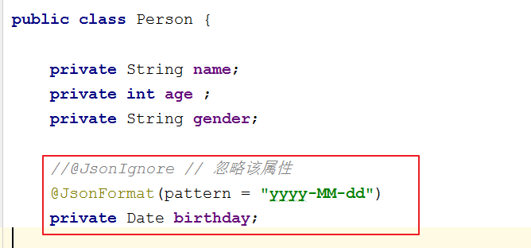

# (二)Jquery与异步Ajax
<extoc></extoc>

## 传统AJAX操作(理解)
### 概念(理解)
ASynchronous JavaScript And XML	异步的JavaScript 和 XML

    Ajax 是一种在无需重新加载整个网页的情况下，能够更新部分网页的技术。
    通过在后台与服务器进行少量数据交换，Ajax 可以使网页实现异步更新。这意味着可以在不重新加载整个网页的情况下，对网页的某部分进行更新。
    传统的网页（不使用 Ajax）如果需要更新内容，必须重载整个网页页面。

异步和同步:客户端和服务器端相互通信的基础上

    * 客户端必须等待服务器端的响应。在等待的期间客户端不能做其他操作。
    * 客户端不需要等待服务器端的响应。在服务器处理请求的过程中，客户端可以进行其他的操作。

### 传统JS实现方式（了解）
```html
<!DOCTYPE html>
<html lang="en">
<head>
    <meta charset="UTF-8">
    <title>Title</title>
    <script>
        //定义方法
        function fun() {
            //发送异步请求
            //1.创建核心对象
            var xmlhttp;
            if (window.XMLHttpRequest) {// code for IE7+, Firefox, Chrome, Opera, Safari
                xmlhttp = new XMLHttpRequest();
            } else {// code for IE6, IE5
                xmlhttp = new ActiveXObject("Microsoft.XMLHTTP");
            }

            //2. 建立连接
            /*
                参数:
                    1. 请求方式:GET、POST
                        * get方式，请求参数在URL后边拼接。send方法为空参
                        * post方式，请求参数在send方法中定义
                    2. 请求的URL:
                    3. 同步或异步请求:true（异步）或 false（同步）
             */
            xmlhttp.open("GET", "ajaxServlet?username=tom", true);

            //3.发送请求
            xmlhttp.send();

            //4.接受并处理来自服务器的响应结果
            //获取方式 :xmlhttp.responseText
            //什么时候获取？当服务器响应成功后再获取

            //当xmlhttp对象的就绪状态改变时，触发事件onreadystatechange。
            xmlhttp.onreadystatechange = function () {
                //判断readyState就绪状态是否为4，判断status响应状态码是否为200
                if (xmlhttp.readyState == 4 && xmlhttp.status == 200) {
                    //获取服务器的响应结果
                    var responseText = xmlhttp.responseText;
                    alert(responseText);
                }
            }
        }
    </script>
</head>
<body>
<input type="button" value="发送异步请求" onclick="fun();">
<input>
</body>
</html>
```

## jQuery封装的Ajax操作(掌握)
### `$.ajax({options})`(掌握)
#### 参数及含义:参数太多就不一一列举了,这里列举几个常用的,剩下的可以去文档中查询

| 参数    | 类型    | 是否必选     | 说明     |
| :------------- | :------------- | :------------- | :------------- |
| type    | 请求方式  | 否  | (默认: "GET") 请求方式 ("POST" 或 "GET")， 默认为 "GET"。   |
| url     | String       |   是     | 请求的路径        |
| data    | key-value/String  | 否  |发送至服务器的 key/value 数据 |
| success | 函数  | 否  | 请求成功后的回调函数。参数:由服务器返回，并根据dataType参数进行处理后的数据  |
| dataType| String  | 否  | 预期服务器返回的数据类型。如果不指定，jQuery 将自动根据 HTTP 包 MIME 信息来智能判断，比如XML MIME类型就被识别为XML  |


#### 代码示例
```JavaScript
<script type="text/javascript" src="/javaweb_ajax01/js/jquery-1.8.3.min.js"></script>
<script type="text/javascript">
$(function(){
	//确定事件  绑定事件
	$("#username").blur(function(){
		//获取用户输入的用户名
		var uv = $(this).val();
		//发送异步请求
		$.ajax({
		   type: "get", 					             //请求方式
		   url: "/javaweb_ajax01/isExist",    //请求路径
		   data: {username:uv},			      	 //请求参数
		   success: function(msg){		    	//响应成功之后的回调函数  参数msg就是响应的数据相当于responseText和responseXML
         //更新页面
			   $("#usernameMsg").html(msg)  ;
		   }
		});
	})
});
</script>
```

### `$.get(url, [data], [callback], [type])`:发送get请求(掌握)

#### 参数及含义:

| 参数    | 类型    | 是否必选     | 说明     |
| :------------- | :------------- | :------------- | :------------- |
| url     | String       |   是     | 待装入 HTML 网页网址        |
| data    | key-value/String  | 否  |发送至服务器的 key/value 数据 |
| callback| 函数  | 否  | 请求成功时回调函数  |
| type    | String  | 否  | 预期服务器响应的数据类型:xml, html, script, json, text, _default   |

#### 示例
#### 代码示例
```javascript
<script type="text/javascript" src="/javaweb_ajax01/js/jquery-1.8.3.min.js"></script>
<script type="text/javascript">
$(function(){
	//确定事件  绑定事件
	$("#username").blur(function(){
		//获取用户输入的用户名
		var uv = $(this).val();
		//发送异步请求
		var url = "/javaweb_ajax01/isExist";
		var params = {username:uv};
		$.get(url,params,function(data){  //data代表响应的数据,相当于responseText和responseXML
			//更新页面
			$("#usernameMsg").html(data);
		},"html");

	})
});
</script>
```

### $.post(url, [data], [callback], [type]):发送post请求(掌握)
#### 参数及含义:

| 参数    | 类型    | 是否必选     | 说明     |
| :------------- | :------------- | :------------- | :------------- |
| url     | String       |   是     | 待装入 HTML 网页网址        |
| data    | key-value/String  | 否  |发送至服务器的 key/value 数据 |
| callback| 函数  | 否  | 请求成功时回调函数  |
| type    | String  | 否  | 预期服务器响应的数据类型:xml, html, script, json, text, _default   |

#### 代码示例

```javascript
<script type="text/javascript" src="/javaweb_ajax01/js/jquery-1.8.3.min.js"></script>
<script type="text/javascript">
$(function(){
	//确定事件  绑定事件
	$("#username").blur(function(){
		//获取用户输入的用户名
		var uv = $(this).val();
		//发送异步请求
		var url = "/javaweb_ajax01/isExist";
		var params = {username:uv};
		$.post(url,params,function(data){  //data代表响应的数据,相当于responseText和responseXML
			//更新页面
			$("#usernameMsg").html(data);
		},"html");

	})
});
</script>
```

## JSON(掌握)
### 概念: JavaScript Object Notation		JavaScript对象表示法(理解)
    Person p = new Person();
    p.setName("张三");
    p.setAge(23);
    p.setGender("男");

    var p = {"name":"张三","age":23,"gender":"男"};

    * json现在多用于存储和交换文本信息的语法
    * 进行数据的传输
    * JSON 比 XML 更小、更快，更易解析。

### 语法(熟悉)
#### 基本语法
    * 数据在名称/值对中:json数据是由键值对构成的
    	* 键用引号(单双都行)引起来，也可以不使用引号
    	* 值得取值类型:
    		1. 数字（整数或浮点数）
    		2. 字符串（在双引号中）
    		3. 逻辑值（true 或 false）
    		4. 数组（在方括号中）	{"persons":[{},{}]}
    		5. 对象（在花括号中） {"address":{"province":"陕西"....}}
    		6. null
    * 数据由逗号分隔:多个键值对由逗号分隔
    * 花括号保存对象:使用{}定义json 格式
    * 方括号保存数组:[]
#### 示例
```JavaScript
<script>
    //1.定义基本格式
    var person = {"name": "张三", age: 23, 'gender': true};
    //alert(person);

    //2.嵌套格式   {}———> []
    var persons = {
        "persons": [
            {"name": "张三", "age": 23, "gender": true},
            {"name": "李四", "age": 24, "gender": true},
            {"name": "王五", "age": 25, "gender": false}
            ]
    };
    alert(persons);


    //2.嵌套格式   []———> {}
    var ps = [{"name": "张三", "age": 23, "gender": true},
        {"name": "李四", "age": 24, "gender": true},
        {"name": "王五", "age": 25, "gender": false}];
</script>
```
### 获取数据(掌握)
#### 取值方式
    1. json对象.键名
    2. json对象["键名"]
    3. 数组对象[索引]
    4. 遍历
#### 示例
```JavaScript
<script>
    //1.定义基本格式
    var person = {"name": "张三", age: 23, 'gender': true};
    alert(person);
    //获取name的值
    var name1 = person.name;

    var name2 = person["name"];
    alert(name1+" "+name2);

    //2.嵌套格式   {}———> []
    var persons = {
        "persons": [
            {"name": "张三", "age": 23, "gender": true},
            {"name": "李四", "age": 24, "gender": true},
            {"name": "王五", "age": 25, "gender": false}
            ]
    };
    alert(persons);

    //获取王五值
    var name3 = persons.persons[2].name;
    alert(name3);

    //2.嵌套格式   []———> {}
    var ps = [{"name": "张三", "age": 23, "gender": true},
        {"name": "李四", "age": 24, "gender": true},
        {"name": "王五", "age": 25, "gender": false}];
    //获取李四值
    alert(ps);
    alert(ps[1].name);

    获取person对象中所有的键和值
     //for in 循环
    for(var key in person){
         //这样的方式获取不行。因为相当于  person."name"
         //alert(key + ":" + person.key);
         alert(key+":"+person[key]);
     }

      //获取ps中的所有值
     for (var i = 0; i < ps.length; i++) {
         var p = ps[i];
         for(var key in p){
             alert(key+":"+p[key]);
         }
     }
</script>
```

## JSON数据和Java对象的相互转换(掌握)
### JSON解析器(了解)
    - 常见的解析器:Jsonlib，Gson，fastjson，jackson

### Java对象转换JSON(掌握)
#### 使用步骤
    1. 导入jackson的相关jar包
    2. 创建Jackson核心对象 ObjectMapper
    3. 调用ObjectMapper的相关方法进行转换
    		* writeValue(参数1，obj):
                    参数1:
                        File:将obj对象转换为JSON字符串，并保存到指定的文件中
                        Writer:将obj对象转换为JSON字符串，并将json数据填充到字符输出流中
                        OutputStream:将obj对象转换为JSON字符串，并将json数据填充到字节输出流中
        * writeValueAsString(obj):将对象转为json字符串

#### 注解使用
    1. @JsonIgnore:排除属性。
    2. @JsonFormat:属性值得格式化
    	* @JsonFormat(pattern = "yyyy-MM-dd")



#### 复杂java对象转换
    1. List:数组
    2. Map:对象格式一致

#### 示例
```java
//Java对象转为JSON字符串,写入到文本中
@Test
public void test1() throws Exception {
    //1.创建Person对象
    Person p  = new Person();
    p.setName("张三");
    p.setAge(23);
    p.setGender("男");

    //2.创建Jackson的核心对象  ObjectMapper
    ObjectMapper mapper = new ObjectMapper();
    //3.转换
    //writeValue，将数据写到d://a.txt文件中
    //mapper.writeValue(new File("d://a.txt"),p);
    //writeValue.将数据关联到Writer中
    mapper.writeValue(new FileWriter("d://b.txt"),p);
}

//对象转化为JSON
@Test
public void test2() throws Exception {
    //1.创建Person对象
    Person p = new Person();
    p.setName("张三");
    p.setAge(23);
    p.setGender("男");
    p.setBirthday(new Date());

    //2.转换
    ObjectMapper mapper = new ObjectMapper();
    String json = mapper.writeValueAsString(p);

    System.out.println(json);//{"name":"张三","age":23,"gender":"男","birthday":1530958029263}
                            //{"name":"张三","age":23,"gender":"男","birthday":"2018-07-07"}
}

//对象集合转化为JSON
@Test
public void test3() throws Exception {
    //1.创建Person对象
    Person p = new Person();
    p.setName("张三");
    p.setAge(23);
    p.setGender("男");
    p.setBirthday(new Date());

    Person p1 = new Person();
    p1.setName("张三");
    p1.setAge(23);
    p1.setGender("男");
    p1.setBirthday(new Date());

    Person p2 = new Person();
    p2.setName("张三");
    p2.setAge(23);
    p2.setGender("男");
    p2.setBirthday(new Date());


    //创建List集合
    List<Person> ps = new ArrayList<Person>();
    ps.add(p);
    ps.add(p1);
    ps.add(p2);

    //2.转换
    ObjectMapper mapper = new ObjectMapper();
    String json = mapper.writeValueAsString(ps);
    // [{},{},{}]
    //[{"name":"张三","age":23,"gender":"男","birthday":"2018-07-07"},{"name":"张三","age":23,"gender":"男","birthday":"2018-07-07"},{"name":"张三","age":23,"gender":"男","birthday":"2018-07-07"}]
    System.out.println(json);
}


//Map集合转化为JSON
@Test
public void test4() throws Exception {
    //1.创建map对象
    Map<String,Object> map = new HashMap<String,Object>();
    map.put("name","张三");
    map.put("age",23);
    map.put("gender","男");

    //2.转换
    ObjectMapper mapper = new ObjectMapper();
    String json = mapper.writeValueAsString(map);
    //{"name":"张三","age":23,"gender":"男"}
    System.out.println(json);//{"gender":"男","name":"张三","age":23}
}

```


### JSON转为Java对象(了解)
#### 步骤
    1. 导入jackson的相关jar包
    2. 创建Jackson核心对象 ObjectMapper
    3. 调用ObjectMapper的相关方法进行转换
    	   * readValue(json字符串数据,Class)


#### 示例
```java
//演示 JSON字符串转为Java对象
@Test
public void test5() throws Exception {
   //1.初始化JSON字符串
    String json = "{\"gender\":\"男\",\"name\":\"张三\",\"age\":23}";

    //2.创建ObjectMapper对象
    ObjectMapper mapper = new ObjectMapper();
    //3.转换为Java对象 Person对象
    Person person = mapper.readValue(json, Person.class);

    System.out.println(person);
}
```

## 案例:校验用户名是否可用(掌握)
### 分析(理解)

    服务器响应的数据，在客户端使用时，要想当做json数据格式使用。有两种解决方案:

    1. $.get(type):将最后一个参数type指定为"json"
    2. 在服务器端设置MIME类型
    	response.setContentType("application/json;charset=utf-8");

### 代码实现(掌握)
#### 客户端
```html
<!DOCTYPE html>
<html lang="en">
<head>
    <meta charset="UTF-8">
    <title>注册页面</title>
    <script src="js/jquery-3.3.1.min.js"></script>
    <script>
        //在页面加载完成后
        $(function () {
           //给username绑定blur事件
           $("#username").blur(function () {
               //获取username文本输入框的值
               var username = $(this).val();
               //发送ajax请求
               //期望服务器响应回的数据格式：{"userExsit":true,"msg":"此用户名太受欢迎,请更换一个"}
               //                         {"userExsit":false,"msg":"用户名可用"}
               $.get("findUserServlet",{username:username},function (data) {
                   //判断userExsit键的值是否是true

                   // alert(data);
                   var span = $("#s_username");
                   if(data.userExsit){
                       //用户名存在
                       span.css("color","red");
                       span.html(data.msg);
                   }else{
                       //用户名不存在
                       span.css("color","green");
                       span.html(data.msg);
                   }
               });
           });
        });
    </script>
</head>
<body>
    <form>
        <input type="text" id="username" name="username" placeholder="请输入用户名">
        <span id="s_username"></span>
        <br>
        <input type="password" name="password" placeholder="请输入密码"><br>
        <input type="submit" value="注册"><br>
    </form>
</body>
</html>
```

#### 服务端
```java
@WebServlet("/findUserServlet")
public class FindUserServlet extends HttpServlet {
    protected void doPost(HttpServletRequest request, HttpServletResponse response) throws ServletException, IOException {
        //1.获取用户名
        String username = request.getParameter("username");
        //2.调用service层判断用户名是否存在
        //期望服务器响应回的数据格式：{"userExsit":true,"msg":"此用户名太受欢迎,请更换一个"}
        //                         {"userExsit":false,"msg":"用户名可用"}
        //设置响应的数据格式为json
        response.setContentType("application/json;charset=utf-8");
        Map<String,Object> map = new HashMap<String,Object>();

        if("tom".equals(username)){
            //存在
            map.put("userExsit",true);
            map.put("msg","此用户名太受欢迎,请更换一个");
        }else{
            //不存在
            map.put("userExsit",false);
            map.put("msg","用户名可用");
        }

        //将map转为json，并且传递给客户端
        //将map转为json
        ObjectMapper mapper = new ObjectMapper();
        //并且传递给客户端
        mapper.writeValue(response.getWriter(),map);
    }
}
```
