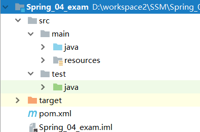
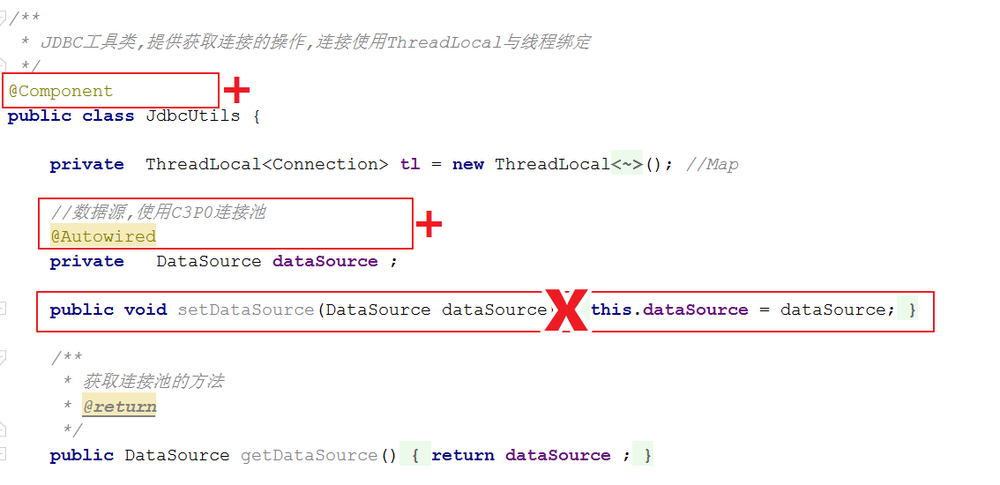
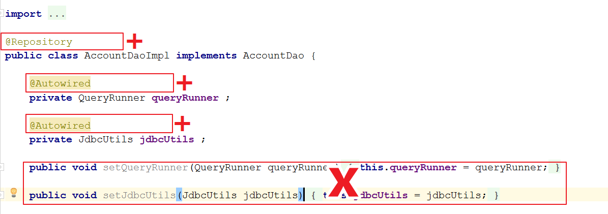
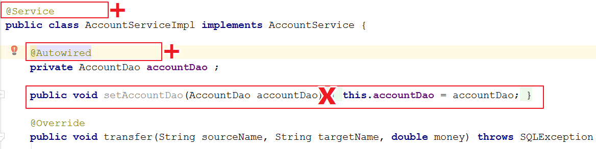
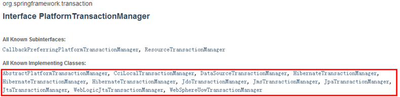
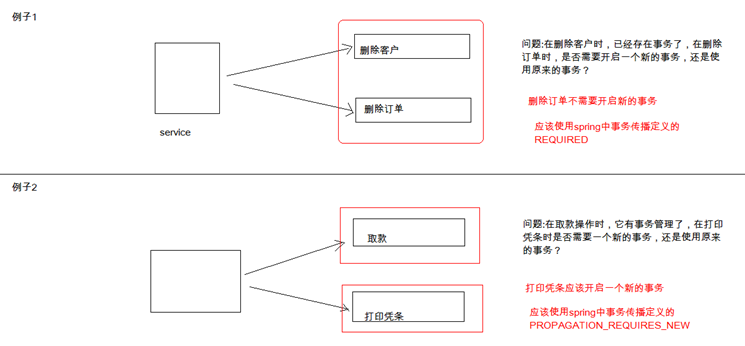
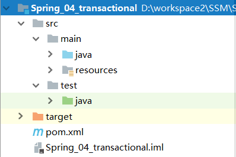
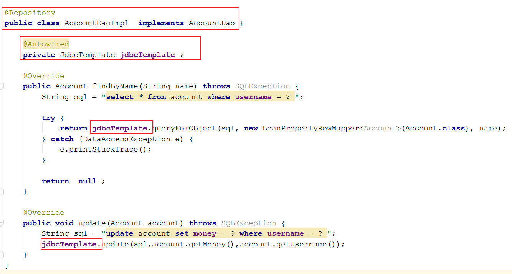
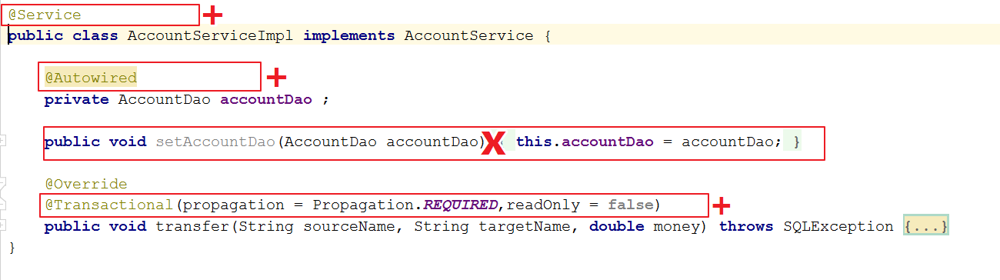

# 今日内容介绍

<extoc></extoc>

# 使用SpringAop实现事物控制(理解)
## 准备(理解)
### 创建maven项目(理解)


### 导入依赖jar包(理解)
```xml
<dependencies>
    <dependency>
        <groupId>junit</groupId>
        <artifactId>junit</artifactId>
        <version>4.12</version>
    </dependency>
    <dependency>
        <groupId>mysql</groupId>
        <artifactId>mysql-connector-java</artifactId>
        <version>5.1.38</version>
    </dependency>
    <dependency>
        <groupId>org.springframework</groupId>
        <artifactId>spring-context</artifactId>
        <version>5.0.2.RELEASE</version>
    </dependency>
    <dependency>
        <groupId>org.springframework</groupId>
        <artifactId>spring-test</artifactId>
        <version>5.0.2.RELEASE</version>
    </dependency>
    <dependency>
        <groupId>commons-dbutils</groupId>
        <artifactId>commons-dbutils</artifactId>
        <version>1.6</version>
    </dependency>
    <dependency>
        <groupId>c3p0</groupId>
        <artifactId>c3p0</artifactId>
        <version>0.9.1.2</version>
    </dependency>
    <dependency>
        <groupId>cglib</groupId>
        <artifactId>cglib</artifactId>
        <version>3.2.2</version>
    </dependency>
    <dependency>
        <groupId>org.aspectj</groupId>
        <artifactId>aspectjweaver</artifactId>
        <version>1.8.7</version>
    </dependency>
</dependencies>

<build>
    <plugins>
        <plugin>
            <groupId>org.apache.maven.plugins</groupId>
            <artifactId>maven-compiler-plugin</artifactId>
            <version>3.7.0</version>
            <configuration>
                <target>1.8</target>
                <source>1.8</source>
            </configuration>
        </plugin>
    </plugins>
</build>
```

### 编写实体类(理解)
```java
public class Account {

    private int id ;

    private String username ;

    private double money ;

    public int getId() {
        return id;
    }

    public void setId(int id) {
        this.id = id;
    }

    public String getUsername() {
        return username;
    }

    public void setUsername(String username) {
        this.username = username;
    }

    public double getMoney() {
        return money;
    }

    public void setMoney(double money) {
        this.money = money;
    }
}
```
### 编写数据访问层接口及实现类(理解)
#### 接口
```java
public interface AccountDao {

    /**
     * 根据用户名称查询用户信息
     * @param name
     * @return
     */
    Account findByName(String name) throws SQLException;

    /**
     * 更新账户信息
     * @param source
     */
    void update(Account source) throws SQLException;
}

```
#### 实现类
```java
public class AccountDaoImpl implements AccountDao {

    private QueryRunner queryRunner ;

    private JdbcUtils jdbcUtils ;

    public void setQueryRunner(QueryRunner queryRunner) {
        this.queryRunner = queryRunner;
    }

    public void setJdbcUtils(JdbcUtils jdbcUtils) {
        this.jdbcUtils = jdbcUtils;
    }

    @Override
    public Account findByName(String name) throws SQLException {
        String sql = "select * from account where username = ? ";
        return queryRunner.query(jdbcUtils.getThreadConnection(),sql,new BeanHandler<Account>(Account.class),name);
    }

    @Override
    public void update(Account account) throws SQLException {
        String sql = "update account set money = ? where username = ? ";
        queryRunner.update(jdbcUtils.getThreadConnection(),sql,account.getMoney(),account.getUsername());
    }
}
```

### 创建业务层接口及实现类(理解)
#### 接口
```java
public interface AccountService {

    /**
     * 转账业务功能
     * @param sourceName  转出账户
     * @param targetName  转入账户
     * @param money         转账金额
     * @throws SQLException
     */
    public void transfer(String sourceName, String targetName, double money) throws SQLException;
}

```
#### 实现类
```java
public class AccountServiceImpl implements AccountService {

    private AccountDao accountDao ;

    public void setAccountDao(AccountDao accountDao) {
        this.accountDao = accountDao;
    }

    @Override
    public void transfer(String sourceName, String targetName, double money) throws SQLException {

        //1.根据名称查询转出账户
        Account source = accountDao.findByName(sourceName);
        //2.根据名称查询转入账户
        Account target = accountDao.findByName(targetName);
        //3.转出账户减钱
        source.setMoney(source.getMoney()-money);
        //4.转入账户加钱
        target.setMoney(target.getMoney()+money);
        //5.更新转出账户余额
        accountDao.update(source);
        //int i = 10 / 0 ; //特意添加的异常代码,让程序执行异常
        //6.更新转入账户余额
        accountDao.update(target);
    }
}
```

### 编写事物控制工具类(理解)
#### JdbcUtils工具类
```java
/**
 * JDBC工具类,提供获取连接的操作,连接使用ThreadLocal与线程绑定
 */
public class JdbcUtils {

    private  ThreadLocal<Connection> tl = new ThreadLocal<Connection>(); //Map

    //数据源,使用C3P0连接池
    private   DataSource dataSource ;

    public void setDataSource(DataSource dataSource) {
        this.dataSource = dataSource;
    }

    /**
     * 获取连接池的方法
     * @return
     */
    public DataSource getDataSource(){
        return dataSource ;
    }

    /**
     * 获取当前线程上的连接
     * @return
     */
    public  Connection getThreadConnection() {
        try{
            //1.先从ThreadLocal上获取
            Connection conn = tl.get();
            //2.判断当前线程上是否有连接
            if (conn == null) {
                //3.从数据源中获取一个连接，并且存入ThreadLocal中
                conn = dataSource.getConnection();
                tl.set(conn);
            }
            //4.返回当前线程上的连接
            return conn;
        }catch (Exception e){
            throw new RuntimeException(e);
        }
    }

    /**
     * 把连接和线程解绑
     */
    public  void release(){
        tl.remove();
    }
}
```

#### TransactionManager工具类
```java

/**
 * JDBC事物管理器
 */
public class TransactionManager {

    private JdbcUtils jdbcUtils ;

    public void setJdbcUtils(JdbcUtils jdbcUtils) {
        this.jdbcUtils = jdbcUtils;
    }

    /**
     * 开启事务
     */
    public  void beginTransaction() {
        try {
            jdbcUtils.getThreadConnection().setAutoCommit(false);
        } catch (Exception e) {
            e.printStackTrace();
        }
    }

    /**
     * 提交事务
     */
    public  void commit() {
        try {
            jdbcUtils.getThreadConnection().commit();
        } catch (Exception e) {
            e.printStackTrace();
        }
    }

    /**
     * 回滚事务
     */
    public  void rollback() {
        try {
            jdbcUtils.getThreadConnection().rollback();
        } catch (Exception e) {
            e.printStackTrace();
        }
    }

    /**
     * 释放连接
     */
    public  void release() {
        try {
            jdbcUtils.getThreadConnection().close();//还回连接池中
            jdbcUtils.release();
        } catch (Exception e) {
            e.printStackTrace();
        }
    }
}
```

### 创建Spring核心配置文件`beans.xml`(理解)
```xml
<?xml version="1.0" encoding="UTF-8"?>
<beans xmlns="http://www.springframework.org/schema/beans"
       xmlns:xsi="http://www.w3.org/2001/XMLSchema-instance"
       xmlns:context="http://www.springframework.org/schema/context"
       xmlns:aop="http://www.springframework.org/schema/aop"
       xsi:schemaLocation="http://www.springframework.org/schema/beans
        http://www.springframework.org/schema/beans/spring-beans.xsd
        http://www.springframework.org/schema/context
        http://www.springframework.org/schema/context/spring-context.xsd
        http://www.springframework.org/schema/aop
        http://www.springframework.org/schema/aop/spring-aop.xsd">


</beans>
```

### 使用SpringAop解决事物问题--xml配置方式(理解)
#### 配置Spring的IOC和DI和AOP
```xml
<?xml version="1.0" encoding="UTF-8"?>
<beans xmlns="http://www.springframework.org/schema/beans"
       xmlns:xsi="http://www.w3.org/2001/XMLSchema-instance"
       xmlns:context="http://www.springframework.org/schema/context"
       xmlns:aop="http://www.springframework.org/schema/aop"
       xsi:schemaLocation="http://www.springframework.org/schema/beans
        http://www.springframework.org/schema/beans/spring-beans.xsd
        http://www.springframework.org/schema/context
        http://www.springframework.org/schema/context/spring-context.xsd
        http://www.springframework.org/schema/aop
        http://www.springframework.org/schema/aop/spring-aop.xsd">

    <context:property-placeholder location="classpath:db.properties"></context:property-placeholder>

    <!--配置数据源-->
    <bean id="dataSource" class="com.mchange.v2.c3p0.ComboPooledDataSource">
        <property name="driverClass" value="${jdbc.driver}"></property>
        <property name="jdbcUrl" value="${jdbc.url}"></property>
        <property name="user" value="${jdbc.username}"></property>
        <property name="password" value="${jdbc.password}"></property>
    </bean>

    <!--配置DbUtils核心运行类queryRunner,注入数据源-->
    <bean id="queryRunner" class="org.apache.commons.dbutils.QueryRunner">
        <constructor-arg name="ds" ref="dataSource"></constructor-arg>
    </bean>

    <!--配置JDBC工具类-->
    <bean id="jdbcUtils" class="com.itheima.utils.JdbcUtils">
        <property name="dataSource" ref="dataSource"></property>
    </bean>

    <!--配置事物管理器-->
    <bean id="tx" class="com.itheima.utils.TransactionManager">
        <property name="jdbcUtils" ref="jdbcUtils"></property>
    </bean>

    <!--配置数据访问层对象,注入jdbcUtils与queryRunner对象-->
    <bean id="accountDao" class="com.itheima.dao.impl.AccountDaoImpl">
        <property name="jdbcUtils" ref="jdbcUtils"></property>
        <property name="queryRunner" ref="queryRunner"></property>
    </bean>

    <!--配置业务层对象,注入数据访问层接口-->
    <bean id="accountService" class="com.itheima.service.impl.AccountServiceImpl">
        <property name="accountDao" ref="accountDao"></property>
    </bean>

    <!--使用SpringAop配置事物-->
    <aop:config>
        <!--配置切面-->
        <aop:aspect id="txAspect" ref="tx">
            <!--配置切入点-->
            <aop:pointcut id="txPointcut" expression="execution(* com.itheima.service.impl.*.*(..))"></aop:pointcut>
            <!--配置前置通知:开启事物-->
            <aop:before method="beginTransaction" pointcut-ref="txPointcut"></aop:before>

            <!--配置后置同时:提交事物-->
            <aop:after-returning method="commit" pointcut-ref="txPointcut"></aop:after-returning>

            <!--配置异常通知:回滚事物-->
            <aop:after-throwing method="rollback" pointcut-ref="txPointcut"></aop:after-throwing>

            <!--配置最终通知:释放资源-->
            <aop:after method="release" pointcut-ref="txPointcut"></aop:after>
        </aop:aspect>
    </aop:config>
</beans>
```

#### 编写测试代码
```java
public class AccountServiceTest {
    @Test
    public void transfer() throws SQLException {
        ApplicationContext applicationContext = new ClassPathXmlApplicationContext("beans.xml");
        AccountService accountService = (AccountService) applicationContext.getBean("accountService");
        //zhangsan给lisi转账1000元
        accountService.transfer("zhangsan","lisi",1000);
    }
}
```

### 使用SpringAop解决事物问题--注解方式(理解)
#### 核心配置文件中配置数据源及自动代理
```xml
<?xml version="1.0" encoding="UTF-8"?>
<beans xmlns="http://www.springframework.org/schema/beans"
       xmlns:xsi="http://www.w3.org/2001/XMLSchema-instance"
       xmlns:context="http://www.springframework.org/schema/context"
       xmlns:aop="http://www.springframework.org/schema/aop"
       xsi:schemaLocation="http://www.springframework.org/schema/beans
        http://www.springframework.org/schema/beans/spring-beans.xsd
        http://www.springframework.org/schema/context
        http://www.springframework.org/schema/context/spring-context.xsd
        http://www.springframework.org/schema/aop
        http://www.springframework.org/schema/aop/spring-aop.xsd">

    <!--加载属性文件-->
    <context:property-placeholder location="classpath:db.properties"></context:property-placeholder>

    <!--配置注解扫描-->
    <context:component-scan base-package="com.itheima"></context:component-scan>

    <!--配置自动代理-->
    <aop:aspectj-autoproxy></aop:aspectj-autoproxy>

    <!--配置数据源-->
    <bean id="dataSource" class="com.mchange.v2.c3p0.ComboPooledDataSource">
        <property name="driverClass" value="${jdbc.driver}"></property>
        <property name="jdbcUrl" value="${jdbc.url}"></property>
        <property name="user" value="${jdbc.username}"></property>
        <property name="password" value="${jdbc.password}"></property>
    </bean>

    <!--配置DbUtils核心运行类queryRunner,注入数据源-->
    <bean id="queryRunner" class="org.apache.commons.dbutils.QueryRunner">
        <constructor-arg name="ds" ref="dataSource"></constructor-arg>
    </bean>
</beans>
```
#### 修改JdbcUtils工具类使用注解实现


#### 修改数据访问层实现类使用注解实现


#### 修改业务层实现类使用注解实现


#### 修改TransactionManager事物管理器使用注解实现
```java
/**
 * JDBC事物管理器
 */
@Component
@Aspect
public class TransactionManager {

    @Autowired
    private JdbcUtils jdbcUtils ;

    @Pointcut("execution(* com.itheima.service.impl.*.*(..))")
    public void txPointCut(){};

    /**
     * 因为注解AOP通知的执行顺序问题(前置--->最终-->后置),会导致连接先从线程中移除,再执行提交事物的操作
     * 所以这里使用环绕通知自己控制事物
     * 环绕通知
     * @param pjp
     * @return
     */
    @Around("txPointCut()")
    public Object aroundAdvice(ProceedingJoinPoint pjp){
        Object rtValue=null;
        try{
            //获取参数
            Object[] args=pjp.getArgs();
            //开启事务
            this.beginTransaction();
            //执行方法
            rtValue=pjp.proceed(args);
            //提交事务
            this.commit();
            //返回结果
            return rtValue;
        }catch (Throwable e) {
            //回滚事务
            this.rollback();
            throw  new RuntimeException(e);
        } finally {
            //释放资源
            this.release();
        }
    }

    /**
     * 开启事务
     */
    public  void beginTransaction() {
        try {
            jdbcUtils.getThreadConnection().setAutoCommit(false);
        } catch (Exception e) {
            e.printStackTrace();
        }
    }

    /**
     * 提交事务
     */
    public  void commit() {
        try {
            jdbcUtils.getThreadConnection().commit();
        } catch (Exception e) {
            e.printStackTrace();
        }
    }

    /**
     * 回滚事务
     */
    public  void rollback() {
        try {
            jdbcUtils.getThreadConnection().rollback();
        } catch (Exception e) {
            e.printStackTrace();
        }
    }

    /**
     * 释放连接
     */
    public  void release() {
        try {
            jdbcUtils.getThreadConnection().close();//还回连接池中
            jdbcUtils.release();
        } catch (Exception e) {
            e.printStackTrace();
        }
    }
}
```

#### 编写测试代码
```java
@RunWith(SpringJUnit4ClassRunner.class)
@ContextConfiguration(locations = "classpath:beans.xml")
public class AccountServiceTest {

    @Autowired
    private AccountService accountService ;

    @Test
    public void transfer() throws SQLException {
        //zhangsan给lisi转账1000元
        accountService.transfer("zhangsan","lisi",1000);
    }
}
```

# Spring事物控制(掌握)

## Spring事务控制我们要明确的三点(熟悉)

    1. JavaEE体系进行分层开发，事务处理位于业务层，Spring提供了分层设计业务层的事务处理解决方案。

    2. spring框架为我们提供了一组事务控制的接口。具体在后面的第二小节介绍。这组接口是在spring-tx-5.0.2.RELEASE.jar中。

    3. spring的事务控制都是基于AOP的，它既可以使用编程的方式实现，也可以使用配置的方式实现。我们学习的重点是使用配置的方式实现。

## Spring中事务控制的API介绍(熟悉)

### PlatformTransactionManager接口(熟悉)
此接口是spring的事务管理器，它里面提供了我们常用的操作事务的方法，如下图：


我们在开发中都是使用它的实现类



常用的实现类:

    `org.springframework.jdbc.datasource.DataSourceTransactionManager` 使用Spring JDBC或iBatis 进行持久化数据时使用

    `org.springframework.orm.hibernate5.HibernateTransactionManager` 使用Hibernate版本进行持久化数据时使用

### TransactionDefinition(熟悉)

描述的是事务的定义信息对象，里面有如下方法：


#### 事物的隔离级别


#### 事物的传播行为

事务的传播行为：它解决的是两个被事务管理的方法互相调用问题。它与数据库没关系，是程序内部维护的问题。



    REQUIRED:如果当前没有事务，就新建一个事务，如果已经存在一个事务中，加入到这个事务中。一般的选择（默认值）

    SUPPORTS:支持当前事务，如果当前没有事务，就以非事务方式执行（没有事务）

    MANDATORY：使用当前的事务，如果当前没有事务，就抛出异常 REQUERS_NEW:新建事务，如果当前在事务中，把当前事务挂起。

    NOT_SUPPORTED:以非事务方式执行操作，如果当前存在事务，就把当前事务挂起

    NEVER:以非事务方式运行，如果当前存在事务，抛出异常 NESTED:如果当前存在事务，则在嵌套事务内执行。如果当前没有事务，则执行REQUIRED类似的操作。

### TransactionStatus(熟悉)

此接口提供的是事务具体的运行状态，方法介绍如下图：


## 准备(掌握)
### 创建maven项目(掌握)


### 导入依赖jar包(掌握)
```xml
<dependencies>
    <dependency>
        <groupId>junit</groupId>
        <artifactId>junit</artifactId>
        <version>4.12</version>
    </dependency>
    <dependency>
        <groupId>mysql</groupId>
        <artifactId>mysql-connector-java</artifactId>
        <version>5.1.38</version>
    </dependency>
    <dependency>
        <groupId>org.springframework</groupId>
        <artifactId>spring-context</artifactId>
        <version>5.0.2.RELEASE</version>
    </dependency>
    <dependency>
        <groupId>org.springframework</groupId>
        <artifactId>spring-jdbc</artifactId>
        <version>5.0.2.RELEASE</version>
    </dependency>
    <dependency>
        <groupId>org.springframework</groupId>
        <artifactId>spring-test</artifactId>
        <version>5.0.2.RELEASE</version>
    </dependency>
    <dependency>
        <groupId>c3p0</groupId>
        <artifactId>c3p0</artifactId>
        <version>0.9.1.2</version>
    </dependency>
    <dependency>
        <groupId>cglib</groupId>
        <artifactId>cglib</artifactId>
        <version>3.2.2</version>
    </dependency>
    <dependency>
        <groupId>org.aspectj</groupId>
        <artifactId>aspectjweaver</artifactId>
        <version>1.8.7</version>
    </dependency>
</dependencies>

<build>
    <plugins>
        <plugin>
            <groupId>org.apache.maven.plugins</groupId>
            <artifactId>maven-compiler-plugin</artifactId>
            <version>3.7.0</version>
            <configuration>
                <target>1.8</target>
                <source>1.8</source>
            </configuration>
        </plugin>
    </plugins>
</build>
```

### 编写实体类(掌握)
```java
public class Account {

    private int id ;

    private String username ;

    private double money ;

    public int getId() {
        return id;
    }

    public void setId(int id) {
        this.id = id;
    }

    public String getUsername() {
        return username;
    }

    public void setUsername(String username) {
        this.username = username;
    }

    public double getMoney() {
        return money;
    }

    public void setMoney(double money) {
        this.money = money;
    }
}
```
### 编写数据访问层接口及实现类(掌握)
#### 接口`AccountDao`
```java
public interface AccountDao {

    /**
     * 根据用户名称查询用户信息
     * @param name
     * @return
     */
    Account findByName(String name) throws SQLException;

    /**
     * 更新账户信息
     * @param source
     */
    void update(Account source) throws SQLException;
}

```
#### 实现类`AccountDaoImpl`
```java
@Repository
public class AccountDaoImpl extends JdbcDaoSupport implements AccountDao {

    @Override
    public Account findByName(String name) throws SQLException {
        String sql = "select * from account where username = ? ";

        try {
            return getJdbcTemplate().queryForObject(sql, new BeanPropertyRowMapper<Account>(Account.class), name);
        } catch (DataAccessException e) {
            e.printStackTrace();
        }

        return  null ;
    }

    @Override
    public void update(Account account) throws SQLException {
        String sql = "update account set money = ? where username = ? ";
        getJdbcTemplate().update(sql,account.getMoney(),account.getUsername());
    }
}

```

### 创建业务层接口及实现类(掌握)
#### 接口
```java
public interface AccountService {

    /**
     * 转账业务功能
     * @param sourceName  转出账户
     * @param targetName  转入账户
     * @param money         转账金额
     * @throws SQLException
     */
    public void transfer(String sourceName, String targetName, double money) throws SQLException;
}
```

#### 实现类
```java
public class AccountServiceImpl implements AccountService {

    private AccountDao accountDao ;

    public void setAccountDao(AccountDao accountDao) {
        this.accountDao = accountDao;
    }

    @Override
    public void transfer(String sourceName, String targetName, double money) throws SQLException {

        //1.根据名称查询转出账户
        Account source = accountDao.findByName(sourceName);
        //2.根据名称查询转入账户
        Account target = accountDao.findByName(targetName);
        //3.转出账户减钱
        source.setMoney(source.getMoney()-money);
        //4.转入账户加钱
        target.setMoney(target.getMoney()+money);
        //5.更新转出账户余额
        accountDao.update(source);
        //int i = 10 / 0 ; //特意添加的异常代码,让程序执行异常
        //6.更新转入账户余额
        accountDao.update(target);
    }
}
```

### 创建Spring核心配置文件`beans.xml`(掌握)
```xml
<?xml version="1.0" encoding="UTF-8"?>
<beans xmlns="http://www.springframework.org/schema/beans"
       xmlns:xsi="http://www.w3.org/2001/XMLSchema-instance"
       xmlns:context="http://www.springframework.org/schema/context"
       xmlns:aop="http://www.springframework.org/schema/aop"
       xmlns:tx="http://www.springframework.org/schema/tx"
       xsi:schemaLocation="http://www.springframework.org/schema/beans
        http://www.springframework.org/schema/beans/spring-beans.xsd
        http://www.springframework.org/schema/context
        http://www.springframework.org/schema/context/spring-context.xsd
        http://www.springframework.org/schema/aop
        http://www.springframework.org/schema/aop/spring-aop.xsd
        http://www.springframework.org/schema/tx
        http://www.springframework.org/schema/tx/spring-tx.xsd">

        <!--加载属性文件-->
        <context:property-placeholder location="classpath:db.properties"></context:property-placeholder>

        <!--配置dao-->
        <bean id="accountDao" class="com.itheima.dao.impl.AccountDaoImpl">
            <property name="dataSource" ref="dataSource"></property>
        </bean>
        <!--配置service-->
        <bean id="accountService" class="com.itheima.service.impl.AccountServiceImpl">
            <property name="accountDao" ref="accountDao"></property>
        </bean>

        <!--配置数据源-->
        <bean id="dataSource" class="com.mchange.v2.c3p0.ComboPooledDataSource">
            <property name="driverClass" value="${jdbc.driver}"></property>
            <property name="jdbcUrl" value="${jdbc.url}"></property>
            <property name="user" value="${jdbc.username}"></property>
            <property name="password" value="${jdbc.password}"></property>
        </bean>

</beans>
```

### 编写测试类(掌握)
```java
@RunWith(SpringJUnit4ClassRunner.class)
@ContextConfiguration(locations = "classpath:beans.xml")
public class AccountServiceTest {

    @Autowired
    private AccountService accountService ;

    @Test
    public void transfer() throws SQLException {
        //zhangsan给lisi转账1000元
        accountService.transfer("zhangsan","lisi",1000);
    }
}
```

## 基于XML的声明式事务控制(掌握)

### 配置事务步骤(掌握)

    1. 配置事务管理器
    2. 配置事务的通知：此时我们需要导入事务的约束 tx名称空间和约束，同时也需要aop的名称空间和约束
           tx:advice标签配置事务通知：
                属性：
                    id：给事务通知起一个唯一标识
                    transaction-manager：给事务通知提供一个事务管理器引用
    3. 配置AOP中的通用切入点表达式
    4. 建立事务通知和切入点表达式的对应关系
    5. 配置事务的属性：在事务的通知tx:advice标签的内部

### 配置声明式事务控制(掌握)
```xml
<?xml version="1.0" encoding="UTF-8"?>
<beans xmlns="http://www.springframework.org/schema/beans"
       xmlns:xsi="http://www.w3.org/2001/XMLSchema-instance"
       xmlns:context="http://www.springframework.org/schema/context"
       xmlns:aop="http://www.springframework.org/schema/aop"
       xmlns:tx="http://www.springframework.org/schema/tx"
       xsi:schemaLocation="http://www.springframework.org/schema/beans
        http://www.springframework.org/schema/beans/spring-beans.xsd
        http://www.springframework.org/schema/context
        http://www.springframework.org/schema/context/spring-context.xsd
        http://www.springframework.org/schema/aop
        http://www.springframework.org/schema/aop/spring-aop.xsd
        http://www.springframework.org/schema/tx
        http://www.springframework.org/schema/tx/spring-tx.xsd">

    <!--加载属性文件-->
    <context:property-placeholder location="classpath:db.properties"></context:property-placeholder>

    <!--配置dao-->
    <bean id="accountDao" class="com.itheima.dao.impl.AccountDaoImpl">
        <property name="dataSource" ref="dataSource"></property>
    </bean>
    <!--配置service-->
    <bean id="accountService" class="com.itheima.service.impl.AccountServiceImpl">
        <property name="accountDao" ref="accountDao"></property>
    </bean>

    <!--配置数据源-->
    <bean id="dataSource" class="com.mchange.v2.c3p0.ComboPooledDataSource">
        <property name="driverClass" value="${jdbc.driver}"></property>
        <property name="jdbcUrl" value="${jdbc.url}"></property>
        <property name="user" value="${jdbc.username}"></property>
        <property name="password" value="${jdbc.password}"></property>
    </bean>

    <!--配置事务管理器-->
    <bean id="transactionManager" class="org.springframework.jdbc.datasource.DataSourceTransactionManager">
        <property name="dataSource" ref="dataSource"></property>
    </bean>

    <!--配置事务通知-->
    <tx:advice id="txAdvice" transaction-manager="transactionManager">
        <!--配置事务的属性
            isolation:用于指定事务的隔离级别，默认值为DEFAULT,表示使用数据库默认隔离级别
            propagation:用于指定事务的传播行为，默认值为REQUIRED，表示一定会有事务，增删改的选择，
                         查询选择SUPPORTS
            read-only:用于指定事务是否只读，布尔值，只有查询方法才能设为true,默认值为false表示读写
            timeout:用于指定事务的超时时间，默认值为-1表示永不超时，如果指定数值，以秒为单位
            rollback-for:用于指定一个异常，当产生该异常时事务回滚，产生其他异常时事务不回滚。
                          没有默认值，表示产生任何异常都回滚
            no-rollback-for:用于指定一个异常，当产生该异常时事务不回滚，产生其他异常时事务回滚。
                            没有默认值，表示任何异常都回滚
        -->
        <tx:attributes>
            <!--此配置意思为:当以get/find开头的方法支持事务，且该事务为只读-->
            <tx:method name="get*" propagation="REQUIRED" read-only="true"/>
            <tx:method name="find*" propagation="REQUIRED" read-only="true"/>

            <!--此配置意思为:当以update,del,delete,insert,add,save开头的方法进行事务控制，会回滚-->
            <tx:method name="updaet*" propagation="REQUIRED"></tx:method>
            <tx:method name="del*" propagation="REQUIRED"></tx:method>
            <tx:method name="delete*" propagation="REQUIRED"></tx:method>
            <tx:method name="insert*" propagation="REQUIRED"></tx:method>
            <tx:method name="add*" propagation="REQUIRED"></tx:method>
            <tx:method name="save*" propagation="REQUIRED"></tx:method>
        </tx:attributes>
    </tx:advice>

    <!--配置AOP-->
    <aop:config>
        <!--配置切入点，也就是事务控制要在哪一层上，一般事务在业务层控制-->
        <aop:pointcut id="txPointCut" expression="execution(* com.itheima.service.impl.*.*(..))"></aop:pointcut>
        <!--建立切入点表达式和事务通知之间的关系-->
        <aop:advisor advice-ref="txAdvice" pointcut-ref="txPointCut"></aop:advisor>
    </aop:config>

</beans>
```

## 基于注解的声明式事务控制(掌握)
### 修改Dao实现类,添加注解(掌握)


### 修改业务层实现类(掌握)


### 修改配置文件`beans.xml`开启事物控制(掌握)
```xml
<?xml version="1.0" encoding="UTF-8"?>
<beans xmlns="http://www.springframework.org/schema/beans"
       xmlns:xsi="http://www.w3.org/2001/XMLSchema-instance"
       xmlns:context="http://www.springframework.org/schema/context"
       xmlns:aop="http://www.springframework.org/schema/aop"
       xmlns:tx="http://www.springframework.org/schema/tx"
       xsi:schemaLocation="http://www.springframework.org/schema/beans
        http://www.springframework.org/schema/beans/spring-beans.xsd
        http://www.springframework.org/schema/context
        http://www.springframework.org/schema/context/spring-context.xsd
        http://www.springframework.org/schema/aop
        http://www.springframework.org/schema/aop/spring-aop.xsd
        http://www.springframework.org/schema/tx
        http://www.springframework.org/schema/tx/spring-tx.xsd">

    <!--加载属性文件-->
    <context:property-placeholder location="classpath:db.properties"></context:property-placeholder>

    <!--开启组件扫描-->
    <context:component-scan base-package="com.itheima"></context:component-scan>

    <!--配置数据源-->
    <bean id="dataSource" class="com.mchange.v2.c3p0.ComboPooledDataSource">
        <property name="driverClass" value="${jdbc.driver}"></property>
        <property name="jdbcUrl" value="${jdbc.url}"></property>
        <property name="user" value="${jdbc.username}"></property>
        <property name="password" value="${jdbc.password}"></property>
    </bean>

    <!--配置JDBC-->
    <bean id="jdbcTemplate" class="org.springframework.jdbc.core.JdbcTemplate">
        <property name="dataSource" ref="dataSource"></property>
    </bean>

    <!--配置spring基于注解的事务管理器
      1、配置事务管理器
      2、开启spring对注解事务的支持
      3、在需要使用事务的类上使用@Transactional注解
    -->
    <bean id="transactionManager" class="org.springframework.jdbc.datasource.DataSourceTransactionManager">
        <property name="dataSource" ref="dataSource"></property>
    </bean>

    <!--开启spring对注解事务的支持-->
    <tx:annotation-driven transaction-manager="transactionManager"></tx:annotation-driven>

</beans>
```
