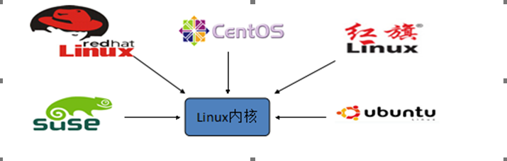

# Linux基础一
<extoc></extoc>

# Linux概述与安装
## Linux概述(了解)
#### Unix的概述(了解)
Unix是一个强大的多用户、多任务操作系统。 于1969年在AT&T的贝尔实验室开发。 UNIX的商标权由国际开放标准组织（The Open Group）所拥有。 UNIX操作系统是商业版，需要收费，价格比Microsoft Windows正版要贵一些。

#### Linux的概述(了解)
    Linux是基于Unix的,Linux是一种自由和开放源码的操作系统，存在着许多不同的Linux版本，但它们都使用了Linux内核。Linux可安装在各种计算机硬件设备中，比如手机、平板电脑、路由器、台式计算机

    

    诞生于1991 年10 月5 日。是由芬兰赫尔辛基大学学生Linus Torvalds和后来加入的众多爱好者共同开发完成

    

    

#### Linux的历史(了解)
    Linux最初是由芬兰赫尔辛基大学学生Linus Torvalds由于自己不满意教学中使用的MINIX操作系统， 所以在1990年底由于个人爱好设计出了LINUX系统核心。后来发布于芬兰最大的ftp服务器上，用户可以免费下载，所以它的周边的程序越来越多，Linux本身也逐渐发展壮大起来，之后Linux在不到三年的时间里成为了一个功能完善，稳定可靠的操作系统.

#### Linux的应用(了解)
    服务器系统 Web应用服务器、数据库服务器、接口服务器、DNS、FTP等等；
    嵌入式系统 路由器、防火墙、手机、PDA、IP 分享器、交换器、家电用品的微电脑控制器等等，
    高性能运算、计算密集型应用 Linux有强大的运算能力。
    桌面应用系统
    移动手持系统

#### Linux版本(了解)

    Linux的版本分为两种：内核版本和发行版本； 内核版本是指在Linus领导下的内核小组开发维护的系统内核的版本号 ； 发行版本是一些组织和公司根据自己发行版的不同而自定的 ；

#### 主流版本(了解)


## Linux安装(熟悉)
### 虚拟机安装(熟悉)
```
什么是虚拟软件：
    虚拟原件是一个可以使你在一台机器上同时运行二个或更多Windows、LINUX等系统。它可以模拟一个标准PC环境。这个环境和真实的计算机一样，都有芯片组、CPU、内存、显卡、声卡、网卡、软驱、硬盘、光驱、串口、并口、USB控制器等

常用的虚拟原件：
    1.VMware workstation
    2.VirtualBox
```

#### 1. 运行`VMware-workstation-full-12.5.4-5192485.exe`程序


#### 2. 点击下一步进行安装


#### 3. 勾选接收许可协议,点击下一步继续


#### 4. 选择安装目录,注意不要安装在中文及特殊符号目录下


#### 5. 用户体验设置,点击下一步继续


#### 6. 选择是否创建快捷方式


#### 7. 点击安装


#### 8. 点击许可证


#### 9. 输入密钥,完成激活


#### 10. 打开网络适配器,如果有如下二张网卡,代表安装成功


### CentOS安装(熟悉)

#### 1. 点击`创建新的虚拟机`图标


#### 2. 选择 典型（推荐）→ 下一步


#### 3. 选择稍后安装操作系统


#### 4. 选择操作系统和版本


#### 5. 输入虚拟机名称和安装路径


#### 6. 设置磁盘大小


#### 7. 自定义硬件


#### 8. 选择CentOS安装镜像文件


#### 9. 点击完成


#### 10. 启动虚拟机


#### 11. 选择第一项，安装全新操作系统或升级现有操作系统


#### 12. 使用Tab键进行选择，选择Skip，退出检测


#### 13. 点击Next


#### 14. 选择语言，这里选择的是中文简体


#### 15. 选择键盘样式


#### 16. 选择存储设备


#### 17. 输入主机名


#### 18. 配置网络


#### 19. 设置时区，勾选使用UTC时间


#### 20. 输入根用户（root）的密码


#### 21. 根据此Linux具体功能，选择不同的方式


#### 22. 选择安装的Linux版本


#### 23. 安装中


#### 24. 重新引导


### Linux目录结构介绍(熟悉)


    - root管理员的home目录root
    - 其他用户的home目录home目录中

### CRT远程连接软件的使用(熟悉)
#### 双击CRT程序


#### 输入虚拟机IP和用户名


#### 输入密码


#### 输入命令进行操作


#### 界面乱码解决


# Linux的常用命令(掌握)

## 切换目录命令`cd`(掌握)
    cd app	切换到app目录
    cd ..	切换到上一层目录
    cd /		切换到系统根目录
    cd ~		切换到用户主目录
    cd -		切换到上一个所在目录

## 列出文件列表：`ls`、 `ll`、`dir`(掌握)

    ls(list)是一个非常有用的命令，用来显示当前目录下的内容。配合参数的使用，能以不同的方式显示目录内容。     
    格式：ls[参数] [路径或文件名]
    常用：
        在linux中以 . 开头的文件都是隐藏的文件
        * ls
        * ls -a  显示所有文件或目录（包含隐藏的文件）
        * ls -l  缩写成ll

## 创建目录和移除目录：`mkdir`、 `rmdir`(掌握)

    mkdir(make directory)命令可用来创建子目录。
        mkdir app   在当前目录下创建app目录
        mkdir –p app2/test   级联创建aap2以及test目

    rmdir(remove directory)命令可用来删除“空”的子目录：
        rmdir app    删除app目录

## 浏览文件 `cat`、`more`、`less`、` tail`(掌握)

## `cat`、`more`、`less`(掌握)
    cat 用于显示文件的内容。 格式：cat[参数]<文件名>
        - cat yum.conf

    more 一般用于要显示的内容会超过一个画面长度的情况。按空格键显示下一个画面。回车显示下一行内容。按 q 键退出查看。
        - more yum.conf

    less 用法和more类似，不同的是less可以通过PgUp、PgDn键来控制。
        - less yum.conf

## `tail`(掌握)
    tail命令是在实际使用过程中使用非常多的一个命令，它的功能是：用于显示文件后几行的内容。ctrl+c 结束查看

        - tail -10 /etc/passwd    查看后10行数据
        - tail -f catalina.log   动态查看日志(*****)

## 删除文件`rm`(掌握)

    用法：rm [选项]... 文件...

        rm a.txt    删除a.txt文件

    删除需要用户确认，y/n rm 删除不询问
        rm -f   a.txt    不询问，直接删除 rm 删除目录
        rm -r   a    递归删除 不询问递归删除（慎用）
        rm -rf  a    不询问递归删除
        rm -rf  *      删除所有文件
        rm -rf  /*      自杀

## 复制文件`cp`(掌握)

    cp(copy)命令可以将文件从一处复制到另一处。一般在使用cp命令时将一个文件复制成另一个文件或复制到某目录时，需要指定源文件名与目标文件名或目录。

        cp a.txt b.txt   将a.txt复制为b.txt文件
        cp a.txt ../   将a.txt文件复制到上一层目录中

## 重命名文件 `mv`(掌握)

    mv 移动或者重命名
        mv a.txt ../    将a.txt文件移动到上一层目录中
        mv a.txt b.txt    将a.txt文件重命名为b.txt

## 打包/压缩和解包/解压缩 `tar`(掌握)

    tar命令位于/bin目录下，它能够将用户所指定的文件或目录打包成一个文件，但不做压缩。一般Linux上常用的压缩方式是选用tar将许多文件打包成一个文件，再以gzip压缩命令压缩成xxx.tar.gz(或称为xxx.tgz)的文件。  

    常用参数：
        -c：创建一个新tar文件
        -v：显示运行过程的信息
        -f：指定文件名
        -z：调用gzip压缩命令进行压缩
        -t：查看压缩文件的内容
        -x：解开tar文件

    打包：
        tar –cvf xxx.tar ./*

    打包并且压缩：
        tar –zcvf xxx.tar.gz ./*

    解压:
        tar –xvf xxx.tar
        tar -xvf xxx.tar.gz -C /usr/aaa

## 过滤 `grep`(掌握)

    查找符合条件的字符串。
    用法: grep [选项]... PATTERN [FILE]...
    示例：
        grep lang anaconda-ks.cfg  在文件中查找lang
        grep lang anaconda-ks.cfg –color 高亮显示

## 其他常用命令 (掌握)
    1. 查看当前工作目录   :  pwd
    2. 创建一个空文件     :  touch
    3. 友好显示文件大小   :  ll -h
    4. 下载资料           :  wget


## 文件编辑命令 `vi`/`vim`(掌握)

    在Linux下一般使用vi编辑器来编辑文件。 vi既可以查看文件也可以编辑文件。 三种模式：命令行、插入、底行模式。
    切换到命令行模式：按Esc键；
    切换到插入模式：按 i 、o、a键；
        i 在当前位置生前插入
        I 在当前行首插入
        a 在当前位置后插入
        A 在当前行尾插入
        o 在当前行之后插入一行
        O 在当前行之前插入一行

    切换到底行模式：按 :（冒号）； 更多详细用法，查询文档《Vim命令合集.docx》和《vi使用方法详细介绍.docx》


    打开文件：vim file
    退出：esc  :q
    修改文件：输入i进入插入模式
    保存并退出：esc  :wq

    不保存退出：esc  :q!

    3种进入插入模式：
        i:在当前的光标所在处插入
        o:在当前光标所在的行的下一行插入
        a:在光标所在的下一个字符插入

    快捷键：
        dd – 快速删除一行
        R – 替换

## 重定向和输出`>`/`>>`(熟悉)

    `>` 重定向输出，覆盖原有内容
    `>>` 重定向输出，又追加功能

    示例：
      cat /etc/passwd > a.txt  将输出定向到a.txt中
      cat /etc/passwd >> a.txt  输出并且追加
      ifconfig > ifconfig.txt   将ifconfig命令的结果输出到 ifconfig.txt文件中

## 管道 `|`(熟悉)

    管道是Linux命令中重要的一个概念，其作用是将一个命令的输出用作另一个命令的输入。
    示例:
      ls --help | more  分页查询帮助信息
      ps –ef | grep java  查询名称中包含java的进程

      ifconfig | more
      cat index.html | more
      ps –ef | grep aio

##  命令控制符(了解)

    命令之间使用 && 连接，实现逻辑与的功能。  
    只有在 && 左边的命令返回真（命令返回值 $? == 0），&& 右边的命令才会被执行。  
    只要有一个命令返回假（命令返回值 $? == 1），后面的命令就不会被执行。

    mkdir test && cd test

## 网络通信命令(熟悉)

    ifconfig  显示或设置网络设备。
    ifconfig  显示网络设备
    ifconfig eth0 up 启用eth0网卡
    ifconfig eth0 down  停用eth0网卡 ping   探测网络是否通畅。
    ping 192.168.0.1 netstat 查看网络端口。
    netstat -an | grep 3306 查询3306端口占用情况

## 系统管理命令(了解)

    date 显示或设置系统时间
    date  显示当前系统时间
    date -s “2014-01-01 10:10:10“  设置系统时间 df 显示磁盘信息
    df –h  友好显示大小 free 显示内存状态
    free –m 以mb单位显示内存组昂头 top 显示，管理执行中的程序

    clear 清屏幕
    ps 正在运行的某个进程的状态
    ps –ef  查看所有进程
    ps –ef | grep ssh 查找某一进程 kill 杀掉某一进程
    kill 2868  杀掉2868编号的进程
    kill -9 2868  强制杀死进程

    du 显示目录或文件的大小。
    du –h 显示当前目录的大小
    who 显示目前登入系统的用户信息。
    hostname 查看当前主机名
    修改：vi /etc/sysconfig/network
    uname 显示系统信息。
    uname -a 显示本机详细信息。 依次为：内核名称(类别)，主机名，内核版本号，内核版本，内核编译日期，硬件名，处理器类型，硬件平台类型，操作系统名称
