# 黑马旅游网一
<extoc></extoc>

## 项目介绍

为了巩固web基础知识，提升综合运用能力，故而讲解此案例。要求，每位同学能够独立完成此案例

## 技术选型

### Web层
    1. Servlet：前端控制器
    2. html：视图
    3. Filter：过滤器
    4. BeanUtils：数据封装
    5. Jackson：json序列化工具

### Service层
    6. Javamail：java发送邮件工具
    7. Redis：nosql内存数据库
    8. Jedis：java的redis客户端

###Dao层
    9. Mysql：数据库
    10. Druid：数据库连接池
    11. JdbcTemplate：jdbc的工具


## 准备工作
### 创建`maven`的web项目及包结构

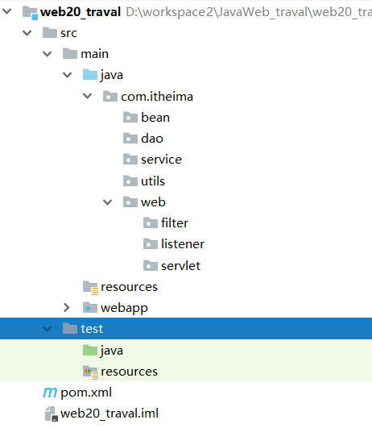

注意:补齐maven项目的各个目录

### 编写POM文件引入相关依赖及插件
```xml
<?xml version="1.0" encoding="UTF-8"?>

<project xmlns="http://maven.apache.org/POM/4.0.0" xmlns:xsi="http://www.w3.org/2001/XMLSchema-instance"
         xsi:schemaLocation="http://maven.apache.org/POM/4.0.0 http://maven.apache.org/xsd/maven-4.0.0.xsd">
    <modelVersion>4.0.0</modelVersion>

    <groupId>com.itheima</groupId>
    <artifactId>web20_traval</artifactId>
    <version>1.0-SNAPSHOT</version>
    <packaging>war</packaging>

    <name>web20_traval Maven Webapp</name>
    <!-- FIXME change it to the project's website -->
    <url>http://www.example.com</url>


    <properties>
        <project.build.sourceEncoding>UTF-8</project.build.sourceEncoding>
        <maven.compiler.source>1.9</maven.compiler.source>
        <maven.compiler.target>1.9</maven.compiler.target>
    </properties>


    <dependencies>
        <!--单元测试的jar包-->
        <dependency>
            <groupId>junit</groupId>
            <artifactId>junit</artifactId>
            <version>4.11</version>
            <scope>test</scope>
        </dependency>

        <!--tomcat9的jar包-->
        <dependency>
            <groupId>org.apache.tomcat</groupId>
            <artifactId>tomcat-catalina</artifactId>
            <version>7.0.47</version>
            <scope>provided</scope>
        </dependency>
        <!--springjdbc的jar包-->
        <dependency>
            <groupId>org.springframework</groupId>
            <artifactId>spring-jdbc</artifactId>
            <version>4.3.18.RELEASE</version>
        </dependency>
        <!--mysql数据库的驱动包-->
        <dependency>
            <groupId>mysql</groupId>
            <artifactId>mysql-connector-java</artifactId>
            <version>5.1.38</version>
        </dependency>
        <!--数据封装的jar包-->
        <dependency>
            <groupId>commons-beanutils</groupId>
            <artifactId>commons-beanutils</artifactId>
            <version>1.8.3</version>
        </dependency>
        <!--json转化的jar包-->
        <dependency>
            <groupId>com.fasterxml.jackson.core</groupId>
            <artifactId>jackson-databind</artifactId>
            <version>2.7.3</version>
        </dependency>
        <!--druid连接池的jar包-->
        <dependency>
            <groupId>com.alibaba</groupId>
            <artifactId>druid</artifactId>
            <version>1.1.10</version>
        </dependency>
        <!--Jedis的jar包-->
        <dependency>
            <groupId>redis.clients</groupId>
            <artifactId>jedis</artifactId>
            <version>2.9.0</version>
        </dependency>
        <!--java邮件客户端-->
        <dependency>
            <groupId>com.sun.mail</groupId>
            <artifactId>javax.mail</artifactId>
            <version>1.5.6</version>
        </dependency>
        <dependency>
            <groupId>javax.mail</groupId>
            <artifactId>javax.mail-api</artifactId>
            <version>1.5.6</version>
        </dependency>
    </dependencies>

    <build>
        <plugins>
            <plugin>
                <groupId>org.apache.tomcat.maven</groupId>
                <artifactId>tomcat7-maven-plugin</artifactId>
                <version>2.2</version>
                <configuration>
                    <port>8080</port>
                    <path>/web20</path>
                </configuration>
            </plugin>
        </plugins>
    </build>
</project>
```

### 引入项目配置文件


### 引入项目会使用到的类
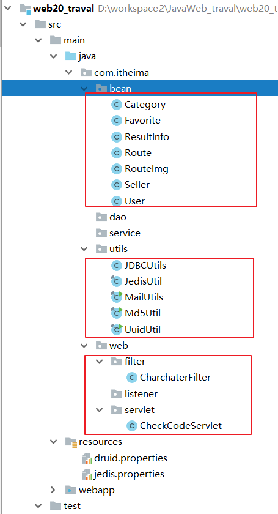

### 引入静态页面
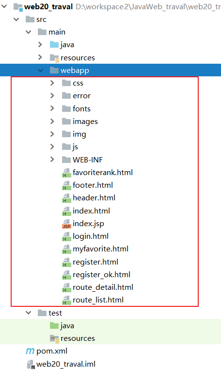

### 创建数据库,导入数据
```sql
-- 创建数据库
create database web20_traval character set utf8 ;
-- 使用数据库
use web20_traval;
```
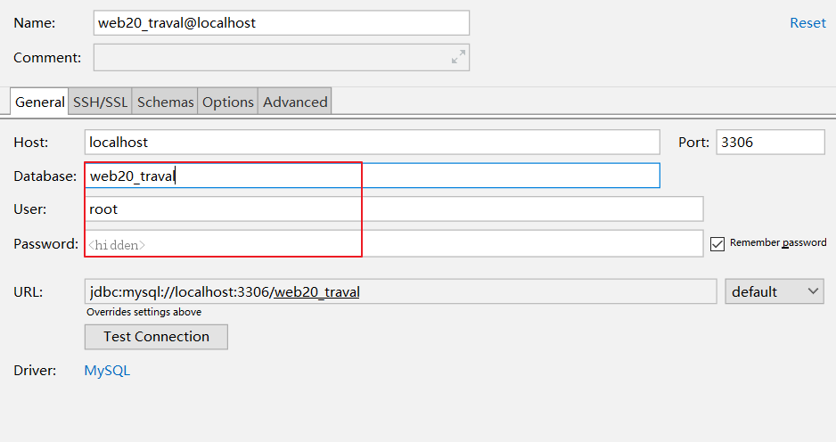

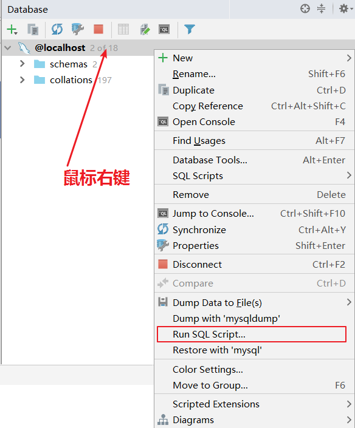

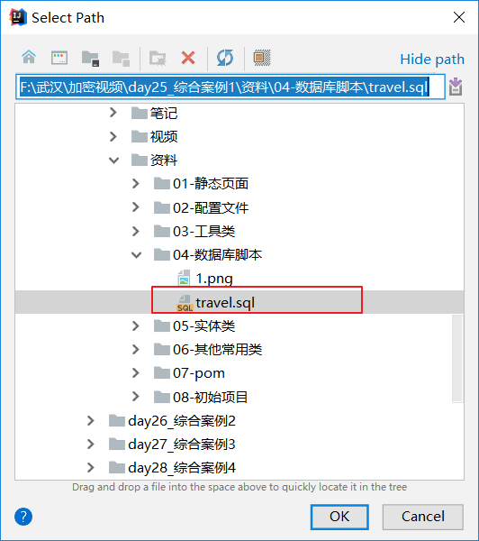


**注意修改配置文件数据库的名称及用户名和密码**

## 启动项目
### 配置tomcat


### 启动tomcat服务器


### 访问页面

http://localhost:8080/web20/index.html


# 用户注册功能
## 需求一:前端校验
```
1. 用户名：单词字符，长度8到20位
2. 密码：单词字符，长度8到20位
3. email：邮件格式
4. 姓名：非空
5. 手机号：手机号格式
6. 出生日期：非空
7. 验证码：非空
8. 校验通过提交表单
```

### 1. 页面内引入`jquery.validate.js`文件,修改其代码
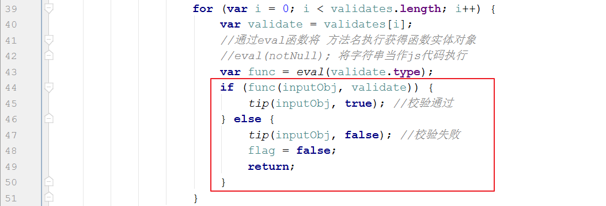

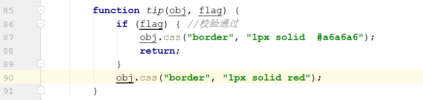

### 2. 为注册页面的各个校验项添加规则
```html
<form id="registerForm">
<!--提交处理请求的标识符-->
<input type="hidden" name="action" value="register">
	<table style="margin-top: 25px;">
		<tr>
			<td class="td_left">
				<label for="username">用户名</label>
			</td>
			<td class="td_right">
				<input type="text" id="username" name="username" placeholder="请输入账号" validate='[{"type":"notNull","msg":"用户名不能为空！"},{"type":"regex","reg":"^[a-zA-Z0-9]{2,9}$","msg":"用户名必须是8-20位字母或数字组成"}]'>
		</td>
		</tr>
		<tr>
			<td class="td_left">
				<label for="password">密码</label>
			</td>
			<td class="td_right">
				<input type="text" id="password" name="password" placeholder="请输入密码" validate='[{"type":"notNull","msg":"用户名不能为空！"},{"type":"regex","reg":"^[a-zA-Z0-9]{2,9}$","msg":"用户名必须是8-20位字母或数字组成"}]'>
			</td>
		</tr>
		<tr>
			<td class="td_left">
				<label for="email">Email</label>
			</td>
			<td class="td_right">
				<input type="text" id="email" name="email" placeholder="请输入Email" validate='[{"type":"regex","reg":"^\\w+([-+.]\\w+)*@\\w+([-.]\\w+)*\\.\\w+([-.]\\w+)*$","msg":"邮箱格式不正确!"}]'>
			</td>
		</tr>
		<tr>
			<td class="td_left">
				<label for="name">姓名</label>
			</td>
			<td class="td_right">
				<input type="text" id="name" name="name" placeholder="请输入真实姓名" validate='[{"type":"notNull","msg":"姓名不能为空！"}]'>
			</td>
		</tr>
		<tr>
			<td class="td_left">
				<label for="telephone">手机号</label>
			</td>
			<td class="td_right">
				<input type="text" id="telephone" name="telephone" placeholder="请输入您的手机号" validate='[{"type":"regex","reg":"^(13[0-9]|14[579]|15[0-3,5-9]|16[6]|17[0135678]|18[0-9]|19[89])\\d{8}$","msg":"手机号格式不正确!"}]'>
			</td>
		</tr>
		<tr>
			<td class="td_left">
				<label for="sex">性别</label>
			</td>
			<td class="td_right gender">
				<input type="radio" id="sex" name="sex" value="男" checked> 男
				<input type="radio" name="sex" value="女"> 女
			</td>
		</tr>
		<tr>
			<td class="td_left">
				<label for="birthday">出生日期</label>
			</td>
			<td class="td_right">
				<input type="date" id="birthday" name="birthday" placeholder="年/月/日" validate='[{"type":"notNull","msg":"请选择出生日期"}]'>
			</td>
		</tr>
		<tr>
			<td class="td_left">
				<label for="check">验证码</label>
			</td>
			<td class="td_right check">
				<input type="text" id="check" name="check" class="check" validate='[{"type":"notNull","msg":"验证码不能为空"}]'>
				
			</td>
		</tr>
		<tr>
			<td class="td_left">
			</td>
			<td class="td_right check">
				<input type="submit" class="submit" value="注册">
			<span id="errorMsg" style="color: red;"></span>
			</td>
		</tr>
	</table>
</form>
```
### 3. 页面内编写JS调用校验的方法
```JavaScript
<script src="js/jquery-3.3.1.js"></script>
<script src="js/jquery.validate.js"></script>
<script>
    $(function () {
        //表单校验
        $("#registerForm").validate(function () {

            var url = "/web20/registUserServlet";
            var params = $(this).serialize();
            $.post(url, params, function (data) {
                //处理服务器响应的数据  data  {flag:true,errorMsg:"注册失败"}
                if (data.flag) {
                    //注册成功，跳转成功页面
                    location.href = "register_ok.html";
                } else {
                    //注册失败,给errorMsg添加提示信息
                    $("#errorMsg").html(data.errorMsg);
                }
            },'json');
        });
    });
</script>
```


## 需求二:服务器完成用户注册功能

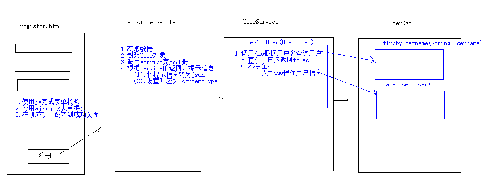

### Web层
```java
@WebServlet("/registUserServlet")
public class RegistUserServlet extends HttpServlet {
    protected void doPost(HttpServletRequest request, HttpServletResponse response) throws ServletException, IOException {

        //1. 验证码校验
        String check = request.getParameter("check");
        //从sesion中获取验证码
        HttpSession session = request.getSession();
        String checkcode_server = (String) session.getAttribute("CHECKCODE_SERVER");
        session.removeAttribute("CHECKCODE_SERVER");//为了保证验证码只能使用一次
        //比较
        if(checkcode_server == null || !checkcode_server.equalsIgnoreCase(check)){
            //验证码错误
            ResultInfo info = new ResultInfo();
            //注册失败
            info.setFlag(false);
            info.setErrorMsg("验证码错误");
            //将info对象序列化为json
            ObjectMapper mapper = new ObjectMapper();
            String json = mapper.writeValueAsString(info);

            response.getWriter().write(json);
            return;
        }

        //2. 验证码校验通过,完成组成操作
        //2.1.获取数据
        Map<String, String[]> map = request.getParameterMap();

        //2.2.封装对象
        User user = new User();
        try {
            BeanUtils.populate(user,map);
        } catch (IllegalAccessException e) {
            e.printStackTrace();
        } catch (InvocationTargetException e) {
            e.printStackTrace();
        }

        //2.3.调用service完成注册
        UserService service = new UserServiceImpl();
        boolean flag = service.regist(user);
        ResultInfo info = new ResultInfo();
        //4.响应结果
        if(flag){
            //注册成功
            info.setFlag(true);
        }else{
            //注册失败
            info.setFlag(false);
            info.setErrorMsg("注册失败!");
        }

        //3. 将info对象序列化为json
        ObjectMapper mapper = new ObjectMapper();
        String json = mapper.writeValueAsString(info);

        //4. 将json数据写回客户端
        response.getWriter().write(json);
    }
}
```

### 业务层
#### 接口`UserService`
```java
/**
 * 用户注册操作
 * @param user  封装用户注册数据
 * @return true:注册成功  false:注册失败
 */
boolean regist(User user);
```
#### 实现类`UserServiceImpl`
```java
private UserDao userDao = new UserDaoImpl();

@Override
public boolean regist(User user) {
    //1.根据用户名查询用户对象
    User u = userDao.findByUsername(user.getUsername());
    //判断u是否为null
    if(u != null){
        //用户名存在，注册失败
        return false;
    }

    //2.保存用户信息
    userDao.save(user);

    return true;
}
```
### 数据访问层
#### 接口`UserDao`
```java
/**
 * 根据用户名查询用户
 * @param username  用户名
 * @return  用户对象
 */
User findByUsername(String username);

/**
 * 保存用户到数据库
 * @param user
 */
void save(User user);
```
#### 实现类`UserDaoImpl`
```java
private JdbcTemplate template = new JdbcTemplate(JDBCUtils.getDataSource());

@Override
public User findByUsername(String username) {
    try {
        //1.定义sql
        String sql = "select * from tab_user where username = ?";

        //2.执行sql
        User user = template.queryForObject(sql, new BeanPropertyRowMapper<User>(User.class), username);
        return user;
    } catch (Exception e) {
        return null;
    }
}

@Override
public void save(User user) {
    //1.定义sql
    String sql = "insert into tab_user(username,password,name,birthday,sex,telephone,email) values(?,?,?,?,?,?,?)";
    //2.执行sql
    template.update(sql,user.getUsername(),user.getPassword(),user.getName(),user.getBirthday(),user.getSex(),user.getTelephone(),user.getEmail());
}
```

### 客户端回调函数接收响应的数据
```JavaScript
$(function () {
    //表单校验
    $("#registerForm").validate(function () {
        var url = "/web20/registUserServlet";
        //序列化表单数据 username=aaa&password=123...
        var params = $(this).serialize();
        $.post(url, params, function (data) {
            //处理服务器响应的数据  data  {flag:true,errorMsg:"注册失败"}

            //--------------------------------------
            if (data.flag) {
                //注册成功，跳转成功页面
                location.href = "register_ok.html";
            } else {
                //注册失败,给errorMsg添加提示信息
                $("#errorMsg").html(data.errorMsg);
            }
            //--------------------------------------

        },'json');
    });
});
```

## 需求三: 用户注册成功发送激活邮件

为什么要进行邮件激活？为了保证用户填写的邮箱是正确的。将来可以推广一些宣传信息，到用户邮箱中

**准备工作:**

    1.	申请邮箱
    2.	开启授权码
    3.	在MailUtils中设置自己的邮箱账号和密码(授权码)
    4. 邮件工具类：MailUtils，调用其中sendMail方法可以完成邮件发送

  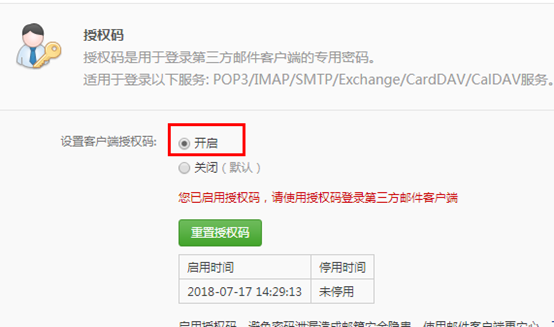
**分析**

经过分析，发现，用户激活其实就是修改用户表中的status为‘Y’


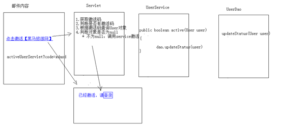

### 修改用户注册功能,添加发送验证码操作

#### 修改用户注册功能,添加发送邮件代码
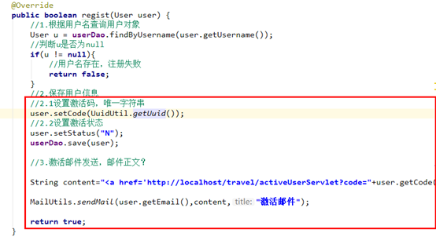

#### 修改保存Dao代码，加上存储status和code 的代码逻辑
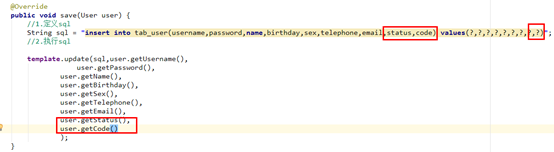

### Web层
```java
@WebServlet("/activeUserServlet")
public class ActiveUserServlet extends HttpServlet {
    protected void doPost(HttpServletRequest request, HttpServletResponse response) throws ServletException, IOException {
        //1.获取激活码
        String code = request.getParameter("code");
        if(code != null){
            //2.调用service完成激活
            UserService service = new UserServiceImpl();
            boolean flag = service.active(code);

            //3.判断标记
            String msg = null;
            if(flag){
                //激活成功
                msg = "激活成功，请<a href='login.html'>登录</a>";
            }else{
                //激活失败
                msg = "激活失败，请联系管理员!";
            }
            response.setContentType("text/html;charset=utf-8");
            response.getWriter().write(msg);
        }
    }
}
```

### 业务层
#### 接口`UserService`
```java
/**
* 激活邮件
* @param code  激活码
* @return
*/
boolean active(String code);
```
#### 实现类`UserServiceImpl`
```java
@Override
public boolean active(String code) {
    //1.根据激活码查询用户对象
    int row = userDao.updateStatus(code,"Y");
    if(row > 0){
        return true;
    }else{
        return false;
    }
}
```

### 数据访问层
#### 接口`UserDao`
```java
/**
 * 更新用户状态
 * @param code  需要更新状态的用户
 * @param status   激活状态  N 未激活  Y  激活
 * @return
 */
int updateStatus( String code,String status);
```

#### 实现类`UserDaoImpl`
```java
@Override
public int updateStatus(String code, String status) {
    String sql = " update tab_user set status = ? where code = ? ";
    int row = template.update(sql, status, code);
    return row;
}
```
