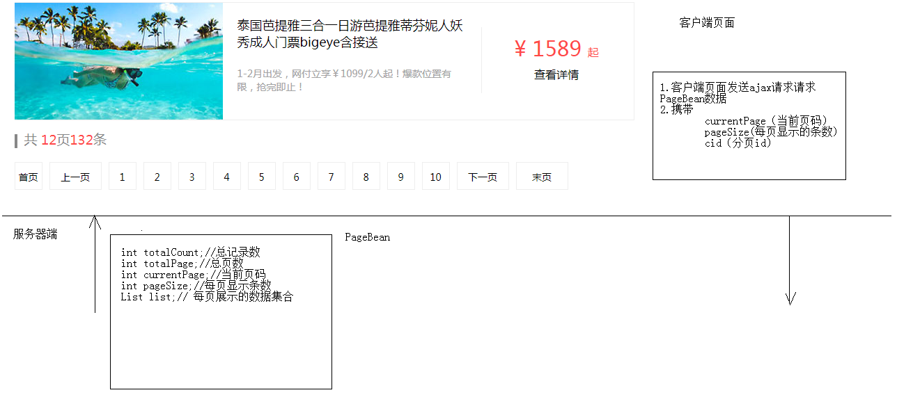
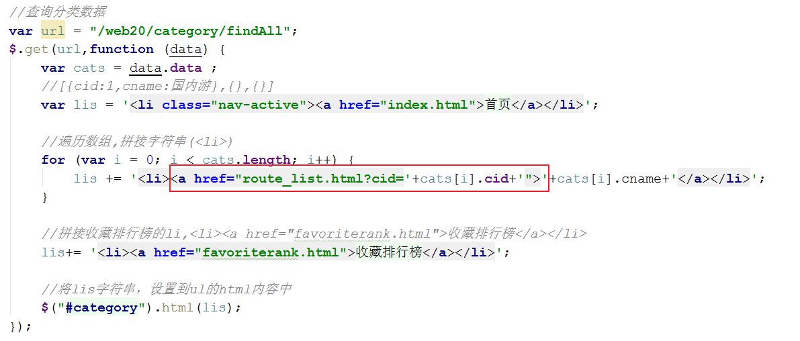
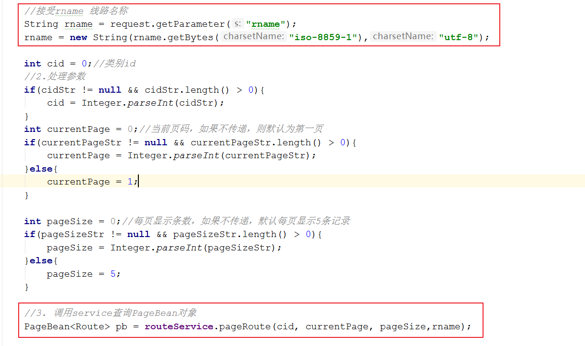
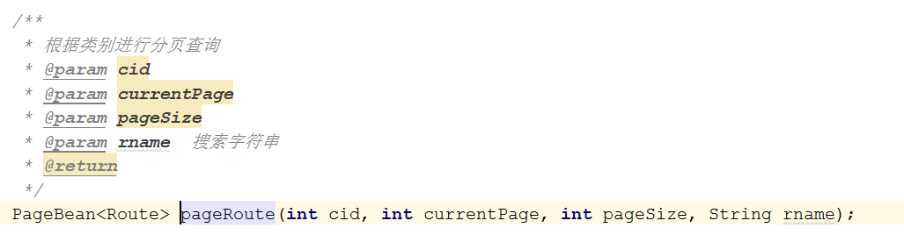
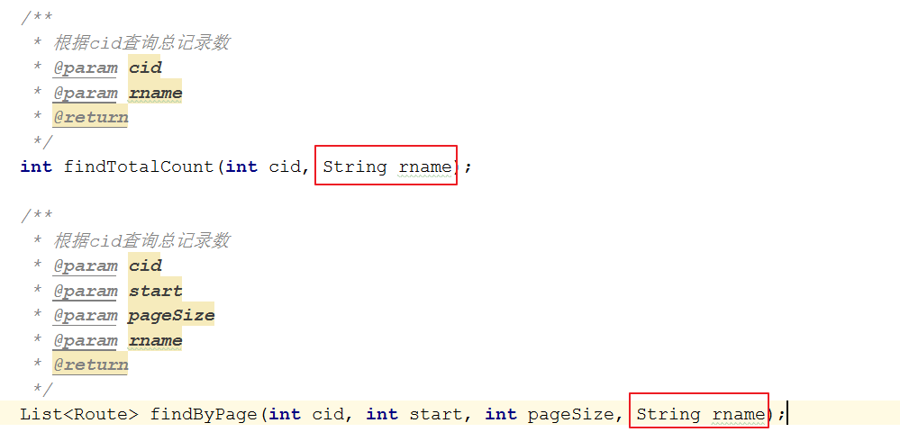
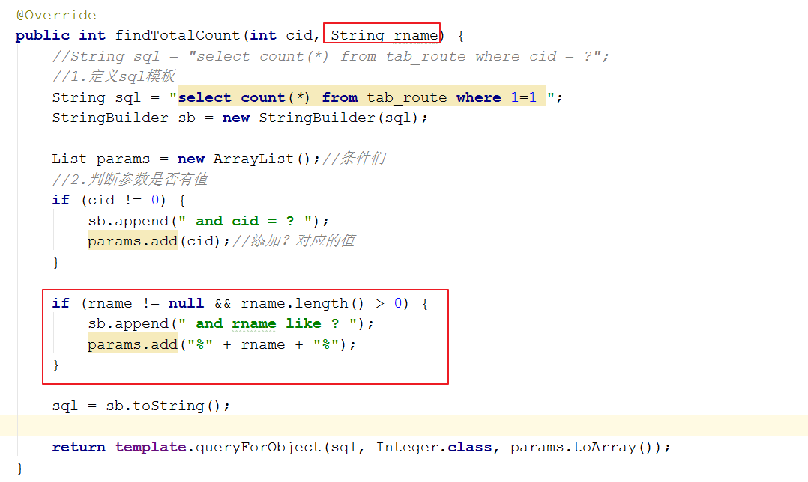
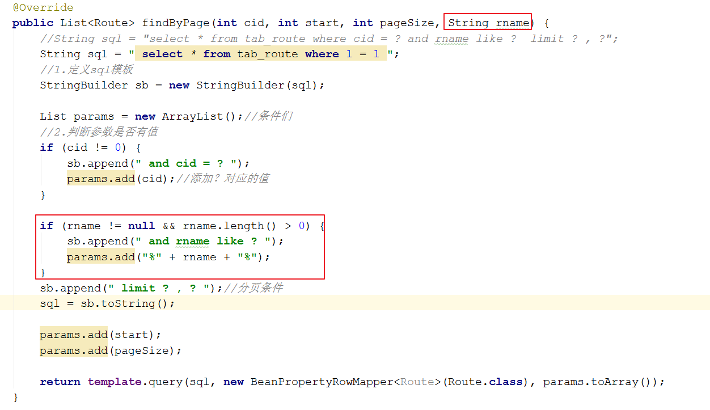

# (四)黑马旅游网三
<extoc></extoc>

# 线路分页查询
## 分析


## 准备
因为点击分类,需要展示分类下的所有旅游线路,所以需要对之前的分类查询功能略作修改
### 分类查询功能修改一:业务层返回的数据中应该带有分类的id`CategoryServiceImpl`
```java
@Override
public List<Category> findAll() {
    //1.从redis中查询
    //1.1获取jedis客户端
    Jedis jedis = JedisUtil.getJedis();
    //1.2可使用sortedset排序查询
    //Set<String> categorys = jedis.zrange("category", 0, -1);

    //-------------------------------------------------
    //1.3查询sortedset中的分数(cid)和值(cname)
    Set<Tuple> categorys = jedis.zrangeWithScores("category", 0, -1);
    //-------------------------------------------------

    List<Category> cs = null;
    //2.判断查询的集合是否为空
    if (categorys == null || categorys.size() == 0) {
        System.out.println("从数据库查询....");
        //3.如果为空,需要从数据库查询,在将数据存入redis
        //3.1 从数据库查询
        cs = categoryDao.findAll();
        //3.2 将集合数据存储到redis中的 category的key
        for (int i = 0; i < cs.size(); i++) {
            jedis.zadd("category", cs.get(i).getCid(), cs.get(i).getCname());
        }
    } else {
        System.out.println("从redis中查询.....");

        //4.如果不为空,将set的数据存入list
        cs = new ArrayList<Category>();
        //-------------------------------------
        for (Tuple tuple : categorys) {
            Category category = new Category();
            category.setCname(tuple.getElement());
            category.setCid((int)tuple.getScore());
            cs.add(category);
        }
        //-------------------------------------
    }

    return cs;
}
```
### 分类查询功能修改二:添加分类列表的链接路径`header.html`


## 代码实现
### 客户端:发送异步请求
#### 封装查询的方法
```JavaScript
function load(cid ,currentPage){
    //发送ajax请求，请求route/pageRoute,传递cid
    var url = "/web20/route/pageRoute";
    var params = {cid:cid,currentPage:currentPage};
    $.get(url,params,function (data) {
        //回调函数,处理响应数据

        //1. 分页数据展示

        //2. 分页条码展示

    },'json');
}
```
#### 页面加载完成获取需要查询的分类id,调用查询方法
```JavaScript
$(function () {
    //获取?后面的字符串
    var search = location.search;
    //alert(search);//?id=5
    // 切割字符串，拿到第二个值
    var cid = search.split("=")[1];
    // 发送异步请求,获取分类数据
    load(cid,1);
});
```

### Web层:接收用户请求,调用业务层处理数据
```java
@WebServlet("/route/*")
public class RouteServlet extends BaseServlet {

    private RouteService routeService = new RouteServiceImpl();

    /**
     * 分页查询
     * @param request
     * @param response
     * @throws ServletException
     * @throws IOException
     */
    public void pageRoute(HttpServletRequest request, HttpServletResponse response) throws ServletException, IOException {
        //1.接受参数
        String currentPageStr = request.getParameter("currentPage");
        String pageSizeStr = request.getParameter("pageSize");
        String cidStr = request.getParameter("cid");

        int cid = 0;//类别id
        //2.处理参数
        if(cidStr != null && cidStr.length() > 0){
            cid = Integer.parseInt(cidStr);
        }
        int currentPage = 0;//当前页码，如果不传递，则默认为第一页
        if(currentPageStr != null && currentPageStr.length() > 0){
            currentPage = Integer.parseInt(currentPageStr);
        }else{
            currentPage = 1;
        }

        int pageSize = 0;//每页显示条数，如果不传递，默认每页显示5条记录
        if(pageSizeStr != null && pageSizeStr.length() > 0){
            pageSize = Integer.parseInt(pageSizeStr);
        }else{
            pageSize = 5;
        }

        //3. 调用service查询PageBean对象
        PageBean<Route> pb = routeService.pageRoute(cid, currentPage, pageSize);

        //4. 封装返回数据
        ResultInfo resultInfo = new ResultInfo(true,pb);
        
        //5. 将数据写回到客户端
        writeValue(resultInfo)
    }
}
```

### 业务层:完成业务逻辑处理
#### 接口`RouteService`
```java
/**
 * 根据类别进行分页查询
 * @param cid
 * @param currentPage
 * @param pageSize
 * @return
 */
public PageBean<Route> pageRoute(int cid, int currentPage, int pageSize);
```

#### 实现类`RouteServiceImpl`
```java
public class RouteServiceImpl implements RouteService {

    private RouteDao routeDao = new RouteDaoImpl();

    @Override
    public PageBean<Route> pageRoute(int cid, int currentPage, int pageSize) {
        //封装PageBean
        PageBean<Route> pb = new PageBean<Route>();
        //设置当前页码
        pb.setCurrentPage(currentPage);
        //设置每页显示条数
        pb.setPageSize(pageSize);

        //设置总记录数
        int totalCount = routeDao.findTotalCount(cid);
        pb.setTotalCount(totalCount);
        //设置当前页显示的数据集合
        int start = (currentPage - 1) * pageSize;//开始的记录数
        List<Route> list = routeDao.findByPage(cid, start, pageSize);
        pb.setList(list);

        //设置总页数 = 总记录数/每页显示条数
        int totalPage = totalCount % pageSize == 0 ? totalCount / pageSize : (totalCount / pageSize) + 1;
        pb.setTotalPage(totalPage);

        return pb;
    }
}

```
### 数据访问层:查询数据库
#### 接口
```java
public interface RouteDao {

    /**
     * 根据cid查询总记录数
     */
    public int findTotalCount(int cid);

    /**
     * 根据cid，start,pageSize查询当前页的数据集合
     */
    public List<Route> findByPage(int cid, int start, int pageSize);
}
```
#### 实现类
```java
public class RouteDaoImpl implements RouteDao {

    private JdbcTemplate template = new JdbcTemplate(JDBCUtils.getDataSource());

    @Override
    public int findTotalCount(int cid) {
        String sql = "select count(*) from tab_route where cid = ?";
        return template.queryForObject(sql,Integer.class,cid);
    }

    @Override
    public List<Route> findByPage(int cid, int start, int pageSize) {
        String sql = "select * from tab_route where cid = ? limit ? , ?";

        return template.query(sql,new BeanPropertyRowMapper<Route>(Route.class),cid,start,pageSize);
    }
}
```

### 客户端:回调函数展示数据
```JavaScript
function load(cid ,currentPage){
    //发送ajax请求，请求route/pageRoute,传递cid
    var url = "/web20/route/pageRoute";
    var params = {cid:cid,currentPage:currentPage};
    $.get(url,params,function (data) {
        var pb = data.data ;
        //解析pagebean数据，展示到页面上
        //1.分页工具条数据展示
        //1.1 展示总页码和总记录数
        $("#totalPage").html(pb.totalPage);
        $("#totalCount").html(pb.totalCount);

        //2.列表数据展示
        var route_lis = "";
        for (var i = 0; i < pb.list.length; i++) {
            //获取{rid:1,rname:"xxx"}
            var route = pb.list[i];
            route_lis += '<li><div class="img"></div><div class="text1"><p>'+route.rname+'</p><br/><p>'+route.routeIntroduce+'</p></div><div class="price"><p class="price_num"><span>&yen;</span><span>'+route.price+'</span><span>起</span></p><p><a href="route_detail.html">查看详情</a></p></div></li>';
        }
        $("#route").html(route_lis);

        $("#pagination3").pagination({
            currentPage: pb.currentPage,
            totalPage: pb.totalPage,
            isShow: true,
            count: 10,
            homePageText: "首页",
            endPageText: "尾页",
            prevPageText: "上一页",
            nextPageText: "下一页",
            callback: function(current) {
                load(cid,current);
            }
        });

        //定位到页面顶部
        window.scrollTo(0,0);
    },'json');
}
```

# 线路条件查询
## 代码实现
### 客户端:获取用户输入的数据,发送请求给服务器
#### 搜索按钮绑定事件
```JavaScript
//根据传递过来的参数name获取对应的值
function getParameter(name) {
    var reg = new RegExp("(^|&)" + name + "=([^&]*)(&|$)","i");
    var r = location.search.substr(1).match(reg);
    if (r!=null){
       return (r[2]);
    }

    return null;
}

//给搜索按钮绑定单击事件，获取搜索输入框的内容
$("#search-button").click(function () {
    //线路名称
    var rname = $("#search_input").val();
    //获取分类id
    var cid = getParameter("cid");
    // 跳转路径 http://localhost/travel/route_list.html?cid=5，拼接上rname=xxx
    location.href="http://localhost/travel/route_list.html?cid="+cid+"&rname="+rname;
});
```
#### 将用户输入的数据,以参数的形式发送到服务器
```JavaScript
<script src="js/jquery-3.3.1.js"></script>
<script src="js/getParameter.js"></script>
<script src="js/jquery.pagination.min.js"></script>
<script>
    $(function () {
        //获取cid的参数值
        var cid = getParameter("cid");
        //获取rname的参数值
        var rname = getParameter("rname");
        //判断rname如果不为null或者""
        if(rname){
            rname = window.decodeURIComponent(rname); //url解码
        }

        //当页码加载完成后，调用load方法，发送ajax请求加载数据
        load(cid,'',rname);
    });

    function load(cid ,currentPage,rname){
        //发送ajax请求，请求route/pageRoute,传递cid
        var url = "/web20/route/pageRoute";
        var params = {cid:cid,currentPage:currentPage,rname:rname};
        $.get(url,params,function (data) {
            var pb = data.data ;
            //解析pagebean数据，展示到页面上
            //1.分页工具条数据展示
            //1.1 展示总页码和总记录数
            $("#totalPage").html(pb.totalPage);
            $("#totalCount").html(pb.totalCount);

            //2.列表数据展示
            var route_lis = "";
            for (var i = 0; i < pb.list.length; i++) {
                //获取{rid:1,rname:"xxx"}
                var route = pb.list[i];
                route_lis += '<li><div class="img"></div><div class="text1"><p>'+route.rname+'</p><br/><p>'+route.routeIntroduce+'</p></div><div class="price"><p class="price_num"><span>&yen;</span><span>'+route.price+'</span><span>起</span></p><p><a href="route_detail.html">查看详情</a></p></div></li>';
            }
            $("#route").html(route_lis);

            $("#pagination3").pagination({
                currentPage: pb.currentPage,
                totalPage: pb.totalPage,
                isShow: true,
                count: 10,
                homePageText: "首页",
                endPageText: "尾页",
                prevPageText: "上一页",
                nextPageText: "下一页",
                callback: function(current) {
                    load(cid,current,rname);
                }
            });

            //定位到页面顶部
            window.scrollTo(0,0);
        },'json');
    }

</script>
```


### Web层:接收用户请求,调用业务层处理数据


### 业务层:完成分页查询业务逻辑处理
#### 接口`RouteService`


#### 实现类`RouteServiceImpl`


### 数据访问层:查询数据库
#### 接口`RouteDao`


#### 实现类`RouteDaoImpl`



