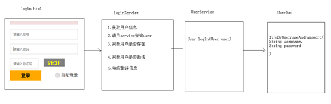
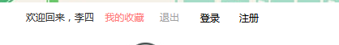
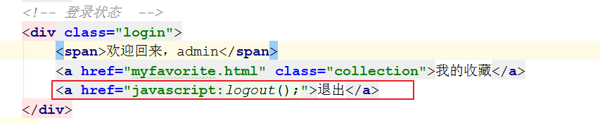
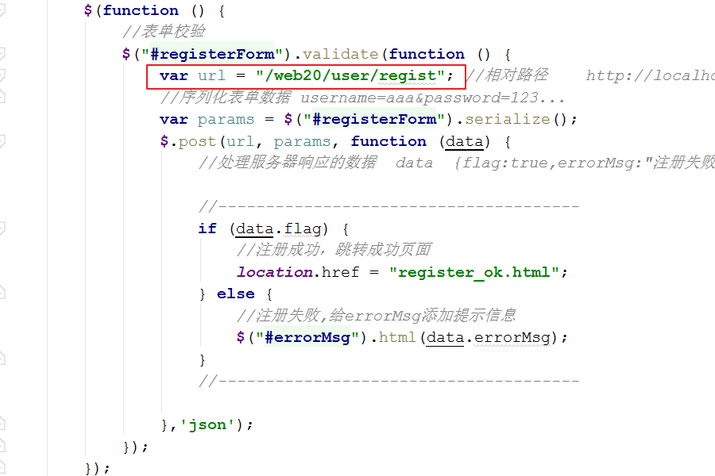
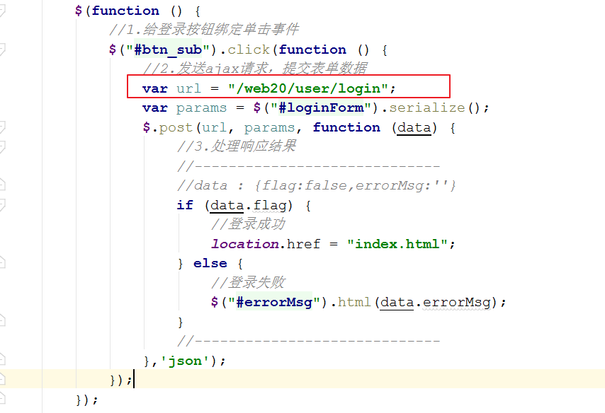
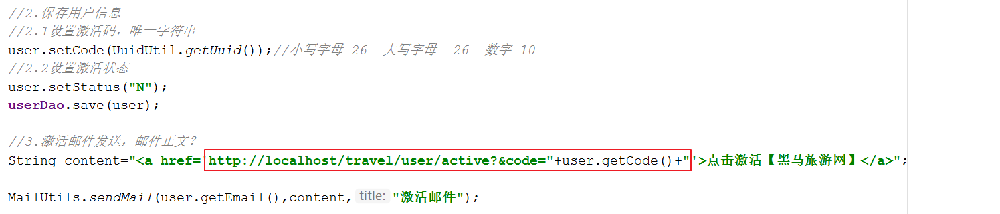
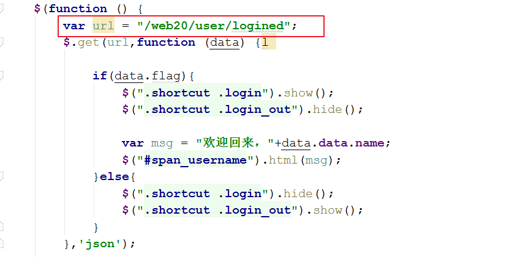
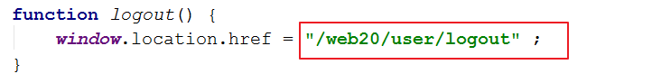
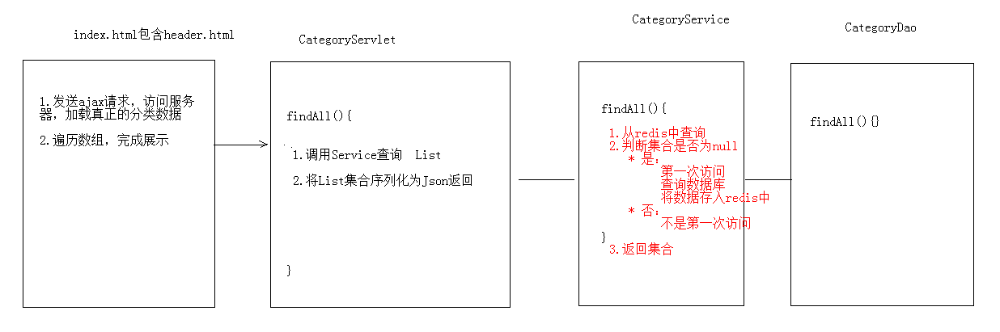

# (三)黑马旅游网二
<extoc></extoc>

# 用户登录
## 分析

## 代码实现
### 客户端:发送异步登录请求
```JavaScript
<script src="js/jquery-3.3.1.js"></script>
<script>
       $(function () {
           //1.给登录按钮绑定单击事件
           $("#btn_sub").click(function () {
               //2.发送ajax请求，提交表单数据
               var url = "/web20/loginServlet";
               var params = $("#loginForm").serialize();
               $.post(url, params, function (data) {
                   //3.处理响应结果

               },'json');
           });
       });

       //图片点击事件
       function changeCheckCode(img) {
           img.src = "/web20/checkCode?" + new Date().getTime();
       }
   </script>
```
### Web层:接收请求,调用业务层处理数据
```java
@WebServlet("/loginServlet")
public class LoginServlet extends HttpServlet {
    protected void doPost(HttpServletRequest request, HttpServletResponse response) throws ServletException, IOException {
        ResultInfo info = new ResultInfo();
        ObjectMapper mapper = new ObjectMapper();

        //1. 验证码校验
        String check = request.getParameter("check");
        //从sesion中获取验证码
        HttpSession session = request.getSession();
        String checkcode_server = (String) session.getAttribute("CHECKCODE_SERVER");
        session.removeAttribute("CHECKCODE_SERVER");//为了保证验证码只能使用一次
        //比较验证码, 验证码错误
        if(checkcode_server == null || !checkcode_server.equalsIgnoreCase(check)){
            //保存错误信息
            info.setFlag(false);
            info.setErrorMsg("验证码错误");

            //将info对象序列化为json
            mapper.writeValue(response.getOutputStream(), info);
            return;
        }

        //用户登录
        //2.1 获取用户名和密码数据
        Map<String, String[]> map = request.getParameterMap();
        //2.2.封装User对象
        User user = new User();
        try {
            BeanUtils.populate(user, map);
        } catch (IllegalAccessException e) {
            e.printStackTrace();
        } catch (InvocationTargetException e) {
            e.printStackTrace();
        }

        //2.3.调用Service查询
        UserService service = new UserServiceImpl();
        User u = service.login(user);

        //2.4.判断用户对象是否为null
        if (u == null) {
            //用户名密码或错误
            info.setFlag(false);
            info.setErrorMsg("用户名密码或错误");
            //将info对象序列化为json
            mapper.writeValue(response.getOutputStream(), info);
            return ;
        }

        //5.判断用户是否激活
        if (u != null && !"Y".equals(u.getStatus())) {
            //用户尚未激活
            info.setFlag(false);
            info.setErrorMsg("您尚未激活，请激活");
            //将info对象序列化为json
            mapper.writeValue(response.getOutputStream(), info);
            return ;
        }

        //6.判断登录成功
        if (u != null && "Y".equals(u.getStatus())) {
            request.getSession().setAttribute("user", u);//登录成功标记
            //登录成功
            info.setFlag(true);
            mapper.writeValue(response.getOutputStream(), info);
            return ;
        }

        //响应数据
        mapper.writeValue(response.getOutputStream(), info);
    }
}
```

### 业务层:完成业务逻辑处理
#### 接口`UserService`
```java
/**
 * 用户登录功能
 * @param user
 * @return
 */
public User login(User user) ;
```
#### 实现类`UserServiceImpl`
```java
@Override
public User login(User user) {
    return userDao.findByUsernameAndPassword(user.getUsername(),user.getPassword());
}
```

### 数据访问层:从数据库查询数据
#### 接口`UserDao`
```java
/**
 * 根据用户名或密码查询用户
 * @param username
 * @param password
 * @return
 */
User findByUsernameAndPassword(String username, String password);
```

#### 实现类`UserDaoImpl`
```java
@Override
public User findByUsernameAndPassword(String username, String password) {
    try {
        //1.定义sql
        String sql = "select * from tab_user where username = ? and password = ?";
        //2.执行sql
        User user = template.queryForObject(sql, new BeanPropertyRowMapper<User>(User.class), username,password);
        return user ;
    } catch (Exception e) {
        return null;
    }
}
```

### 客户端:回调函数处理响应数据
```JavaScript
$(function () {
    //1.给登录按钮绑定单击事件
    $("#btn_sub").click(function () {
        //2.发送ajax请求，提交表单数据
        var url = "/web20/loginServlet";
        var params = $("#loginForm").serialize();
        $.post(url, params, function (data) {
            //3.处理响应结果
            //-----------------------------
            //data : {flag:false,errorMsg:''}
            if (data.flag) {
                //登录成功
                location.href = "index.html";
            } else {
                //登录失败
                $("#errorMsg").html(data.errorMsg);
            }
            //-----------------------------
        },'json');
    });
});
```

## 展示用户信息

登录成功跳转首页(`index.html`)展示用户姓名



### 客户端:发送异步请求`header.html`
```JavaScript
<script>
    $(function () {
        var url = "/web20/findUserServlet";
        $.get(url,function (data) {
            //{uid:1,name:'李四'}
            var msg = "欢迎回来，"+data.name;
            $("#span_username").html(msg);
        });
    });
</script>
```

### Web层:接收用户请求,获取登录用户信息
```java
@WebServlet("/findUserServlet")
public class FindUserServlet extends HttpServlet {
    protected void doPost(HttpServletRequest request, HttpServletResponse response) throws ServletException, IOException {
        //从session中获取登录用户
        Object user = request.getSession().getAttribute("user");

        //将user写回客户端
        ObjectMapper mapper = new ObjectMapper();
        response.setContentType("application/json;charset=utf-8");
        mapper.writeValue(response.getOutputStream(),user);
    }
}
```

## 退出登录

    什么叫做登录了？session中有user对象。

    所以,退出登录实际上就是将session中的user对象销毁
    1.	访问servlet，将session销毁
    2.	跳转到登录页面

### 客户端:修改页面退出按钮


```JavaScript
function logout() {
    window.location.href = "/web20/logoutServlet" ;
}
```

### Web层:接收请求,销毁session
```java
@WebServlet("/logoutServlet")
public class LogoutServlet extends HttpServlet {
    protected void doPost(HttpServletRequest request, HttpServletResponse response) throws ServletException, IOException {
        //1.销毁session
        request.getSession().invalidate();
        //2.跳转登录页面
        response.sendRedirect(request.getContextPath()+"/login.html");
    }
}
```


# 程序代码优化:BaseServlet抽取

## 编写BaseServlet代码
```java
public class BaseServlet extends HttpServlet {

    @Override
    protected void service(HttpServletRequest req, HttpServletResponse resp) throws ServletException, IOException {
        //1. 获取用户要执行的方法名称
        //1.1获取请求路径
        String uri = req.getRequestURI(); //   /travel/user/add
        //1.2 获取需要调用的方法
        String methodName = uri.substring(uri.lastIndexOf('/') + 1);

        //2. 获取对应名称的方法对象
        try {
            Class<? extends BaseServlet> clzz = this.getClass();
            Method method = clzz.getDeclaredMethod(methodName, HttpServletRequest.class, HttpServletResponse.class);
            //3. 执行方法
            method.setAccessible(true);
            method.invoke(this,req,resp);
        } catch (Exception e) {
            e.printStackTrace();
        }
    }

    /**
     * 直接将传入的对象序列化为json，并且写回客户端
     * @param obj
     */
    public void writeValue(Object obj,HttpServletResponse response) throws IOException {
        ObjectMapper mapper = new ObjectMapper();
        response.setContentType("application/json;charset=utf-8");
        mapper.writeValue(response.getOutputStream(),obj);
    }

    /**
     * 将传入的对象序列化为json，返回
     * @param obj
     * @return
     */
    public String writeValueAsString(Object obj) throws JsonProcessingException {
        ObjectMapper mapper = new ObjectMapper();
        return mapper.writeValueAsString(obj);
    }
}
```
## 编写Servlet继承BaseServlet
```java
@WebServlet("/user/*")
public class UserServlet extends BaseServlet {
  /**
   * 激活用户账户
   * @param request
   * @param response
   * @throws IOException
   */
    private void active(HttpServletRequest request, HttpServletResponse response) throws IOException {
        //1.获取激活码
        String code = request.getParameter("code");
        if (code != null) {
            //2.调用service完成激活
            UserService service = new UserServiceImpl();
            boolean flag = service.active(code);

            //3.判断标记
            String msg = null;
            if (flag) {
                //激活成功
                msg = "激活成功，请<a href='login.html'>登录</a>";
            } else {
                //激活失败
                msg = "激活失败，请联系管理员!";
            }
            response.setContentType("text/html;charset=utf-8");
            response.getWriter().write(msg);
        }
    }

    /**
     * 获取登录用户信息
     * @param request
     * @param response
     * @throws ServletException
     * @throws IOException
     */
    private void logined(HttpServletRequest request, HttpServletResponse response) throws ServletException, IOException {
          //从session中获取登录用户
          Object user = request.getSession().getAttribute("user");
          ResultInfo info = new ResultInfo();
          //将user写回客户端
          if(user==null){
              info.setFlag(false);
          }else{
              info.setFlag(true);
              info.setData(user);
          }

          ObjectMapper mapper = new ObjectMapper();
          response.setContentType("application/json;charset=utf-8");
          mapper.writeValue(response.getOutputStream(), info);
      }


      /**
       * 用户注册操作
       * @param request
       * @param response
       * @throws ServletException
       * @throws IOException
       */
      protected void regist(HttpServletRequest request, HttpServletResponse response) throws ServletException, IOException {

          //验证校验
          String check = request.getParameter("check");
          //从sesion中获取验证码
          HttpSession session = request.getSession();
          String checkcode_server = (String) session.getAttribute("CHECKCODE_SERVER");
          session.removeAttribute("CHECKCODE_SERVER");//为了保证验证码只能使用一次
          //比较
          if(checkcode_server == null || !checkcode_server.equalsIgnoreCase(check)){
              //验证码错误
              ResultInfo info = new ResultInfo();
              //注册失败
              info.setFlag(false);
              info.setErrorMsg("验证码错误");
              //将info对象序列化为json
              ObjectMapper mapper = new ObjectMapper();
              String json = mapper.writeValueAsString(info);

              response.getWriter().write(json);
              return;
          }

          //1.获取数据
          Map<String, String[]> map = request.getParameterMap();

          //2.封装对象
          User user = new User();
          try {
              BeanUtils.populate(user,map);
          } catch (IllegalAccessException e) {
              e.printStackTrace();
          } catch (InvocationTargetException e) {
              e.printStackTrace();
          }

          //3.调用service完成注册
          UserService service = new UserServiceImpl();
          boolean flag = service.regist(user);
          ResultInfo info = new ResultInfo();
          //4.响应结果
          if(flag){
              //注册成功
              info.setFlag(true);
          }else{
              //注册失败
              info.setFlag(false);
              info.setErrorMsg("注册失败!");
          }

          System.out.println("用户注册...");
          //将info对象序列化为json
          ObjectMapper mapper = new ObjectMapper();
          String json = mapper.writeValueAsString(info);
          //将json数据写回客户端
          response.getWriter().write(json);
      }

      /**
       * 用户登录
       * @param request
       * @param response
       * @throws ServletException
       * @throws IOException
       */
      private void login(HttpServletRequest request, HttpServletResponse response) throws ServletException, IOException {
          ResultInfo info = new ResultInfo();
          ObjectMapper mapper = new ObjectMapper();

          //1. 验证码校验
          String check = request.getParameter("check");
          //从sesion中获取验证码
          HttpSession session = request.getSession();
          String checkcode_server = (String) session.getAttribute("CHECKCODE_SERVER");
          session.removeAttribute("CHECKCODE_SERVER");//为了保证验证码只能使用一次
          //比较验证码, 验证码错误
          if (checkcode_server == null || !checkcode_server.equalsIgnoreCase(check)) {
              //保存错误信息
              info.setFlag(false);
              info.setErrorMsg("验证码错误");

              //将info对象序列化为json
              mapper.writeValue(response.getOutputStream(), info);
              return;
          }

          //用户登录
          //2.1 获取用户名和密码数据
          Map<String, String[]> map = request.getParameterMap();
          //2.2.封装User对象
          User user = new User();
          try {
              BeanUtils.populate(user, map);
          } catch (IllegalAccessException e) {
              e.printStackTrace();
          } catch (InvocationTargetException e) {
              e.printStackTrace();
          }

          //2.3.调用Service查询
          UserService service = new UserServiceImpl();
          User u = service.login(user);

          //2.4.判断用户对象是否为null
          if (u == null) {
              //用户名密码或错误
              info.setFlag(false);
              info.setErrorMsg("用户名密码或错误");
              //将info对象序列化为json
              mapper.writeValue(response.getOutputStream(), info);
              return;
          }

          //5.判断用户是否激活
          if (u != null && !"Y".equals(u.getStatus())) {
              //用户尚未激活
              info.setFlag(false);
              info.setErrorMsg("您尚未激活，请激活");
              //将info对象序列化为json
              mapper.writeValue(response.getOutputStream(), info);
              return;
          }

          //6.判断登录成功
          request.getSession().setAttribute("user", u);//登录成功标记
          //登录成功
          info.setFlag(true);
          mapper.writeValue(response.getOutputStream(), info);
      }

      /**
       * 用户退出登录
       * @param request
       * @param response
       * @throws ServletException
       * @throws IOException
       */
      private void logout(HttpServletRequest request, HttpServletResponse response) throws ServletException, IOException {
          //1.销毁session
          request.getSession().invalidate();

          //2.跳转登录页面
          response.sendRedirect(request.getContextPath() + "/login.html");
      }
}
```
## 修改请求路径
### 用户注册


### 用户登录


### 用户激活


### 登录用户信息查询


### 退出登录


# 分类查询
## 分析


## 代码实现
### 客户端:页面加载完成发送异步请求`header.html`
```JavaScript
//查询分类数据
var url = "/web20/category/findAll";
$.get(url,function (data) {
    //回调函数,接收响应数据


});
```

### Web层:接收用户请求,调用业务层完成业务逻辑处理
```java
@WebServlet("/category/*")
public class CategoryServlet extends BaseServlet {

    private CategoryService service = new CategoryServiceImpl();

    /**
     * 查询所有
     * @param request
     * @param response
     * @throws ServletException
     * @throws IOException
     */
    public void findAll(HttpServletRequest request, HttpServletResponse response) throws ServletException, IOException {
        //1.调用service查询所有
        List<Category> cs = service.findAll();
        //2.序列化json返回
       writeValue(cs,response);
    }
}
```
### 业务层:处理业务逻辑
#### 接口`CategoryService`
```java
public interface CategoryService {
    public List<Category> findAll();
}
```

#### 实现类`CategoryServiceImpl`
```java
public class CategoryServiceImpl implements CategoryService {

    private CategoryDao categoryDao = new CategoryDaoImpl();

    @Override
    public List<Category> findAll() {
        return categoryDao.findAll();
    }
}
```

### 数据访问层:查询分类数据
#### 接口`CategoryDao`
```java
public interface CategoryDao {
    /**
     * 查询所有
     * @return
     */
    public List<Category> findAll();
}
```

#### 实现类`CategoryDaoImpl`
```java
public class CategoryDaoImpl implements CategoryDao {

    private JdbcTemplate template = new JdbcTemplate(JDBCUtils.getDataSource());

    @Override
    public List<Category> findAll() {
        String sql = "select * from tab_category ";
        return template.query(sql,new BeanPropertyRowMapper<Category>(Category.class));
    }
}
```
### 客户端:回调函数展示分类数据
```JavaScript
//查询分类数据
var url = "/web20/category/findAll";
$.get(url,function (data) {
    //回调函数,接收响应数据
    //---------------------------------------
    //[{cid:1,cname:国内游},{},{}]
    var lis = '<li class="nav-active"><a href="index.html">首页</a></li>';

    //遍历数组,拼接字符串(<li>)
    for (var i = 0; i < data.length; i++) {
        lis += '<li><a href="route_list.html?cid='+data[i].cid+'">'+data[i].cname+'</a></li>';
    }

    //拼接收藏排行榜的li,<li><a href="favoriterank.html">收藏排行榜</a></li>
    lis+= '<li><a href="favoriterank.html">收藏排行榜</a></li>';

    //将lis字符串，设置到ul的html内容中
    $("#category").html(lis);
    //------------------------------------------
});
```


## 功能优化
### 业务层修改`CategoryServiceImpl`
```java
@Override
public List<Category> findAll() {
    //1.从redis中查询
    //1.1获取jedis客户端
    Jedis jedis = JedisUtil.getJedis();

    //1.2可使用sortedset排序查询
    Set<String> categorys = jedis.zrange("category", 0, -1);

    List<Category> cs = null;
    //2.判断查询的集合是否为空
    if (categorys == null || categorys.size() == 0) {
        System.out.println("从数据库查询....");
        //3.如果为空,需要从数据库查询,在将数据存入redis
        //3.1 从数据库查询
        cs = categoryDao.findAll();
        //3.2 将集合数据存储到redis中的 category的key
        for (int i = 0; i < cs.size(); i++) {
            jedis.zadd("category", cs.get(i).getCid(), cs.get(i).getCname());
        }
    } else {
        //4.如果不为空,将set的数据存入list
        cs = new ArrayList<Category>();
        for (String str : categorys) {
            Category category = new Category();
            category.setCname(str);
            cs.add(category);
        }
    }

    return cs;
}
```
