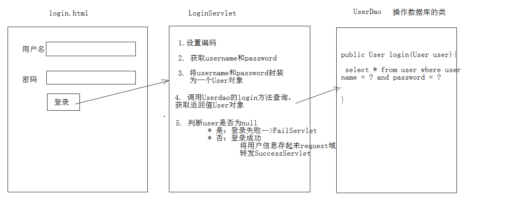
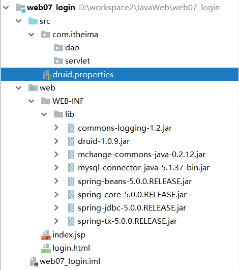
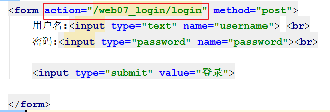
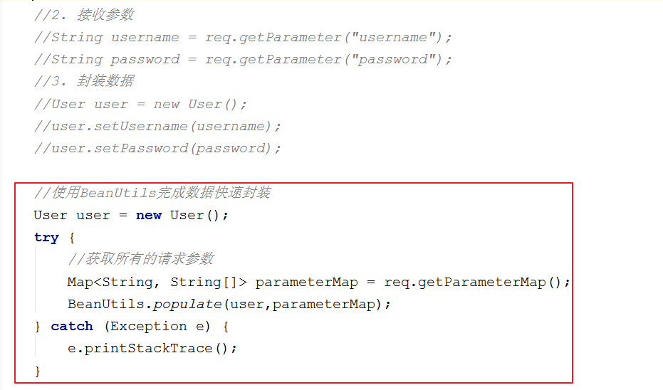

# 今日内容介绍
<extoc></extoc>

# HTTP协议(理解)
```
* 概念：Hyper Text Transfer Protocol 超文本传输协议
  * 传输协议：定义了，客户端和服务器端通信时，发送数据的格式
  * 特点：
    1. 基于TCP/IP的高级协议
    2. 默认端口号:80
    3. 基于请求/响应模型的:一次请求对应一次响应
    4. 无状态的：每次请求之间相互独立，不能交互数据

  * 历史版本：
    * 1.0：每一次请求响应都会建立新的连接
    * 1.1：复用连接
```

## HTTP协议 请求消息数据格式(理解)

请求部分可以分成三块,请求行,请求头,请求体

### 字符串格式：(理解)
```http
POST /login.html	HTTP/1.1
Host: localhost
User-Agent: Mozilla/5.0 (Windows NT 6.1; Win64; x64; rv:60.0) Gecko/20100101 Firefox/60.0
Accept: text/html,application/xhtml+xml,application/xml;q=0.9,*/*;q=0.8
Accept-Language: zh-CN,zh;q=0.8,zh-TW;q=0.7,zh-HK;q=0.5,en-US;q=0.3,en;q=0.2
Accept-Encoding: gzip, deflate
Referer: http://localhost/login.html
Connection: keep-alive
Upgrade-Insecure-Requests: 1

username=zhangsan
```

### 请求行: 请求方式 请求url 请求协议/版本(理解)
```
POST /login.html	HTTP/1.1
```
#### 请求方式有哪些?常用的有哪些?有什么区别?
```
HTTP协议有7中请求方式，常用的有2种
* GET：
		1. 请求参数在请求行中，在url后。
		2. 请求的url长度有限制的
		3. 不太安全
* POST：
		1. 请求参数在请求体中
		2. 请求的url长度没有限制的
		3. 相对安全
```

### 请求头：客户端浏览器告诉服务器一些信息`请求头名称: 请求头值`(理解)

#### 常见的请求头
```
1. User-Agent：浏览器告诉服务器，我访问你使用的浏览器版本信息
  * 可以在服务器端获取该头的信息，解决浏览器的兼容性问题

2. Referer：http://localhost/login.html
  * 告诉服务器，我(当前请求)从哪里来？
    * 作用： 防盗链 , 统计工作
```

### 请求体(正文)：封装POST请求消息的请求参数(GET方式没有请求体)(理解)

# 请求对象(Request)(理解)
## request对象和response对象的原理(理解)
```
* request和response对象是由服务器创建的。我们来使用它们
* request对象是来获取请求消息，response对象是来设置响应消息
```

## request对象继承体系结构(理解)
```
ServletRequest		--	接口
  |	继承
HttpServletRequest	-- 接口
  |	实现
org.apache.catalina.connector.RequestFacade 类(tomcat)
```

## request功能(理解)
### 获取请求行数据`GET /day14/demo1?name=zhangsan HTTP/1.1`(部分掌握)
#### 方法
| 返回值 | 方法名称    |  方法介绍  |
| :------------- | :------------- |:------------- |
|  `String`        | **getMethod()**  |  获取请求方式,例如: `GET/POST`  |
|  `String`        | **getContextPath()**  | 获取虚拟目录,例如: `/day14` |
|  `String`        | getProtocol()     |  取协议及版本,例如:`HTTP/1.1` |
|  `String`        | getRemoteAddr()   | 获取客户机的IP地址,例如:`192.168.26.10`  |
|  `String`        | getServletPath()  | 获取客户机地址,例如:`/demo1` |
|  `String`        | getQueryString()  | 获取get方式请求参数列表,例如:`name=zhangsan&password=123`  |
|  `String`        | **getRequestURI()**  | 获取请求URI(统一资源标识符),例如:`/day14/demo1`  |
|  `StringBuffer`  | **getRequestURL()**   | 获取请求URL(统一资源定位符),例如:`http://localhost/day14/demo1` |


#### 示例
```java
/**
 * 演示Request对象获取请求行数据
 */
@WebServlet("/requestDemo1")
public class RequestDemo1 extends HttpServlet {
    protected void doGet(HttpServletRequest request, HttpServletResponse response) throws ServletException, IOException {
        //1. 获取请求方式 ：GET
        String method = request.getMethod();
        System.out.println(method);
        //2.(*)获取虚拟目录：/day14
        String contextPath = request.getContextPath();
        System.out.println(contextPath);
        //3. 获取Servlet路径: /demo1
        String servletPath = request.getServletPath();
        System.out.println(servletPath);
        //4. 获取get方式请求参数：name=zhangsan
        String queryString = request.getQueryString();
        System.out.println(queryString);
        //5.(*)获取请求URI：/day14/demo1
        String requestURI = request.getRequestURI();
        StringBuffer requestURL = request.getRequestURL();
        System.out.println(requestURI);
        System.out.println(requestURL);
        //6. 获取协议及版本：HTTP/1.1
        String protocol = request.getProtocol();
        System.out.println(protocol);
        //7. 获取客户机的IP地址：
        String remoteAddr = request.getRemoteAddr();
        System.out.println(remoteAddr);
    }
}

```

### 获取请求头数据(熟悉)
#### 方法
| 返回值 | 方法名称    |  方法介绍  |
| :------------- | :------------- |:------------- |
|  `String`        | getHeader(String name)  |  通过请求头的名称获取请求头的值  |
|  `Enumeration<String>`  | getHeaderNames()  | 获取所有的请求头名称 |

#### 示例:获取所有请求头信息
```java
@WebServlet("/requestDemo2")
public class RequestDemo2 extends HttpServlet {
    protected void doGet(HttpServletRequest request, HttpServletResponse response) throws ServletException, IOException {
        //演示获取请求头数据
        //1.获取所有请求头名称
        Enumeration<String> headerNames = request.getHeaderNames();
        //2.遍历
        while(headerNames.hasMoreElements()){
            String name = headerNames.nextElement();
            //根据名称获取请求头的值
            String value = request.getHeader(name);
            System.out.println(name+"---"+value);
        }
    }
}
```

#### 示例:获取`user-agent`头
```java
@WebServlet("/requestDemo2")
public class RequestDemo2 extends HttpServlet {
    protected void doGet(HttpServletRequest request, HttpServletResponse response) throws ServletException, IOException {

        //1.演示获取请求头数据:user-agent
        String agent = request.getHeader("user-agent");
        //判断agent的浏览器版本
        if(agent.contains("Chrome")){
            //谷歌
            System.out.println("谷歌来了...");
        }else if(agent.contains("Firefox")){
            //火狐
            System.out.println("火狐来了...");
        }
    }
}
```

#### 示例:获取`referer`头
```java
@WebServlet("/requestDemo4")
public class RequestDemo4 extends HttpServlet {
    protected void doGet(HttpServletRequest request, HttpServletResponse response) throws ServletException, IOException {
        //演示获取请求头数据:referer
        String referer = request.getHeader("referer");
        System.out.println(referer);//http://localhost/day14/login.html
        //防盗链
        if(referer != null ){
            if(referer.contains("/day14")){
                //正常访问
               // System.out.println("播放电影....");
                response.setContentType("text/html;charset=utf-8");
                response.getWriter().write("播放电影....");
            }else{
                //盗链
                //System.out.println("想看电影吗？来优酷吧...");
                response.setContentType("text/html;charset=utf-8");
                response.getWriter().write("想看电影吗？来优酷吧...");
            }
        }
    }
}
```

### 获取请求体数据(熟悉)

注意: 只有POST请求方式，才有请求体，在请求体中封装了POST请求的请求参数

#### 方法
| 返回值 | 方法名称    |  方法介绍  |
| :------------- | :------------- |:------------- |
|  `BufferedReader`        | getReader()  |  获取字符输入流，只能操作字符数据  |
|  `ServletInputStream`  | getInputStream()  | 获取字节输入流，可以操作所有类型数据,一般用户文件上传 |

获取到流之后再从流中获取数据再从流对象中拿数据

#### 示例:字符输入流
```java
@WebServlet("/requestDemo5")
public class RequestDemo5 extends HttpServlet {
    protected void doPost(HttpServletRequest request, HttpServletResponse response) throws ServletException, IOException {
        //获取请求消息体--请求参数
        //1.获取字符流
        BufferedReader br = request.getReader();
        //2.读取数据
        String line = null;
        while((line = br.readLine()) != null){
            System.out.println(line);
        }
    }
}
```

#### 示例:字节输入流
```java
@WebServlet("/requestDemo5")
public class RequestDemo5 extends HttpServlet {
    protected void doPost(HttpServletRequest request, HttpServletResponse response) throws ServletException, IOException {
        //获取请求消息体--请求参数
        //1.获取字符流
        BufferedReader br = request.getReader();
        //2.读取数据
        String line = null;
        while((line = br.readLine()) != null){
            System.out.println(line);
        }
    }
}
```

### 获取请求参数(掌握)
  通用方式：不论get还是post请求方式都可以使用下列方法来获取请求参数
#### 方法
| 返回值 | 方法名称    |  方法介绍  |
| :------------- | :------------- |:------------- |
| `String`         | **getParameter(String name)** |  根据参数名称获取参数值 `username=zs`   |
| `String[]`       | **getParameterValues(String name)** | 根据参数名称获取参数值的数组 `hobby=xx&hobby=game` |
| `Map<String,String[]>`   |**getParameterMap()**  | 获取所有参数的map集合 |
| `Enumeration<String>`  | getParameterNames()  | 获取所有请求的参数名称 |

#### 示例代码
```java
@WebServlet("/requestDemo6")
public class RequestDemo6 extends HttpServlet {
    protected void doPost(HttpServletRequest request, HttpServletResponse response) throws ServletException, IOException {
        //post 获取请求参数

        //根据参数名称获取参数值
        String username = request.getParameter("username");
        System.out.println(username);

        System.out.println("----------------");

        //根据参数名称获取参数值的数组
        String[] hobbies = request.getParameterValues("hobby");
        for (String hobby : hobbies) {
            System.out.println(hobby);
        }

        System.out.println("----------------");

        //获取所有请求的参数名称
        Enumeration<String> parameterNames = request.getParameterNames();
        while(parameterNames.hasMoreElements()){
            String name = parameterNames.nextElement();
            System.out.println(name);
            String value = request.getParameter(name);
            System.out.println(value);
        }

        System.out.println("----------------");

        // 获取所有参数的map集合
        Map<String, String[]> parameterMap = request.getParameterMap();
        //遍历
        Set<String> keyset = parameterMap.keySet();
        for (String name : keyset) {
            //获取键获取值
            String[] values = parameterMap.get(name);
            System.out.println(name);
            for (String value : values) {
                System.out.println(value);
            }
        }
    }

    protected void doGet(HttpServletRequest request, HttpServletResponse response) throws ServletException, IOException {
        //get 获取请求参数
        //根据参数名称获取参数值
        String username = request.getParameter("username");
        System.out.println("get");
        System.out.println(username);
    }
}
```

### 参数中文乱码问题(掌握)
#### GET方式

tomcat 8 已经将get方式乱码问题解决了

#### POST方式:会乱码

解决：在获取参数前，设置request的编码`request.setCharacterEncoding("utf-8");`

#### 示例
```java
@WebServlet("/login")
public class LoginServlet extends HttpServlet {
    @Override
    protected void doPost(HttpServletRequest req, HttpServletResponse resp) throws ServletException, IOException {
        //解决post请求乱码问题
        req.setCharacterEncoding("utf-8");
        //接收参数
        String username = req.getParameter("username");
        String password = req.getParameter("password");
        System.out.println(username+" "+password);
    }
}
```

### 请求转发(掌握)

一种在服务器内部的资源跳转方式

#### 步骤：
		1. 通过request对象1. 获取请求转发器对象：`RequestDispatcher getRequestDispatcher(String path)`
		2. 使用RequestDispatcher对象来进行转发：`forward(ServletRequest request, ServletResponse response)`

#### 特点：
		1. 浏览器地址栏路径不发生变化
		2. 只能转发到当前服务器内部资源中。
		3. 转发是一次请求

#### 示例:转发
```java
@WebServlet("/requestDemo8")
public class RequestDemo8 extends HttpServlet {
    protected void doPost(HttpServletRequest request, HttpServletResponse response) throws ServletException, IOException {
        //1. 获取请求转发器对象
        //RequestDispatcher requestDispatcher = request.getRequestDispatcher("/requestDemo9");
        //2. 使用转发器对象来进行转发
        //requestDispatcher.forward(request,response);

        //存储数据到request域中
        request.setAttribute("msg","hello");
        request.getRequestDispatcher("/requestDemo9").forward(request,response);
    }

    protected void doGet(HttpServletRequest request, HttpServletResponse response) throws ServletException, IOException {
        this.doPost(request,response);
    }
}
```

### 共享数据(掌握)
#### 域对象概述

一个有作用范围的对象，可以在范围内共享数据

#### request域

代表一次请求的范围，一般用于请求转发的多个资源中共享数据

#### 方法
| 返回值 | 方法名称    |  方法介绍  |
| :------------- | :------------- |:------------- |
| void           | **setAttribute(String name,Object obj)** |  存储数据   |
| Object         | **getAttitude(String name)** | 通过键获取值 |
| void           | removeAttribute(String name) | 通过键删除数据  |

##### 示例
```java
@WebServlet("/requestDemo9")
public class RequestDemo9 extends HttpServlet {
    protected void doPost(HttpServletRequest request, HttpServletResponse response) throws ServletException, IOException {
        //获取数据
        Object msg = request.getAttribute("msg");
        System.out.println(msg);
    }
}
```

### 获取ServletContext(掌握)
| 返回值 | 方法名称    |  方法介绍  |
| :------------- | :------------- |:------------- |
| ServletContext           | **getServletContext()** |  获取ServletContext域对象   |

#### 示例
```java
@WebServlet("/requestDemo10")
public class RequestDemo10 extends HttpServlet {
    protected void doPost(HttpServletRequest request, HttpServletResponse response) throws ServletException, IOException {
        ServletContext servletContext = request.getServletContext();
        System.out.println(servletContext);
    }
}
```

## 案例：用户登录(熟悉)
### 用户登录案例需求(理解)
		1. 编写login.html登录页面	username & password 两个输入框
		2. 使用Druid数据库连接池技术,操作mysql，day14数据库中user表
		3. 使用JdbcTemplate技术封装JDBC
		4. 登录成功跳转到SuccessServlet展示：登录成功！xxx,欢迎您
		5. 登录失败跳转到FailServlet展示：登录失败，用户名或密码错误

### 分析(理解)



### 开发步骤(熟悉)
#### 1. 创建项目，导入html页面，配置文件，jar包
  

#### 2. 创建数据库环境
```sql
CREATE DATABASE day14;
USE day14;
CREATE TABLE USER(
  id INT PRIMARY KEY AUTO_INCREMENT,
  username VARCHAR(32) UNIQUE NOT NULL,
  PASSWORD VARCHAR(32) NOT NULL
);
```

#### 3. 创建包cn.itcast.domain,创建类User
```java
package cn.itcast.domain;
/**
 * 用户的实体类
 */
public class User {
    private int id;
    private String username;
    private String password;


    public int getId() {
        return id;
    }

    public void setId(int id) {
        this.id = id;
    }

    public String getUsername() {
        return username;
    }

    public void setUsername(String username) {
        this.username = username;
    }

    public String getPassword() {
        return password;
    }

    public void setPassword(String password) {
        this.password = password;
    }

    @Override
    public String toString() {
        return "User{" +
                "id=" + id +
                ", username='" + username + '\'' +
                ", password='" + password + '\'' +
                '}';
    }
}
```

#### 4. 创建包cn.itcast.util,编写工具类JDBCUtils
```java
package cn.itcast.util;

import com.alibaba.druid.pool.DruidDataSourceFactory;

import javax.sql.DataSource;
import javax.xml.crypto.Data;
import java.io.IOException;
import java.io.InputStream;
import java.sql.Connection;
import java.sql.SQLException;
import java.util.Properties;

/**
 * JDBC工具类 使用Durid连接池
 */
public class JDBCUtils {

    private static DataSource ds ;

    static {

        try {
            //1.加载配置文件
            Properties pro = new Properties();
            //使用ClassLoader加载配置文件，获取字节输入流
            InputStream is = JDBCUtils.class.getClassLoader().getResourceAsStream("druid.properties");
            pro.load(is);

            //2.初始化连接池对象
            ds = DruidDataSourceFactory.createDataSource(pro);

        } catch (IOException e) {
            e.printStackTrace();
        } catch (Exception e) {
            e.printStackTrace();
        }
    }

    /**
     * 获取连接池对象
     */
    public static DataSource getDataSource(){
        return ds;
    }

    /**
     * 获取连接Connection对象
     */
    public static Connection getConnection() throws SQLException {
        return  ds.getConnection();
    }
}
```

#### 5. 创建包cn.itcast.dao,创建类UserDao,提供login方法
```java
package com.itheima.dao;

import com.itheima.bean.User;
import com.itheima.utils.JdbcUtils;
import org.springframework.jdbc.core.BeanPropertyRowMapper;
import org.springframework.jdbc.core.JdbcTemplate;

import java.util.List;

public class UserDao {

    //创建jdbc模板
    private JdbcTemplate jt = new JdbcTemplate(JdbcUtils.getDataSource());

    /**
     * 用户登录操作
     * @param user  封装的用户对象
     * @return 登录成功的用户对象  登录失败返回null
     */
    public User login(User user){
        String sql = "select * from user where username = ? and password = ? ";
        User loginedUser = jt.queryForObject(sql, new BeanPropertyRowMapper<User>(User.class), user.getUsername(), user.getPassword());
        return loginedUser;
    }
}
```

#### 6. 编写cn.itcast.web.servlet.LoginServlet类
```java
package com.itheima.servlet;

import com.itheima.bean.User;
import com.itheima.dao.UserDao;

import javax.servlet.ServletException;
import javax.servlet.annotation.WebServlet;
import javax.servlet.http.HttpServlet;
import javax.servlet.http.HttpServletRequest;
import javax.servlet.http.HttpServletResponse;
import java.io.IOException;

/**
 * 用户登录
 */
@WebServlet("/login")
public class LoginServlet extends HttpServlet {
    @Override
    protected void doGet(HttpServletRequest req, HttpServletResponse resp) throws ServletException, IOException {
        doPost(req, resp);
    }

    @Override
    protected void doPost(HttpServletRequest req, HttpServletResponse resp) throws ServletException, IOException {

        //1. 解决中文乱码问题
        req.setCharacterEncoding("utf-8");
        //2. 介绍参数
        String username = req.getParameter("username");
        String password = req.getParameter("password");
        //3. 封装数据
        User user = new User();
        user.setUsername(username);
        user.setPassword(password);
        //4. 调用dao完成登录操作
        UserDao userDao = new UserDao();
        User loginedUser = userDao.login(user);
        //5. 根据结果响应数据
        //登录失败
        if(loginedUser==null){
            req.getRequestDispatcher("/failServlet").forward(req,resp);
            return ;
        }
        //登录成功
        //存储数据
        req.setAttribute("user",user);
        //转发到成功页面
        req.getRequestDispatcher("/successServlet").forward(req,resp);
    }
}
```		

#### 7. 编写FailServlet类(登录失败访问)
```java
package com.itheima.servlet;

import javax.servlet.ServletException;
import javax.servlet.http.HttpServlet;
import javax.servlet.http.HttpServletRequest;
import javax.servlet.http.HttpServletResponse;
import java.io.IOException;

@WebServlet("/failServlet")
public class FailServlet extends HttpServlet {
    @Override
    protected void doGet(HttpServletRequest req, HttpServletResponse resp) throws ServletException, IOException {
        doPost(req, resp);
    }

    @Override
    protected void doPost(HttpServletRequest req, HttpServletResponse resp) throws ServletException, IOException {
        //给页面写一句话
        //设置编码
        resp.setContentType("text/html;charset=utf-8");
        //输出
        resp.getWriter().write("登录失败，用户名或密码错误");
    }
}

```			

#### 8. 编写SuccessServlet(登录成功访问)
```java
package com.itheima.servlet;

import com.itheima.bean.User;

import javax.servlet.ServletException;
import javax.servlet.http.HttpServlet;
import javax.servlet.http.HttpServletRequest;
import javax.servlet.http.HttpServletResponse;
import java.io.IOException;

@WebServlet("/successServlet")
public class SuccessServlet extends HttpServlet {
    @Override
    protected void doGet(HttpServletRequest req, HttpServletResponse resp) throws ServletException, IOException {
        doPost(req, resp);
    }

    @Override
    protected void doPost(HttpServletRequest req, HttpServletResponse resp) throws ServletException, IOException {
        //设置编码
        resp.setContentType("text/html;charset=utf-8");

        //获取request域中共享的user对象
        User user = (User) req.getAttribute("user");
        //登录失败
        if(user == null){
            //输出
            resp.getWriter().write("您还未登录,请先<a href='/web07_login/login.html'>登录</a>");
            return ;
        }

        //登录成功
        resp.getWriter().write("登录成功！"+user.getUsername()+",欢迎您");
        return ;
    }
}
```

#### 8. 修改login.html中form表单的action路径


表单路径一般为:`虚拟目录`+`Servlet的资源路径`


### BeanUtils工具类，简化数据封装(掌握)

#### 作用:用于封装JavaBean的,简化数据封装操作



#### 要求：
		1. 类必须被public修饰
		2. 必须提供空参的构造器
		3. 成员变量必须使用private修饰
		4. 提供公共setter和getter方法

#### 常用方法：
| 返回值 | 方法名称    |  方法介绍  |
| :------------- | :------------- |:------------- |
| void           | setProperty(Object bean,String name,Object value) |  设置属性值   |
| Object         | getProperty(Object bean,String name)  | 获取属性值  |
| void  | **populate(Object obj , Map map)**  | 将map集合的键值对信息，封装到对应的JavaBean对象中  |

##### 示例
```java
public class BeanUtilsTest {

    @Test
    public void test(){

        User user = new User();
        try {
            BeanUtils.setProperty(user,"hehe","male");
            System.out.println(user);

            String gender = BeanUtils.getProperty(user, "hehe");
            System.out.println(gender);
        } catch (IllegalAccessException e) {
            e.printStackTrace();
        } catch (InvocationTargetException e) {
            e.printStackTrace();
        } catch (NoSuchMethodException e) {
            e.printStackTrace();
        }
    }
}
```
