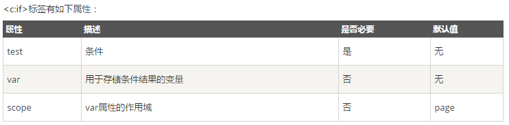
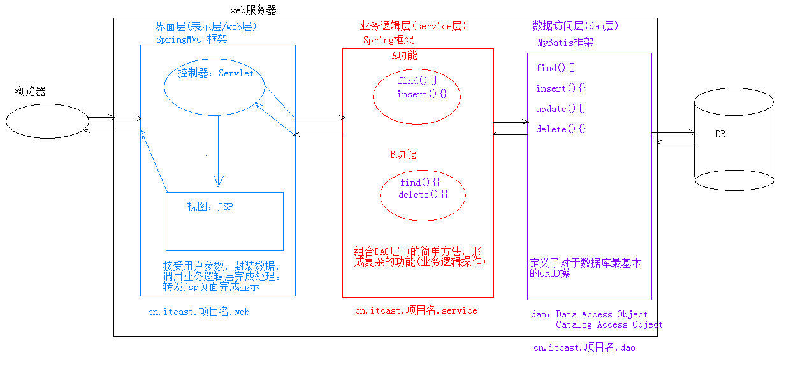
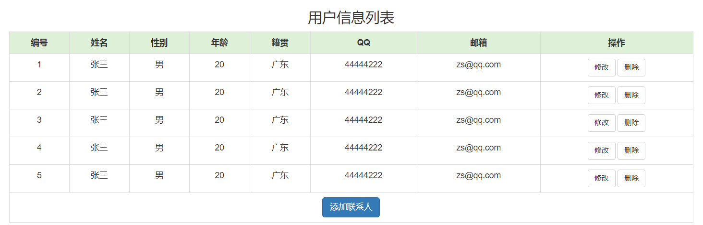
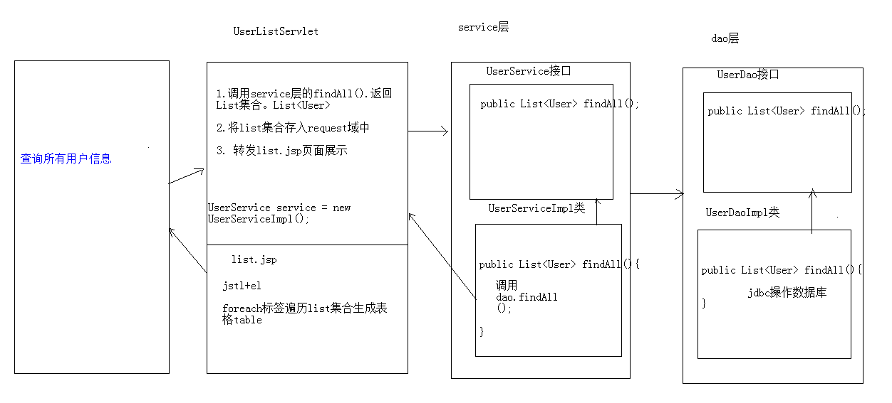
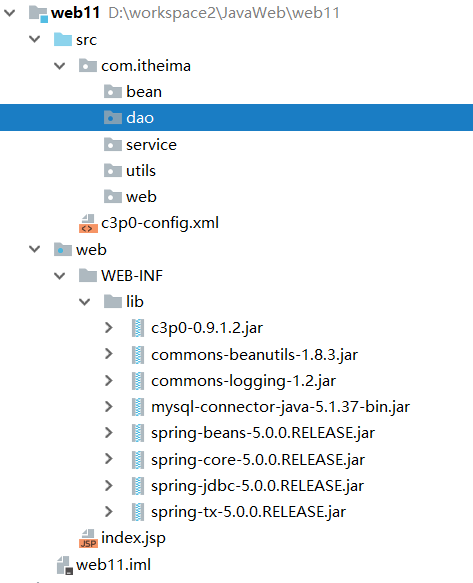
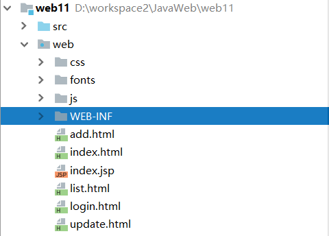
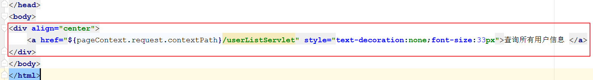

# 今日内容介绍
<extoc></extoc>

# JSP介绍(熟悉)
## JSP指令(熟悉)
### 作用:用于配置JSP页面，导入资源文件(熟悉)
### 格式:`<%@ 指令名称 属性名1=属性值1 属性名2=属性值2 ... %>`(熟悉)
### page指令		: 配置JSP页面的(熟悉)
```
page指令具有如下属性:
    * contentType:等同于response.setContentType()
    	1. 设置响应体的mime类型以及字符集
    	2. 设置当前jsp页面的编码（只能是高级的IDE才能生效，如果使用低级工具，则需要设置pageEncoding属性设置当前页面的字符集）
    * import:导包
    * errorPage:当前页面发生异常后，会自动跳转到指定的错误页面
    * isErrorPage:标识当前也是是否是错误页面。
    	* true:是，可以使用内置对象exception
    	* false:否。默认值。不可以使用内置对象exception
```


### include指令	: 页面包含的。导入页面的资源文件(熟悉)
#### 基本写法 : `	<%@ include 属性名=属性值%>`

#### 示例代码:
  ```
  <%@ include file="/demo/logo.jsp" %>
  ```
  在JSP页面中静态包含一个文件，同时由该JSP解析包含的文件内容。

#### 常用属性

  | 属性名 | 属性说明    |  
  | :------------- | :------------- |
  |   file |  指示JSP页面包含页面路径。 |

#### 注意事项：

  应该将被包含的页面的结构去掉。

  在被包含的页面中定义变量，在包含的页面中还可以使用。

### taglib指令	: 导入资源(熟悉)

#### 基本写法`<%@ taglib 属性名=属性值%>`
  ```
  <%@ taglib prefix="c" uri="http://java.sun.com/jsp/jstl/core" %>
  ```

#### 常用属性

  | 属性名 | 属性说明    |  
  | :------------- | :------------- |
  | uri |  引入的标签库的路径。 |
  | prefix |  引入标签库的别名。 |

## JSP注释(了解)
```
1. html注释:
  <!-- -->:只能注释html代码片段

2. jsp注释:推荐使用
  <%-- --%>:可以注释所有
```


## JSP内置对象(理解记忆)

在jsp页面中不需要创建，直接使用的对象,九大内置对象及其类型如下

| 属性名 | 真实类型    | 属性说明   |
| :------------- | :------------- |:------------- |
|   request		  |	HttpServletRequest  |  从客户端向服务器发送的请求对象          |
|   response	  |	HttpServletResponse |  从服务器端向客户端作出响应对象          |
|   session		  |	HttpSession         |  服务器为客户端创建会话对象              |
|   application	  |	ServletContext      |  代表应用。获得的ServletContext对象。    |
|   out			  |	JspWriter           |  向输出流写入内容的对象。                |
|   page		  |	Object              |  当前的JSP翻译成Servlet后的对象的引用。  |
|   pageContext	  |	PageContext         |  本JSP的页面的上下文对象。               |
|   config		  |	ServletConfig       |  本JSP的ServletConfig对象。              |
|   exception	  |	Throwable           |  表示JSP页面运行时产生的异常对象。       |


## MVC开发模式介绍(理解)
### jsp演变历史(理解)
		1. 早期只有servlet，只能使用response输出标签数据，非常麻烦
		2. 后来又jsp，简化了Servlet的开发，如果过度使用jsp，在jsp中即写大量的java代码，有写html表，造成难于维护，难于分工协作
		3. 再后来，java的web开发，借鉴mvc开发模式，使得程序的设计更加合理性

### MVC概念介绍(理解)
		1. M:Model，模型。JavaBean
			* 完成具体的业务操作，如:查询数据库，封装对象
		2. V:View，视图。JSP
			* 展示数据
		3. C:Controller，控制器。Servlet
			* 获取用户的输入
			* 调用模型
			* 将数据交给视图进行展示

### 优缺点(理解)
    1. 优点:
    	1. 耦合性低，方便维护，可以利于分工协作
    	2. 重用性高

    2. 缺点:
    	1. 使得项目架构变得复杂，对开发人员要求高

# EL表达式(掌握)

## EL概述(了解)
### 什么是EL表达式(了解)
EL（Expression Language） 是为了使JSP写起来更加简单。表达式语言的灵感来自于 ECMAScript 和 XPath 表达式语言，它提供了在 JSP 中简化表达式的方法，让Jsp的代码更加简化。

### 为什么要学习EL表达式(了解)

EL和JSTL一起使用取代JSP页面中嵌入Java代码写法。

### EL表达式常用功能(了解)

1. EL获取数据

2. EL执行运算

3. EL获取web开发常用的对象

### EL表达式的基本语法(掌握)
```
${EL表达式}
```

## EL获取数据(掌握)

EL表达式语句在执行的时候， 分别从page、request、session、application范围查找相应对象，找到就会返回相应对象，找不到返回””(不是null，是空的字符串)。

EL所获取的数据需要在四个作用范围中。

|    域名称         |     域对象     |   域对象类型     |
| :--------------- | :------------- |:------------- |
| pageScope       | pageContext      |PageContext      |
| requestScope    | request          | ServletRequest  |
| sessionScope    | session          | HttpSession |
| applicationScope | application     |ServletContext  |

使用EL获取数据时会调用域对象的`getAttribute("键名称")`方法进行获取

例如: `${requestScope.user } ` 底层的执行代码为 `request.getAttribute("user")`;  

如果省略域范围,那么会从小范围到大范围依次的进行查找,找到之后返回


### EL获取字符串数据(掌握)
```java
<h3>通过EL表达式获取域对象中的数据</h3>
<%
  //pageContext.setAttribute("msg", "PAGE_SCOPE");
  request.setAttribute("msg", "REQUEST_SCOP");
  session.setAttribute("msg", "SESSION_SCOP");
  application.setAttribute("msg", "APPLICATION_SCOPE");
%>
<h3><%=pageContext.getAttribute("msg") %>|${pageScope.msg}</h3>
<h3><%=request.getAttribute("msg") %>|${requestScope.msg}</h3>
<h3><%=session.getAttribute("msg") %>|${sessionScope.msg}</h3>
<h3><%=application.getAttribute("msg") %>|${applicationScope.msg}</h3>
<!-- EL表达式的简写 -->
${msg }
```

### EL获取数组和List集合中的数据(掌握)
```java
<h4>--EL表达式如何获取数组中的数据</h4>
<%
  String[] msgs={"龚老汉","老谈","山鸡哥"};
  //存到pageContext域中
  pageContext.setAttribute("msgs", msgs);
%>
${ msgs[0] }${ msgs[1] }${ msgs[2] }

<h4>--EL表达式如何获取list集合中的数据</h4>
<%
  List<String> lists=new ArrayList<String>();
  lists.add("aaa");
  lists.add("bbb");
  lists.add("ccc");
  //存到pageContext域中
  pageContext.setAttribute("list", lists);
%>
${ list[0] }--${ list[1] }--${ list[2] }
```

### EL获取Map集合中的数据(掌握)
```java
<h4>--EL表达式如何获取map集合中的数据</h4>
<%
  /*注意:1、map集合的键要是String类型 */
  Map<String,String> map=new HashMap<String,String>();
  map.put("1", "aaa");
  map.put("two", "bbb");
  map.put("three.cc", "ccc");
  //存到pageContext域中
  pageContext.setAttribute("map", map);
%>
<!-- 注意2、当key中有特殊字符点时，map集合获取值就不能使用.了,使用下标的方式["key"] -->
${ map['1'] }${ pageScope.map["two"] }${ map["three.cc"] }
```

### EL获取对象属性(掌握)
```java
<h4>--EL表达式如何获取对象属性</h4>
<%
  User user = new User();
  user.setUsername("关晓彤");
  user.setPassword("123");
  pageContext.setAttribute("u", user);
%>
${u.username }----${u.password }
```

### EL获取集合中的对象属性(掌握)
```java
<h4>--EL表达式如何集合中的对象属性</h4>

<%
  List<User> list = new ArrayList<User>();
  User user1 = new User();
  user1.setUsername("鹿晗");
  user1.setPassword("456");

  User user2 = new User();
  user2.setUsername("baby");
  user2.setPassword("789");

  User user3 = new User();
  user3.setUsername("黄晓明");
  user3.setPassword("111");
  list.add(user1);
  list.add(user2);
  list.add(user3);

  pageContext.setAttribute("users", list);
%>
${users[0].username }--${users[0].password }<br/>
${users[1].username }--${users[1].password }<br/>
${users[2].username }--${users[2].password }
```

### EL获取对象的集合属性(掌握)
```java
<h4>--EL表达式如何获取对象的集合属性</h4>
<%
	User user4 = new User();
	user4.setUsername("黄晓明");
	user4.setPassword("111");
	List<String> hs = new ArrayList<String>();
	hs.add("看电影");
	hs.add("写代码");
	hs.add("约会");
	user4.setHobbys(hs);

	pageContext.setAttribute("user", user4);
%>
${user.username }---${user.password }---${user.hobbys[0] }---${user.hobbys[1] }---${user.hobbys[2] }
```

## 执行运算(掌握)
### 执行算术运算(掌握)
```html
<%
	pageContext.setAttribute("m", "10");
	pageContext.setAttribute("n", 20);
%>
<h4>--EL执行算术运算</h4>
${m+n }<!-- 结果:30 --><!-- 在进行算术运算的时候会自动格式化我们数字类型的字符串 -->
```

### 执行关系运算(掌握)
```html
<h4>--EL执行关系运算</h4>
${m>n }--gt-->${m gt n }<br>
${m<n }--lt-->${m lt n }<br>
${m==n }--eq-->${m eq n }<br>
${m>=n }--ge-->${m ge n }<br>
${m<=n }--le-->${m le n }<br>
${m!=n }--ne-->${m ne n }
```

### 执行逻辑运算(掌握)
```html
<h4>--EL执行逻辑运算</h4>
${m<20 && n>10 } --and-->${m < 20 and n > 10 } --and-->${m lt 20 and n gt 10 }
```
### 执行三元运算(掌握)
```html
<h4>--EL执行三目运算</h4>
${m < n ?m:n }<!-- 当m < n 为true时，输出m的值，否则输出n的值 -->
```

### 执行`empty`运算(掌握)
```html
<%
User user = new User();
pageContext.setAttribute("user", user);
%>
<h4>--EL判断对象是否为空</h4>
${ empty user}===>${ not empty user}<br>


<h4>--EL判断集合是否为空</h4>
<%
	List<String> list = new ArrayList<String>();
	list.add("111");
	pageContext.setAttribute("list", list);
%>
${ empty list}===>${ not empty list}<br>

<h4>--EL判断Map集合是否为空</h4>
<%
	Map<String,String> map = new HashMap<String,String>();
	pageContext.setAttribute("map", map);
%>
${ empty map}===>${ not empty map}<br>
```

**注意:使用el表达式的`empty`运算判断集合是否为`null`时,如果集合对象本身不为`null`,但是集合中没有数据,这个时候也会返回`true`**


## 隐式对象:十一个内置对象(熟悉)

EL表达式定义了11个web开发常用对象。

使用这些对象可以很方便获取web开发冲的一些常见对象，并可以读取这些对象中的数据。

| 对象名称 |  描述    |
| :------------- | :------------- |
| **pageContext**		  |  相当于JSP内置对象中pageContext                                |
| pageScope		  |  获取指定域下的名称的数据                                      |
| requestScope		  |  获取指定域下的名称的数据                                  |
| sessionScope		  |  获取指定域下的名称的数据                                  |
| applicationScope	  |  获取指定域下的名称的数据                                  |
| param			  |  在页面中接收请求参数（接收一个名称对应一个值参数）。          |
| paramValues		  |  在页面中接收请求参数（接收一个名称对应多个值参数）。          |
| header			  |  在页面上获取请求头（获取一个key对应一个value 头）             |
| headerValues		  |  在页面上获取请求头（获取一个key对应多个value 头）         |
| **cookie**			  |  访问cookie的名称和值（${cookie.key.name} ${cookie.key.value}）|
| initParam			  |  获取全局初始化参数的值                                    |


# JSTL标签库(掌握)

## JSTL概述(了解)
### 什么是JSTL?
JSTL（JavaServer Pages Standard Tag Library，JSP标准标签库)是一个不断完善的开放源代码的JSP标签库，是由apache的jakarta小组来维护的。JSTL只能运行在支持JSP1.2和Servlet2.3规范的容器上，。

### 为什么学习JSTL?(了解)

主要和EL来取代传统页面上直接嵌入Java代码写法。提升程序可读性、维护性和方便性。


## 使用步骤(掌握)
		1. 导入jstl相关jar包
		2. 引入标签库:taglib指令:  <%@ taglib %>
		3. 使用标签


## 常用的JSTL标签(掌握)
### if标签使用:相当于java代码的if语句(掌握)

#### 属性


#### 示例
```html
<%@ page import="java.util.List" %>
<%@ page import="java.util.ArrayList" %>
<%@ page contentType="text/html;charset=UTF-8" language="java" %>
<%@ taglib prefix="c" uri="http://java.sun.com/jsp/jstl/core" %>

<html>
<head>
    <title>if标签</title>
</head>
<body>
    <c:if test="true">
        <h1>我是真...</h1>
    </c:if>
    <br>

    <%
        //判断request域中的一个list集合是否为空，如果不为null则显示遍历集合
        List list = new ArrayList();
        list.add("aaaa");
        request.setAttribute("list",list);
        request.setAttribute("number",4);
    %>

    <c:if test="${not empty list}">
        遍历集合...
    </c:if>
    <br>

    <c:if test="${number % 2 != 0}">
            ${number}为奇数
    </c:if>

    <c:if test="${number % 2 == 0}">
        ${number}为偶数
    </c:if>

</body>
</html>
```

#### 注意: `c:if`标签没有`else`情况，想要`else`情况，则可以在定义一个`c:if`标签


### choose标签使用:相当于java代码的switch语句(掌握)
#### 示例
```html
<%@ page contentType="text/html;charset=UTF-8" language="java" %>
<%@taglib prefix="c" uri="http://java.sun.com/jsp/jstl/core" %>
<html>
<head>
    <title>choose标签</title>
</head>
<body>
    <%--
        完成数字编号对应星期几案例
            1.域中存储一数字
            2.使用choose标签取出数字         相当于switch声明
            3.使用when标签做数字判断         相当于case
            4.otherwise标签做其他情况的声明  相当于default
    --%>

    <%
        request.setAttribute("number",51);
    %>

    <c:choose>
        <c:when test="${number == 1}">星期一</c:when>
        <c:when test="${number == 2}">星期二</c:when>
        <c:when test="${number == 3}">星期三</c:when>
        <c:when test="${number == 4}">星期四</c:when>
        <c:when test="${number == 5}">星期五</c:when>
        <c:when test="${number == 6}">星期六</c:when>
        <c:when test="${number == 7}">星期天</c:when>

        <c:otherwise>数字输入有误</c:otherwise>
    </c:choose>
</body>
</html>
```


### foreach标签使用:相当于java代码的for语句(掌握)

#### 属性

#### 示例

```html
<%@ page import="java.util.ArrayList" %>
<%@ page import="java.util.List" %>
<%@ page contentType="text/html;charset=UTF-8" language="java" %>

<%@taglib prefix="c" uri="http://java.sun.com/jsp/jstl/core" %>

<html>
<head>
    <title>foreach标签</title>
</head>
<body>
<c:forEach begin="1" end="10" var="i" step="2" varStatus="s">
    ${i} <h3>${s.index}<h3> <h4> ${s.count} </h4><br>

</c:forEach>
    <hr>
    <%
        List list = new ArrayList();
        list.add("aaa");
        list.add("bbb");
        list.add("ccc");
        request.setAttribute("list",list);
    %>

    <c:forEach items="${list}" var="str" varStatus="s">
            ${s.index} ${s.count} ${str}<br>
    </c:forEach>
</body>
</html>

```

## JSTL练习(掌握)
### 需求介绍(理解)

在request域中有一个存有User对象的List集合。需要使用jstl+el将list集合数据展示到jsp页面的表格table中

### 代码实现(掌握)
#### 创建User对象
```java
package cn.itcast.domain;

import java.text.SimpleDateFormat;
import java.util.Date;

public class User {

    private String name;
    private int age;
    private Date birthday;


    public User(String name, int age, Date birthday) {
        this.name = name;
        this.age = age;
        this.birthday = birthday;
    }

    public User() {
    }

    /**
     * 逻辑视图
     * @return
     */
    public String getBirStr(){

        if(birthday != null){
            //1.格式化日期对象
            SimpleDateFormat sdf = new SimpleDateFormat("yyyy-MM-dd HH:mm:ss");
            //2.返回字符串即可
            return sdf.format(birthday);

        }else{
            return "";
        }
    }


    public String getName() {
        return name;
    }

    public void setName(String name) {
        this.name = name;
    }

    public int getAge() {
        return age;
    }

    public void setAge(int age) {
        this.age = age;
    }

    public Date getBirthday() {
        return birthday;
    }

    public void setBirthday(Date birthday) {
        this.birthday = birthday;
    }
}

```

#### 代码实现
```html
<%@ page import="cn.itcast.domain.User" %>
<%@ page import="java.util.List" %>
<%@ page import="java.util.ArrayList" %>
<%@ page import="java.util.Date" %>
<%@ page contentType="text/html;charset=UTF-8" language="java" %>
<%@taglib prefix="c" uri="http://java.sun.com/jsp/jstl/core" %>

<html>
<head>
    <title>test</title>
</head>
<body>

<%
    List list = new ArrayList();
    list.add(new User("张三",23,new Date()));
    list.add(new User("李四",24,new Date()));
    list.add(new User("王五",25,new Date()));

    request.setAttribute("list",list);


%>

<table border="1" width="500" align="center">
    <tr>
        <th>编号</th>
        <th>姓名</th>
        <th>年龄</th>
        <th>生日</th>
    </tr>
    <%--数据行--%>
    <c:forEach items="${list}" var="user" varStatus="s">

        <c:if test="${s.count % 2 != 0}">

            <tr bgcolor="red">
                <td>${s.count}</td>
                <td>${user.name}</td>
                <td>${user.age}</td>
                <td>${user.birStr}</td>
            </tr>
        </c:if>
        <c:if test="${s.count % 2 == 0}">
            <tr  bgcolor="green">
                <td>${s.count}</td>
                <td>${user.name}</td>
                <td>${user.age}</td>
                <td>${user.birStr}</td>
            </tr>
        </c:if>
    </c:forEach>
</table>

</body>
</html>
```

# 三层架构:软件设计架构(理解)



1. 界面层(表示层):用户看的得界面。用户可以通过界面上的组件和服务器进行交互
2. 业务逻辑层:处理业务逻辑的。
3. 数据访问层:操作数据存储文件。

# 案例:用户信息列表展示(掌握)
## 需求:用户信息的增删改查操作(理解)



## 分析(理解)



技术选型:Servlet+JSP+MySQL+JDBCTempleat+Duird+BeanUtilS+tomcat

## 环境搭建(掌握)
### 创建数据库环境(掌握)
```sql
create database web17; -- 创建数据库
use web17; 			   -- 使用数据库
create table user(   -- 创建表
  id int primary key auto_increment,
  name varchar(20) not null,
  gender varchar(5),
  age int,
  address varchar(32),
  qq	varchar(20),
  email varchar(50)
);
```

###	创建项目，导入需要的jar包(掌握)


### 引入页面资源(掌握)



**注意:修改`list.html`为list.jsp**

## 代码实现(掌握)
### 创建`JdbcUtils`工具类(掌握)
```java
/**
 * jdbc操作的工具类
 */
public class JdbcUtils {
    private static DataSource dataSource = new ComboPooledDataSource();

    /**
     * 获取连接
     */
    public static Connection getConnection() throws SQLException {
        return dataSource.getConnection();
    }

    /**
     * 获取连接池
     */
    public static  DataSource getDataSource(){
        return  dataSource ;
    }
}
```

### 数据访问层(掌握)
#### 接口`UserDao`
```java
package cn.itcast.dao;

import cn.itcast.domain.User;

import java.util.List;

/**
 * 用户操作的DAO
 */
public interface UserDao {
    public List<User> findAll();
}
```
#### 实现类`UserDaoImpl`
```java
package cn.itcast.dao.impl;

import cn.itcast.dao.UserDao;
import cn.itcast.domain.User;
import cn.itcast.util.JDBCUtils;
import org.springframework.jdbc.core.BeanPropertyRowMapper;
import org.springframework.jdbc.core.JdbcTemplate;

import java.util.List;

public class UserDaoImpl implements UserDao {

    private JdbcTemplate template = new JdbcTemplate(JDBCUtils.getDataSource());

    @Override
    public List<User> findAll() {
        //使用JDBC操作数据库...
        //1.定义sql
        String sql = "select * from user";
        List<User> users = template.query(sql, new BeanPropertyRowMapper<User>(User.class));
        return users;
    }
}
```

### 业务逻辑层(掌握)
#### 接口`UserService`
```java
package cn.itcast.service;

import cn.itcast.domain.User;

import java.util.List;

/**
 * 用户管理的业务接口
 */
public interface UserService {

    /**
     * 查询所有用户信息
     * @return
     */
    public List<User> findAll();
}
```
#### 实现类`UserServiceImpl`
```java
package cn.itcast.service.impl;

import cn.itcast.dao.UserDao;
import cn.itcast.dao.impl.UserDaoImpl;
import cn.itcast.domain.User;
import cn.itcast.service.UserService;

import java.util.List;

public class UserServiceImpl implements UserService {
    private UserDao dao = new UserDaoImpl();

    @Override
    public List<User> findAll() {
        //调用Dao完成查询
        return dao.findAll();
    }
}
```

### web层(掌握)
```java
package cn.itcast.web.servlet;

import cn.itcast.domain.User;
import cn.itcast.service.UserService;
import cn.itcast.service.impl.UserServiceImpl;

import javax.servlet.ServletException;
import javax.servlet.annotation.WebServlet;
import javax.servlet.http.HttpServlet;
import javax.servlet.http.HttpServletRequest;
import javax.servlet.http.HttpServletResponse;
import java.io.IOException;
import java.util.List;

@WebServlet("/userListServlet")
public class UserListServlet extends HttpServlet {
    protected void doPost(HttpServletRequest request, HttpServletResponse response) throws ServletException, IOException {
        //1.调用UserService完成查询
        UserService service = new UserServiceImpl();
        List<User> users = service.findAll();
        //2.将list存入request域
        request.setAttribute("users",users);
        //3.转发到list.jsp
        request.getRequestDispatcher("/list.jsp").forward(request,response);
    }

    protected void doGet(HttpServletRequest request, HttpServletResponse response) throws ServletException, IOException {
        this.doPost(request, response);
    }
}
```

### 页面(掌握)
#### 用户列表页面`List.jsp`
```html
<%@ page contentType="text/html;charset=UTF-8" language="java" %>
<%@taglib prefix="c" uri="http://java.sun.com/jsp/jstl/core" %>
<!DOCTYPE html>
<html lang="zh-CN">
<head>
    <meta charset="utf-8">
    <meta http-equiv="X-UA-Compatible" content="IE=edge">
    <meta name="viewport" content="width=device-width, initial-scale=1">
    <title>用户信息管理系统</title>
    <link href="css/bootstrap.min.css" rel="stylesheet">
    <script src="js/jquery-2.1.0.min.js"></script>
    <script src="js/bootstrap.min.js"></script>
    <style type="text/css">
        td, th {
            text-align: center;
        }
    </style>
</head>
<body>
<div class="container">
    <h3 style="text-align: center">用户信息列表</h3>
    <table border="1" class="table table-bordered table-hover">
        <tr class="success">
            <th>编号</th>
            <th>姓名</th>
            <th>性别</th>
            <th>年龄</th>
            <th>籍贯</th>
            <th>QQ</th>
            <th>邮箱</th>
            <th>操作</th>
        </tr>

        <c:forEach items="${users}" var="user" varStatus="s">
            <tr>
                <td>${s.count}</td>
                <td>${user.name}</td>
                <td>${user.gender}</td>
                <td>${user.age}</td>
                <td>${user.address}</td>
                <td>${user.qq}</td>
                <td>${user.email}</td>
                <td><a class="btn btn-default btn-sm" href="update.html">修改</a>&nbsp;<a class="btn btn-default btn-sm" href="">删除</a></td>
            </tr>
        </c:forEach>
        <tr>
            <td colspan="8" align="center"><a class="btn btn-primary" href="add.html">添加联系人</a></td>
        </tr>
    </table>
</div>
</body>
</html>
```

#### 首页添加超链接


### 访问(掌握)
地址栏输入:http://localost:8080/web11/index.jsp 点击查询所有用户信息的超链接
