# 今日内容介绍
<extoc></extoc>
# web相关概念(了解)
    1. 软件架构
    	1. C/S：客户端/服务器端
    	2. B/S：浏览器/服务器端

    2. 资源分类
    	1. 静态资源：所有用户访问后，得到的结果都是一样的，称为静态资源.静态资源可以直接被浏览器解析
    		* 如： html,css,JavaScript
    	2. 动态资源:每个用户访问相同资源后，得到的结果可能不一样。称为动态资源。动态资源被访问后，需要先转换为静态资源，在返回给浏览器
    		* 如：servlet/jsp,php,asp....

    3. 网络通信三要素
    	1. IP：电子设备(计算机)在网络中的唯一标识。
    	2. 端口：应用程序在计算机中的唯一标识。 0~65536
    	3. 传输协议：规定了数据传输的规则
    		1. 基础协议：
    			1. tcp:安全协议，三次握手。 速度稍慢
    			2. udp：不安全协议。 速度快

    4. web服务器软件(了解)
      	* 服务器：安装了服务器软件的计算机
      	* 服务器软件：接收用户的请求，处理请求，做出响应
      	* web服务器软件：接收用户的请求，处理请求，做出响应。
      		* 在web服务器软件中，可以部署web项目，让用户通过浏览器来访问这些项目
      		* web容器

    5. 常见的java相关的web服务器软件：
    		* webLogic：oracle公司，大型的JavaEE服务器，支持所有的JavaEE规范，收费的。
    		* webSphere：IBM公司，大型的JavaEE服务器，支持所有的JavaEE规范，收费的。
    		* JBOSS：JBOSS公司的，大型的JavaEE服务器，支持所有的JavaEE规范，收费的。
    		* Tomcat：Apache基金组织，中小型的JavaEE服务器，仅仅支持少量的JavaEE规范servlet/jsp。开源的，免费的。

    6.  JavaEE：Java语言在企业级开发中使用的技术规范的总和，一共规定了13项大的规范

# Tomcat：web服务器软件(熟悉)
    Tomcat是Apache 软件基金会(Apache Software Foundation)的Jakarta 项目中的一个核心项目，由Apache、Sun 和其他一些公司及个人共同开发而成。
    由于有了Sun 的参与和支持，最新的Servlet 和JSP 规范总是能在Tomcat 中得到体现，Tomcat 支持最新的Servlet 和JSP规范。
    因为Tomcat 技术先进、性能稳定，而且免费，因而深受Java 爱好者的喜爱并得到了部分软件开发商的认可，成为目前比较流行的Web 应用服务器。
    Tomcat 服务器是一个免费的开放源代码的Web 应用服务器，属于轻量级应用服务器，在中小型系统和并发访问用户不是很多的场合下被普遍使用，是开发和调试JSP 程序的首选。
    对于一个初学者来说，可以这样认为，当在一台机器上配置好Apache 服务器，可利用它响应HTML(标准通用标记语言下的一个应用)页面的访问请求。
    实际上Tomcat是Apache 服务器的扩展，但运行时它是独立运行的，所以当你运行tomcat 时，它实际上作为一个与Apache 独立的进程单独运行的。
    Tomcat和IIS等Web服务器一样，具有处理HTML页面的功能，另外它还是一个Servlet和JSP容器，独立的Servlet容器是Tomcat的默认模式。
    不过，Tomcat处理静态HTML的能力不如Apache服务器。目前Tomcat最新版本为9.0。

## 下载安装启动及关闭
### 下载(熟悉)
  * 官网地址:http://tomcat.apache.org/
  * 下载地址:http://tomcat.apache.org/download-70.cgi

### 安装(解压即可使用)(熟悉)

  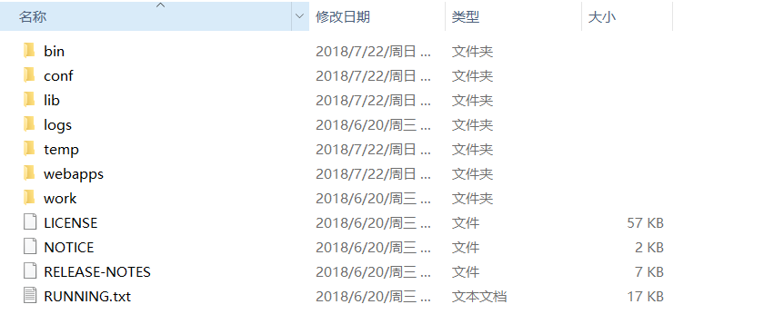

  **注意：安装目录建议不要有中文和空格**

### 卸载：删除目录就行了(熟悉)
### 启动(熟悉)

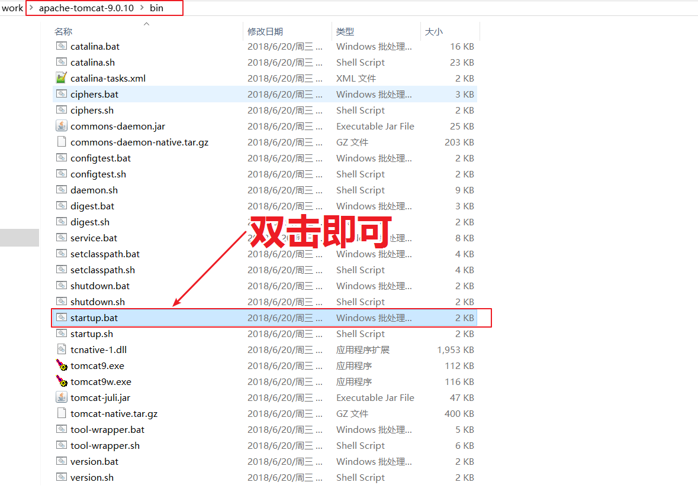

启动成功弹出展示如下运行界面

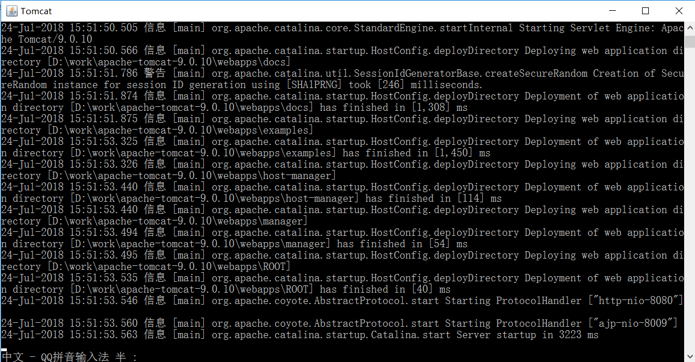

### 访问(熟悉)

打开浏览器输入地址： http://localhost:8080/ 如果出现以下界面,说明启动成功

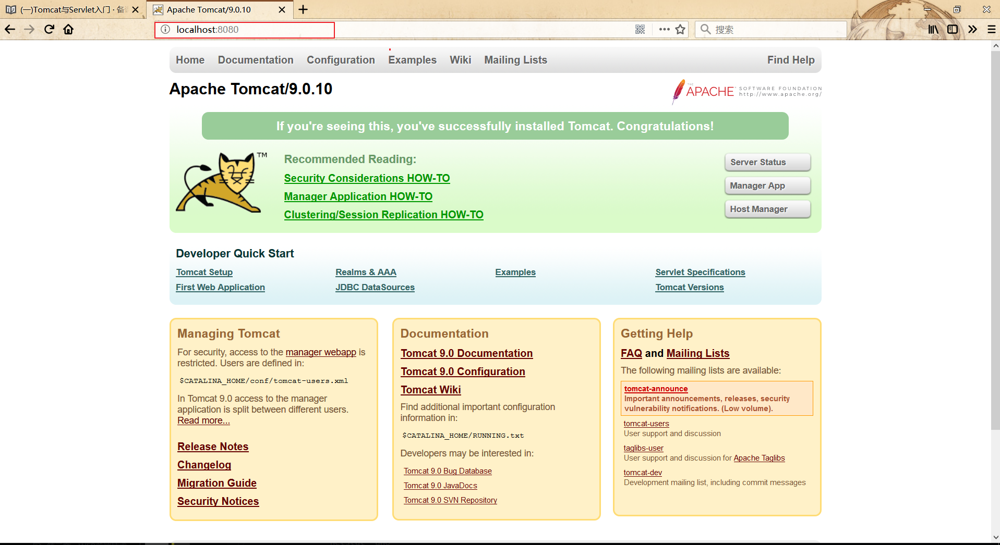

注意:浏览器输入：http://localhost:8080 回车访问自己,如果想访问别人的服务器只要将`localhost`换成要服务的服务器的ip地址即可

例如:http://192.168.26.100:8080

### 关闭(熟悉)
    1. 正常关闭：
      * bin/shutdown.bat
      * ctrl+c

    2. 强制关闭：
      * 点击启动窗口的×


### 注意事项(熟悉)
#### 黑窗口一闪而过
Tomcat运行需要依赖Java环境，也就是说需要在电脑上安装了JDK之后才可以安装和启动Tomcat。

因为Tomcat启动的时候需要使用JRE的环境。必须要配置JAVA_HOME环境变量，如果没有配置JAVA_HOME环境变量，那么服务器在启动的时候就会一闪然后关闭。

解决方案: 配置JAVA_HOME环境变量


#### 启动报错

果电脑上安装了一个应用之后，有可能会占用Tomcat的端口，如果将Tomcat端口占用了，这个Tomcat启动不了的。

Tomcat默认的端口号是8080。一般80端口容易被其他程序所占用。因为80端口是HTTP协议的默认端口(可以省略)。

#### 解决方案一:将占用端口的程序结束掉

步骤一: 输入命令查看8080端口的占用情

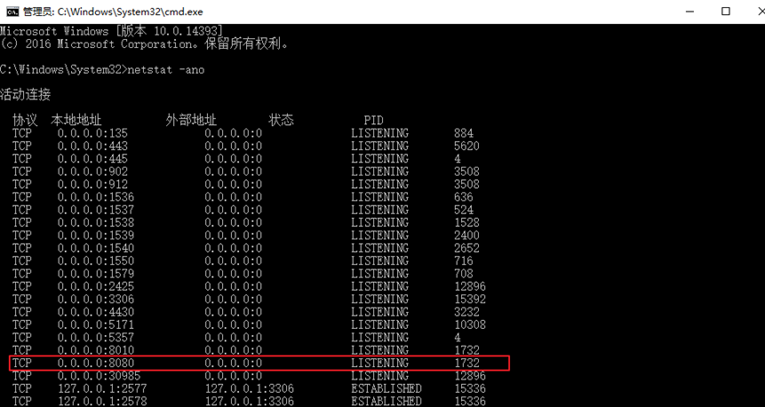

步骤二: 在任务管理器找到1732这个程序,结束进程

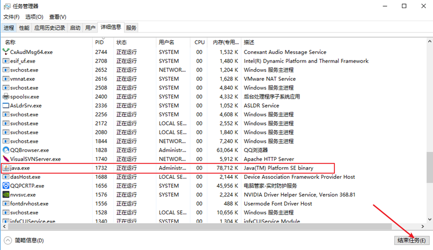

#### 解决方案二:改变自身程序的端口

打开`tomcat/conf/server.xml`修改端口

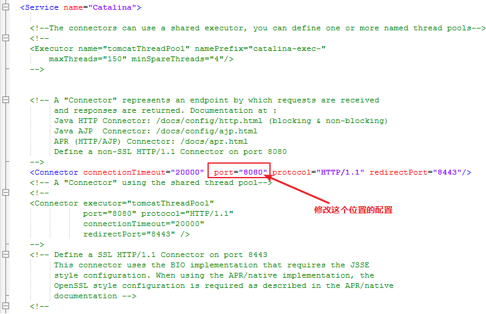

## 使用tomcat发布项目(掌握)
### 方式一:直接将项目放到`webapps`目录下即可。(掌握)
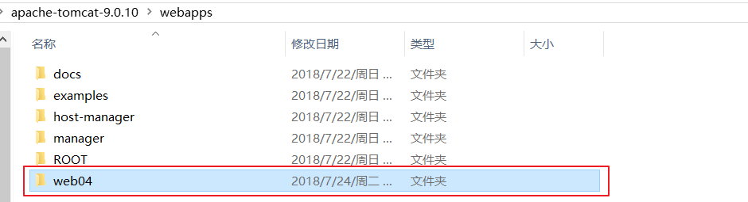

访问:http://localhost:8080/web04/03-baidu.html

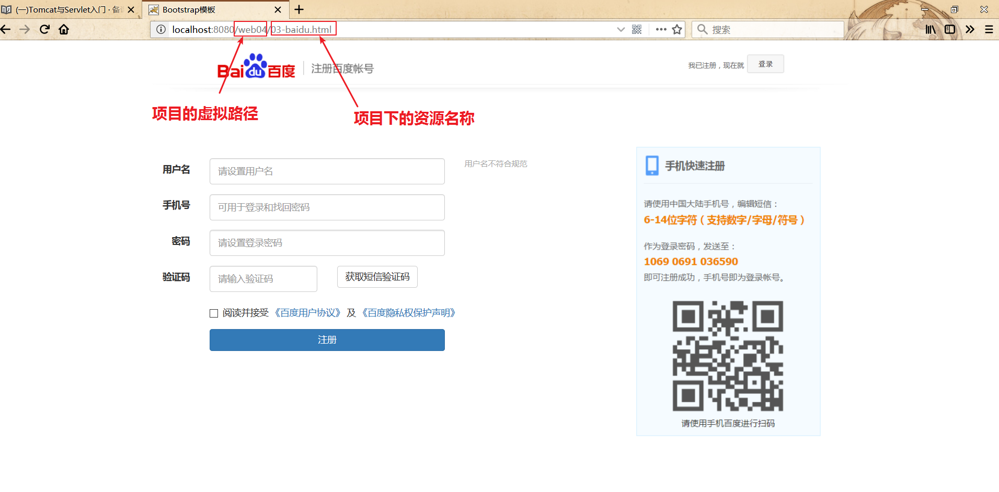

### 方式二:配置`tomcat/conf/server.xml`文件(掌握)
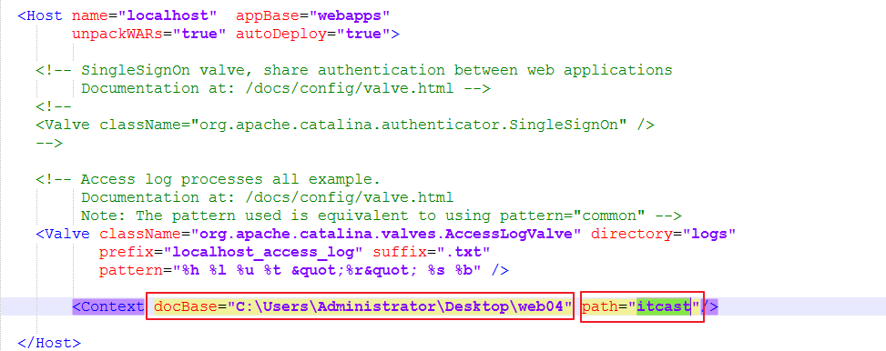

**path : 配置项目的虚拟路径**

**docBase :配置项目的磁盘路径**

访问:http://localhost:8080/itcast/03-baidu.html

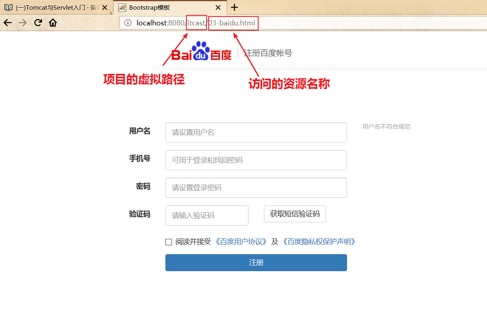

### 方式三:在`conf\Catalina\localhost`创建任意名称的xml文件。(掌握)

#### 步骤一:在`conf\Catalina\localhost`目录下创建一个`xml文件`

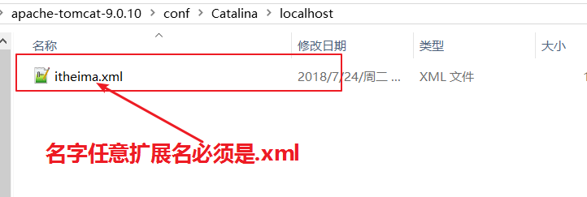

**注意:文件名称就是项目访问的虚拟路径**
#### 步骤二:编写`xml`文件内容,配置虚拟路径

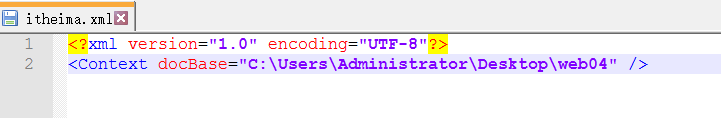

**注意1:xml文件的文档声明不要忘了,可以从一个正常的xml文件中copy**

**注意2:docBase为项目的磁盘路径**

访问:http://localhost:8080/itheima/03-baidu.html

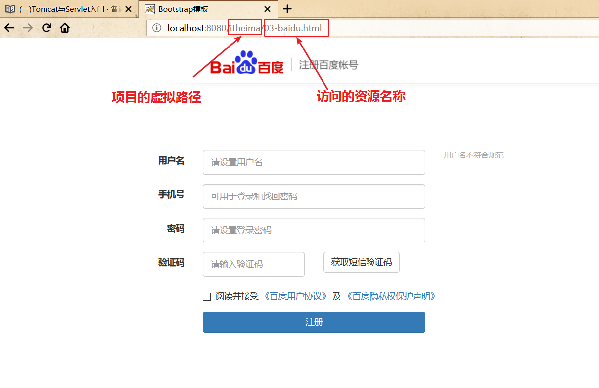

# Servlet简单介绍(熟悉)

## JavaWeb动态项目的目录结构(熟悉)

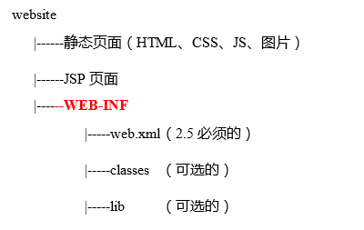

## 将Tomcat集成到IDEA中，并且创建JavaEE的项目，部署项目。(熟悉)

### IDEA集成Tomcat(熟悉)
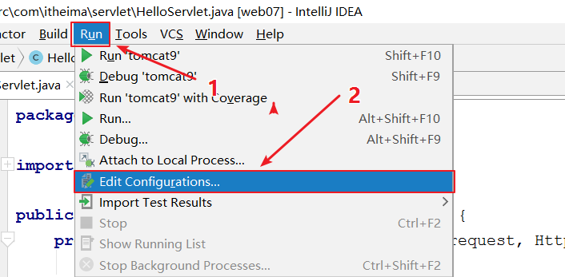

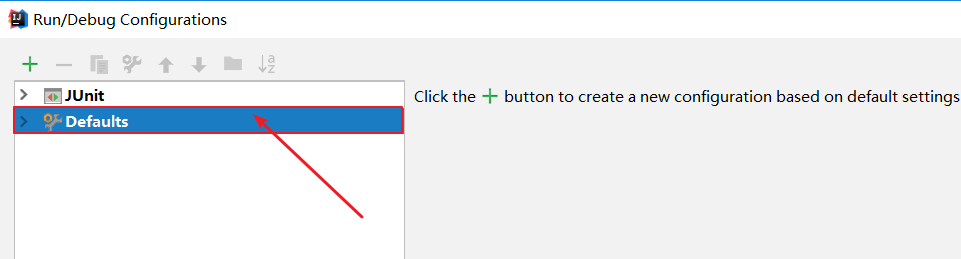

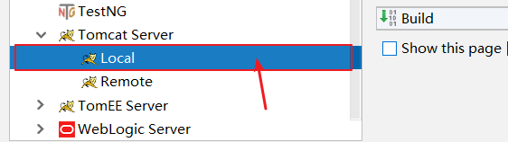

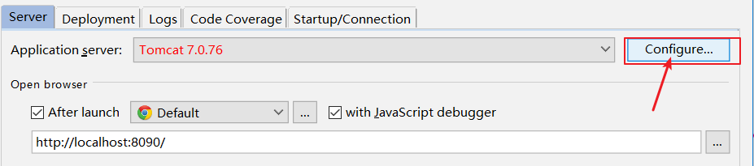

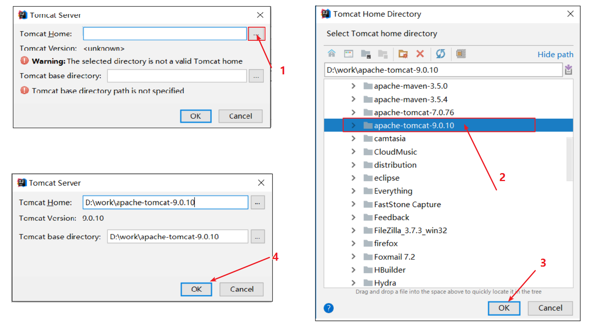

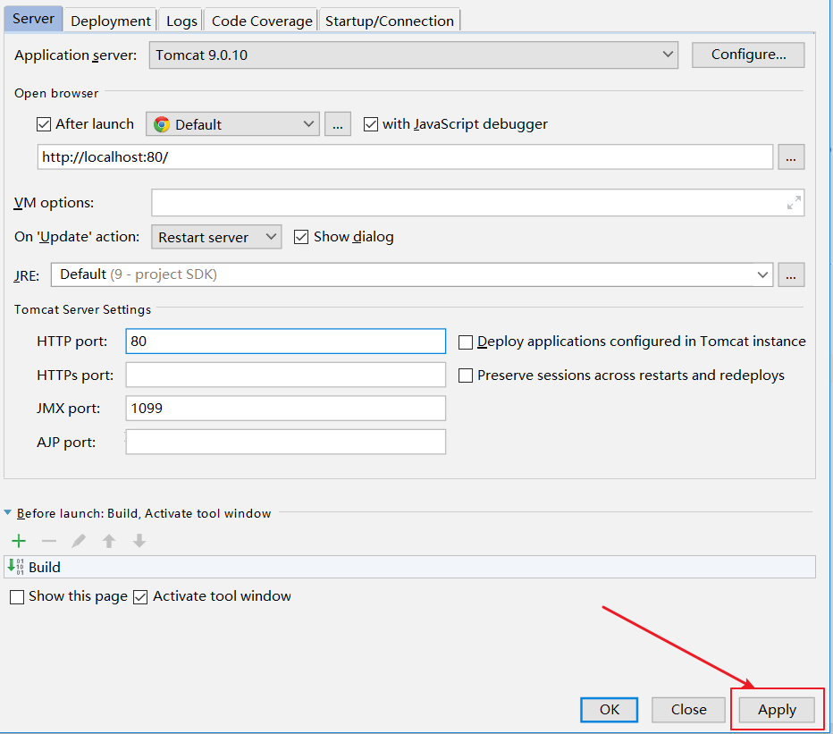

### 创建JavaEE项目(熟悉)


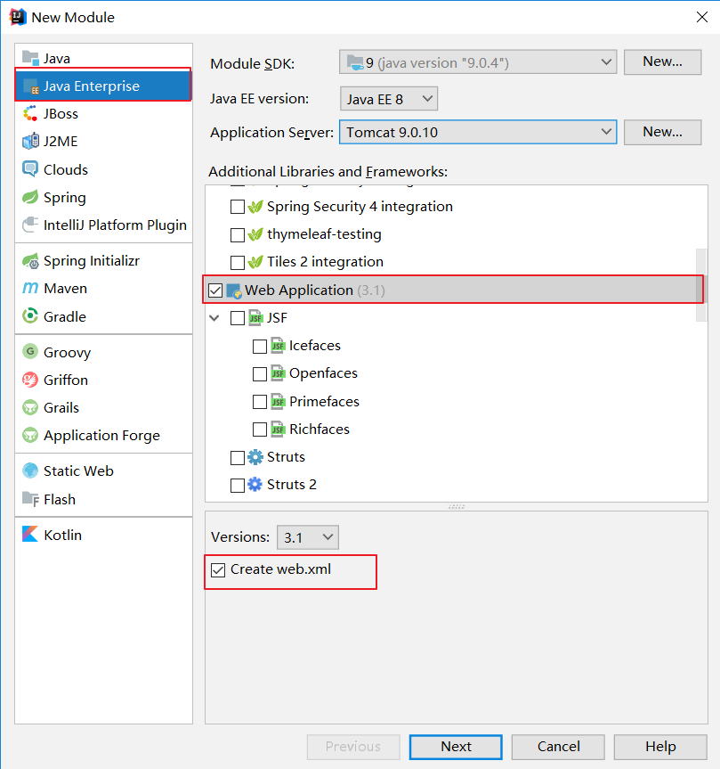

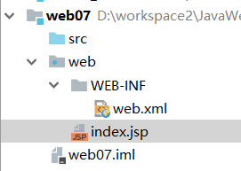

### 启动项目(熟悉)
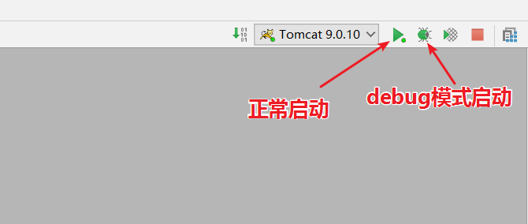

## 什么是Servlet?(理解)

Servlet就是运行在 Web 服务器中的小型 Java 程序。通常通过 HTTP协议接收客户端的请求，同时也会给客户端一个响应

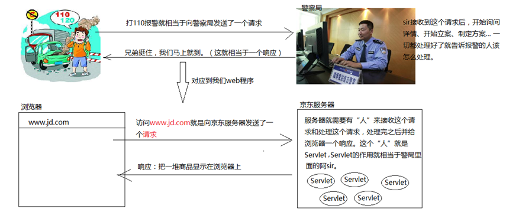

* Servlet就是一个接口，定义了Java类被浏览器访问到(tomcat识别)的规则。
* 将来我们自定义一个类，实现Servlet接口，实现方法。这个类就是一个Servlet

### 快速入门(掌握)
#### 基本步骤
		1. 创建JavaEE项目
		2. 定义一个类，实现Servlet接口
		3. 实现接口中的抽象方法
		4. 配置Servlet

#### 代码实现
##### java代码
```java
package com.itheima.servlet;

import javax.servlet.*;
import java.io.IOException;

public class HelloServlet implements Servlet {
    @Override
    public void init(ServletConfig servletConfig) throws ServletException { }

    @Override
    public ServletConfig getServletConfig() {
        return null;
    }

    @Override
    public void service(ServletRequest servletRequest, ServletResponse servletResponse) throws ServletException, IOException {
        System.out.println("hello servlet....");
    }

    @Override
    public String getServletInfo() {
        return null;
    }

    @Override
    public void destroy() {

    }
}
```

##### 配置`web/WEB-INF/web.xml`配置文件  
```xml
<!--配置Servlet-->
<servlet>
    <!--配置Servlet名称-->
    <servlet-name>HelloServlet</servlet-name>
    <!--配置Servlet类的全路径-->
    <servlet-class>com.itheima.servlet.HelloServlet</servlet-class>
</servlet>
<!--配置Servlet映射-->
<servlet-mapping>
    <!--配置Servlet名称-->
    <servlet-name>HelloServlet</servlet-name>
    <!--配置Servlet的访问路径-->
    <url-pattern>/hello</url-pattern>
</servlet-mapping>  
```

### Servlet执行原理(理解并描述)

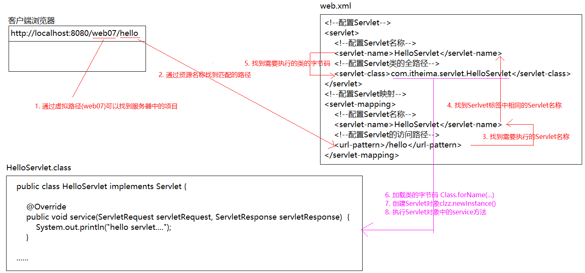

```
1. 当服务器接受到客户端浏览器的请求后，会解析请求URL路径，获取访问的Servlet的资源路径
2. 查找`web.xml`文件，是否有对应的`<url-pattern>`标签体内容。
3. 如果有，则在找到对应的`<servlet-class>`全类名
4. tomcat会将字节码文件加载进内存，并且创建其对象
5. 调用其`service`方法
```

### Servlet中的生命周期方法(理解并描述)

#### 什么是生命周期?

    生命周期：一个对象从创建到销毁过程。

#### Servlet的生命周期介绍
    创建 : 用户第一次访问这个servlet的时候创建 执行`init()` 只执行一次
    销毁 : 服务器关闭,或者项目被移除 这个时候会销毁servlet 执行`destroy()`只执行一次
    执行 : 每一次的用户请求,都会执行其中的`service()`方法

#### 注意事项

##### 配置启动时加载

 默认情况下，第一次被访问时，Servlet被创建,我们可以通过配置改变Servlet的创建时机

只需要在web.xml需要启动时加载的servelt的相关配置中,添加一行配置就可以了`<load-on-startup>1</load-on-startup>`

```
<servlet>
  <servlet-name>ServletLife</servlet-name>
  <servlet-class>com.itheima.servlet.ServletLife</servlet-class>
  <load-on-startup>1</load-on-startup>
</servlet>
<servlet-mapping>
  <servlet-name>ServletLife</servlet-name>
  <url-pattern>/ServletLife</url-pattern>
</servlet-mapping>
```

##### 线程安全问题

问题: Servelt是一个单例对象,整个项目之中相同类型的Servlet实力对象只有一个,多个用户同时访问时，可能存在线程安全问题。

解决：尽量不要在Servlet中定义成员变量。即使定义了成员变量，也不要对修改值

## Servlet3.0简单介绍(掌握)

好处: 支持注解配置。可以不需要`web.xml`了。

### 使用步骤(掌握)
1. 创建JavaEE项目，选择Servlet的版本3.0以上，可以不创建web.xml
2. 定义一个类，实现Servlet接口
3. 实现方法
4. 在类上使用@WebServlet注解，进行配置

#### 示例:
```java
package com.itheima.servlet;

import javax.servlet.*;
import javax.servlet.annotation.WebServlet;
import java.io.IOException;

//@WebServlet(urlPatterns = "/hello")
//@WebServlet(value = "/hello")
@WebServlet("/hello")
public class HelloServlet implements Servlet {

    @Override
    public void service(ServletRequest servletRequest, ServletResponse servletResponse) throws ServletException, IOException {
        System.out.println("hello servlet3.0...");
    }

    @Override
    public void init(ServletConfig servletConfig) throws ServletException {

    }

    @Override
    public ServletConfig getServletConfig() {
        return null;
    }

    @Override
    public String getServletInfo() {
        return null;
    }

    @Override
    public void destroy() {

    }
}

```

### `@WebServlet`源码介绍(熟悉)
```java
@Target({ElementType.TYPE})
@Retention(RetentionPolicy.RUNTIME)
@Documented
public @interface WebServlet {
    String name() default "";//相当于<Servlet-name>

    String[] value() default {};//代表urlPatterns()属性配置

    String[] urlPatterns() default {};//相当于<url-pattern>

    int loadOnStartup() default -1;//相当于<load-on-startup>

    WebInitParam[] initParams() default {};

    boolean asyncSupported() default false;

    String smallIcon() default "";

    String largeIcon() default "";

    String description() default "";

    String displayName() default "";
}
```

## Servelt体系结构介绍(理解)
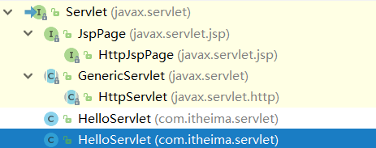

### GenericServlet:与协议无关

    将Servlet接口中其他的方法做了默认空实现，只将service()方法作为抽象将来定义Servlet类时，可以继承GenericServlet，实现service()方法即可

### HttpServlet：对http协议的一种封装，简化操作
    1. 定义类继承HttpServlet
    2. 复写doGet/doPost方法

### 开发中一般会使用HttpServlet(掌握)
```java
package com.itheima.servlet;

import javax.servlet.ServletException;
import javax.servlet.http.HttpServlet;
import javax.servlet.http.HttpServletRequest;
import javax.servlet.http.HttpServletResponse;
import java.io.IOException;

@WebServlet("hello2")
public class HelloServlet2 extends HttpServlet {
    @Override
    protected void doGet(HttpServletRequest req, HttpServletResponse resp) throws ServletException, IOException {
        System.out.println("接收到GET请求...");
    }

    @Override
    protected void doPost(HttpServletRequest req, HttpServletResponse resp) throws ServletException, IOException {
        System.out.println("接收到POST请求...");
    }
}
```

## Servlet访问路径的配置(理解)
### 如何配置访问路径?(理解)
所谓的访问路径其实就是指`Servlet`中`url-pattern`的写法

访问路径分为：`完全路径匹配`、目录匹配、扩展名匹配，实际上目录匹配也属于完全路径匹配。

1.	完全路径匹配：以/开头; 例如：`/ServletLife`、`/abc/ServletLife`;
2.	目录匹配：以/开头，`*`结尾（`*`代表任意字符）; 例如：`/*`、`/aaa/*`
3.	扩展名匹配：以`*`开头,`.xxx`结尾（x是任意字符）; 例如：`*.a`、`*.do`、`*.abc`

注意：不能同时使用`/*`开头,`.xxx`结尾的路径；例如：`/*.do`不允许

### 访问路径的优先级(理解)

对于用户输入的一个URL,服务器可能会有多个Servlet的url-pattern 可以匹配,到底是那一个Servlet会执行呢?

**完全路径匹配 > 目录匹配 > 扩展名匹配**  越精确优先级越高;


### 练习
有如下`url-pattern`,当浏览器输入如下路径时,哪个匹配的Servlet会执行
```java
@WebServlet("/abc/*")
public class HelloServlet1 extends HttpServlet{}

@WebServlet("/*")
public class HelloServlet2 extends HttpServlet{}

@WebServlet("/abc")
public class HelloServlet3 extends HttpServlet{}

@WebServlet("*.do")
public class HelloServlet4 extends HttpServlet{}

@WebServlet("/xxx/yyy/a.do")
public class HelloServlet5 extends HttpServlet{}
```

```
1.	当请求URL为/abc/a.html,哪个servlet执行
2.	当请求URL为/abc时,哪个servlet执行
3.	当请求URL为/abc/a.do时,哪个servlet执行
4.	当请求URL为/a.do时,哪个servlet执行
5.	当请求URL为/xxx/yyy/abc.do时,哪个servlet执行
6.	当请求URL为 /xxx/yyy/a.do时,哪个servlet执行
```

## IDEA与tomcat的相关配置(理解)
  	1. IDEA会为每一个tomcat部署的项目单独建立一份配置文件
  		* 查看控制台的log：`Using CATALINA_BASE`:`C:\Users\fqy\.IntelliJIdea2018.1\system\tomcat\_itcast`

  	2. 工作空间项目    和     tomcat部署的web项目
  		* tomcat真正访问的是`tomcat下部署的web项目`
      * `tomcat下部署的web项目`对应着`工作空间项目`的web目录下的所有资源以及`工作空间项目`的src目录下的所有类编译后的字节码文件
  		* WEB-INF目录下的资源不能被浏览器直接访问。

  	3. 断点调试：使用"小虫子"启动 dubug 启动
